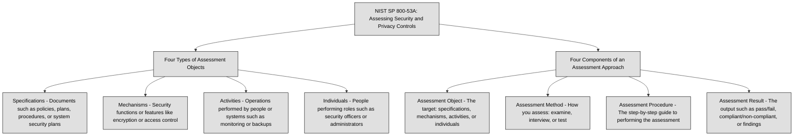
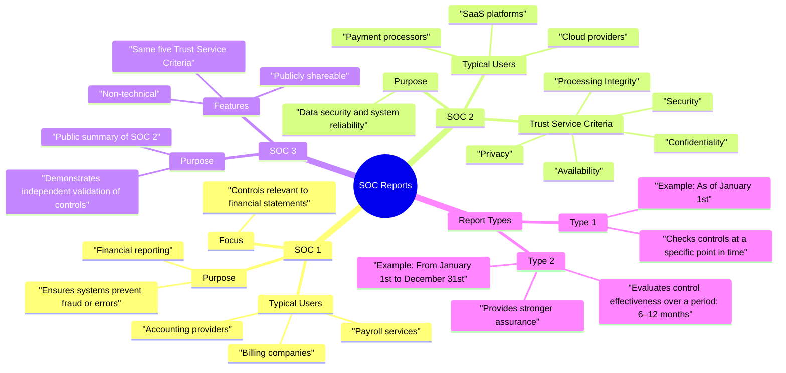

## 6.1.0 Preface ##

> 🔗 This section of Domain 6 is focused on audit design, refer to [6.5 Conduct or facilitate security audits](6.5%20Conduct%20or%20facilitate%20security%20audits.md) to better learn how to implement them.

In previous domains we have learned how to build a secure environment… now it’s time to verify if it actually is secure. `Tests, assessments, and audits are the tools security professionals use to uncover vulnerabilities, misconfigurations, and procedural weaknesses before attackers do`. Domain 6 teaches how to look under the hood of your security program and answer the big question: “*Are we really protected?*”

- **Testing** is like `doing a fire drill`. Penetration tests (pen tests), vulnerability scans, and security functional tests are about simulating attacks, checking what works, and what doesn’t. These are often technical, hands-on, and actively probe systems to see what breaks.
- **Assessments** are `broader and more strategic`. They’re not about “hacking the system,” but evaluating the overall posture—how well policies are followed, how risks are identified, and where improvements are needed. These can include risk assessments, security assessments, and gap analyses. They’re the “health checkups” of your security ecosystem.
- **Audits** are even `more formal, often tied to compliance and regulations`. Whether internal or external, an audit checks if you're actually doing what you say you're doing. Think policies, procedures, logs, and documentation. Auditors follow a structured process to verify controls are in place and functioning—because regulators and stakeholders need proof, not promises.

> ✓: We don’t secure a system by installing firewalls and crossing out fingers. We need a feedback loop—a **cycle of testing, evaluating, and adjusting**. Domain 6 is about holding our systems, processes, and people accountable—and building confidence that your defenses are real, not theoretical.

> 🔗 [NIST SP 800-53A Assessing Security and Privacy Controls in Information Systems and Organizations](https://csrc.nist.gov/pubs/sp/800/53/a/r5/final) defines Four Types of Assessment Objects (*what can be assessed*):
>- Specifications – Documents such as policies, plans, procedures, or system security plans.
>- Mechanisms – Security functions or features (e.g., encryption, access control).
>- Activities – Operations performed by people or systems (e.g., monitoring, backups).
>- Individuals – People performing roles (e.g., security officers, admins).

>And Four Components of an Assessment Approach (*how to assess*):
>- Assessment Object – The target (specifications, mechanisms, activities, individuals).
>- Assessment Method – How you assess (examine, interview, test).
>- Assessment Procedure – The step-by-step guide to performing the assessment.
>- Assessment Result – The output (pass/fail, compliant/non-compliant, findings).

## 6.1.1 Internal (e.g., within organization control) ##

Internal testing involves simulating attacks or failure scenarios in a controlled way to see how systems respond. These tests are often `performed by in-house security teams or internal red/blue teams`. Here are some common types:

1. **Internal Penetration Testing**: Simulates an attack from someone who already has access to the internal network. It identifies vulnerabilities such as unpatched systems, misconfigured firewalls, or excessive privileges.
2. **Phishing Simulations**: Tests user awareness and the effectiveness of email filters. Employees receive fake phishing emails to see who clicks or enters credentials.
3. **Vulnerability Scanning**: Automated tools scan systems and applications for known weaknesses. It’s less intrusive than a pentest and often used more frequently.
4. **Tabletop Exercises**: A simulated incident response meeting where team members walk through a cyberattack scenario. It’s a low-tech, high-impact way to test incident response plans.
5. **Red Team/Blue Team Exercises**: Red teams act as attackers; blue teams defend. These exercises measure detection and response capability in real time.

These internal tests provide insights into technical and human weaknesses, and help validate the effectiveness of implemented security controls.

An **internal audit**, or **first-party audit**, is a structured, formal review conducted by the organization itself. The goal is to verify compliance with internal policies, industry standards, and regulatory requirements. Unlike testing, which often focuses on breaking or bypassing defenses, internal audits focus on documentation, processes, and adherence.

Examples of what internal audits might review are:
- Are user access reviews being conducted quarterly, as the policy says?
- Are backup procedures tested regularly and logs maintained?
- Is encryption being used consistently where it’s required by policy or regulation?
- Are employees trained in data handling procedures?

Internal audits are often performed by an internal audit department, risk and compliance teams, or even security personnel who are trained in audit techniques.

> ⚠ One key challenge with internal audits is the potential for **conflict of interest**. When someone reviews a process they helped design or manage, it’s difficult to be completely objective.

Some examples of conflict include:
- A sysadmin auditing their own patching practices.
- A security manager evaluating the performance of a team they supervise.
- An audit report being downplayed to avoid "bad news" reaching senior leadership.

To mitigate these risks, organizations should:
- Use independent teams within the company.
- Rotate auditors to avoid familiarity bias.
- Report audit results directly to senior leadership or the board.
- Supplement internal audits with periodic third-party (external) audits for critical areas.

### Open Questions ###

1. Why is internal penetration testing important even if an organization has strong perimeter security?  

  
Show answer

Because internal threats like disgruntled employees or compromised accounts can bypass perimeter defenses. Internal testing reveals whether systems are properly secured from the inside as well.

2. How do phishing simulations help strengthen an organization’s security posture?  

  
Show answer

They expose how easily users can be tricked into clicking malicious links or giving away sensitive information. This helps organizations fine-tune security awareness training and email filtering.

3. In what ways do vulnerability scans differ from penetration testing?  

  
Show answer

Vulnerability scans are automated and focus on identifying known weaknesses, while penetration tests simulate real-world attacks to assess how those weaknesses could be exploited. Scans are broad, tests are deeper.

4. Why are tabletop exercises considered “low-tech but high-impact” for cybersecurity teams?  

  
Show answer

Because they focus on people and processes rather than tools, helping teams prepare for decision-making during real incidents. These discussions often reveal gaps that technical tests might miss.

5. How does a red team/blue team exercise improve real-world cyber defense capabilities?  

  
Show answer

It creates a realistic attack-and-defense scenario where defenders can practice detection and response under pressure. This leads to improved reaction times and highlights blind spots in the defense.

6. What is the primary purpose of an internal audit, and how does it differ from security testing?  

  
Show answer

An internal audit checks whether policies and procedures are being followed, focusing on compliance and governance. Security testing, on the other hand, aims to find technical weaknesses.

7. How can conflict of interest affect the outcome of an internal audit?  

  
Show answer

If someone audits their own work or their team’s work, they may unintentionally overlook problems or avoid highlighting them. This can give leadership a false sense of security.

8. Why is it beneficial for internal audit results to be reported directly to senior leadership?  

  
Show answer

It ensures that audit findings are transparent and not filtered or downplayed. Direct reporting helps decision-makers allocate resources and address risks more effectively.

9. What role does regular employee training play in both internal testing and audit readiness?  

  
Show answer

Training reduces the likelihood of human error during real attacks or testing scenarios, like phishing. It also ensures staff are aware of policies and can meet audit expectations.

10. Why should organizations supplement internal audits with third-party audits?  

  
Show answer

External auditors bring fresh, unbiased perspectives and may spot issues that internal teams miss. This strengthens overall security and boosts trust with clients and regulators.

---

## 6.1.2 External (e.g., outside organization control) ##

**Second-party tests**, assessments, and audits are `conducted by an organization’s customer or partner to verify that security requirements are being met`. Unlike internal (first-party) evaluations, second-party activities are driven by contractual obligations, service-level agreements (SLAs), or trust relationships. These evaluations are common in supply chain security, vendor management, and outsourcing scenarios.

Second-party tests may include: 
- customer-initiated penetration testing on a hosted solution
- source code reviews for software developed under contract
- vulnerability scans on systems connected to a partner network
The goal is to assess the supplier or partner's security posture before or during the business relationship.

Second-party assessments focus on the evaluation of controls and risk posture, often based on questionnaires, documentation reviews, and interviews. Customers may send security questionnaires, review incident response plans, or check certifications like ISO 27001 or SOC 2. These assessments help customers understand the level of protection and risk exposure involved in the relationship.

Second-party audits are formal and systematic evaluations, usually performed on-site or remotely by the customer’s audit or compliance teams. They may involve reviewing logs, verifying compliance with security policies, testing access controls, and examining physical security. These audits often check whether the partner is meeting agreed-upon standards for data protection, availability, or regulatory compliance (e.g., GDPR, HIPAA, PCI DSS).

> ⚠ **Conflicts of interest** are less common in second-party audits than in internal ones, but tension may arise if the audited party perceives the audit as intrusive or if the customer demands go beyond the contract. It’s important that expectations are clearly defined in contracts or SLAs to avoid misunderstandings.

The advantages of second-party evaluations include:
- increased trust
- early risk identification
- improved accountability between business partners

They also give the customer visibility into the provider’s real security posture. However, they can be time-consuming, disruptive, and sometimes limited by access constraints or legal boundaries.

> ℹ Second-party tests and audits are essential for supply chain security, due diligence, and contractual compliance. Security professionals should understand how to support these activities while maintaining professionalism, confidentiality, and clear communication.

### Open Questions ###

1. Why do organizations perform second-party tests, assessments, and audits on their suppliers or partners?  

  
Show answer

To ensure the partner’s security controls meet contractual and operational requirements. These evaluations help reduce risk before and during business relationships.

2. What types of security activities are typically included in second-party tests?  

  
Show answer

They can include penetration tests on hosted systems, vulnerability scans on network connections, and source code reviews for software built under contract. These tests aim to confirm security measures are effective.

3. How do second-party assessments help organizations manage vendor risk?  

  
Show answer

They give customers insight into the partner’s controls, certifications, and incident response capabilities. This helps identify potential weaknesses before they impact operations.

4. What is the difference between a second-party assessment and a second-party audit?  

  
Show answer

Assessments are usually based on documentation, questionnaires, and interviews, while audits are formal, hands-on inspections of systems, controls, and processes. Audits often include deeper verification steps.

5. Why is it important to define expectations in contracts or SLAs before conducting second-party audits?  

  
Show answer

Clear expectations avoid misunderstandings and disputes about the audit's scope, depth, and timing. This ensures both parties understand their rights and responsibilities.

6. How can second-party evaluations improve the trust between business partners?  

  
Show answer

They demonstrate transparency and accountability, showing that both sides are serious about security. This strengthens long-term business relationships.

7. What challenges might arise during second-party audits, especially from the supplier's perspective?  

  
Show answer

The supplier might view audits as intrusive or disruptive, especially if requests exceed the contract scope. Legal, privacy, and operational concerns can also create friction.

8. Why are second-party audits considered essential for supply chain security?  

  
Show answer

They allow organizations to verify that vendors are meeting security and compliance commitments, reducing the risk of supply chain attacks. This proactive approach protects both parties from shared vulnerabilities.

---

## 6.1.3 Third-party (e.g., outside of enterprise control) ##

Unlike internal (first-party) or customer-led (second-party) evaluations, third-party audits are `performed by independent external organizations`. These external assessors have no direct business relationship with the entity being tested, and `their primary goal is to provide an objective, unbiased evaluation of the organization’s security, compliance, and operational controls`.

Third-party assessments are especially important when trust must extend beyond contracts. In industries such as finance, healthcare, e-commerce, and cloud computing, stakeholders (like customers, investors, and regulators) demand formal proof that security controls are not only documented but are actually working as intended. This is where third-party evaluations provide measurable and credible assurance.

Third-party tests, assessments, and audits follow a structured methodology to verify whether an organization meets a specific set of security or compliance requirements. They usually follow these steps:

1. **Scope Definition**
The third-party auditor or assessor defines the boundaries of the audit with the client, including systems, processes, locations, and the relevant compliance framework (e.g., ISO 27001, SOC 2, PCI DSS).

2. **Document Review and Interviews**
The auditor starts by reviewing security policies, procedures, prior audit results, and evidence of security activities. They also interview key personnel to confirm operational practices match the documented policies.

3. **Technical Testing and Verification**
Third-party tests may include vulnerability scans, configuration reviews, penetration testing, log inspection, and physical security checks. This confirms that systems are protected against known vulnerabilities and threats.

4.  **Audit Report and Certification**
At the end of the process, the third party produces a formal report detailing their findings, including identified weaknesses, risks, and control gaps. Passing the audit often leads to certifications, which the organization can share with clients or regulators.

Benefits of 3rd party evaluations are:
- Impartiality — External auditors are not part of the company, which reduces bias and conflict of interest.
- Credibility — Third-party reports carry more weight with customers and regulators than self-assessments.
- Risk Reduction — They help identify and mitigate both known and unknown security gaps.
- Compliance Assurance — Many regulations (e.g., GDPR, HIPAA) expect organizations to conduct independent audits.

**SOC** stands for **System and Organization Controls**. These are official reports that an independent auditor prepares to help organizations prove they are handling data and systems securely and correctly. Companies use these reports to show customers and partners that their services are trustworthy.

There are three types of SOC reports, and each has a different focus:
- SOC 1 is about financial reporting. This report checks whether a company’s systems are set up in a way that prevents mistakes or fraud that could affect financial data. If a business handles sensitive financial processes (like payroll, billing, or accounting services), it will usually need a SOC 1 report to prove its systems are secure and reliable for financial reporting.
- SOC 2 is about data security and system reliability.This report looks at whether a company is keeping customer data safe and whether its systems are available and working as expected. SOC 2 focuses on five key areas called the “Trust Service Criteria”:
-- Security
-- Availability
-- Processing Integrity
-- Confidentiality
-- Privacy

Companies that store or process customer data — like cloud services, payment processors, and software platforms — often need a SOC 2 report to show they take security seriously.
- SOC 3 is the public version of SOC 2. It covers the same five areas as SOC 2, but it’s written in a way that anyone can read — without sensitive technical details. Companies often publish SOC 3 certificates on their websites to show customers they’ve passed an independent security check.

When an auditor completes a SOC 1, SOC 2, or SOC 3 review, the report will be either Type 1 or Type 2.
- Type 1: Checks whether the company has the right controls in place at one specific moment.
 Example: On January 1st, were the security controls set up correctly?
- Type 2: Checks whether the controls worked properly over time, usually 6 to 12 months.
 Example: Did the security controls work as expected from January 1st to December 31st?

Type 2 reports give stronger proof because they show the company didn’t just set up the controls, but also followed them day after day.

> 🔗 Give a look also to 1.3.2 in [1.3 Evaluate, apply, and sustain security governance principles](../DOMAIN1%20-%20Security%20and%20Risk%20Management/1.3%20Evaluate,%20apply,%20and%20sustain%20security%20governance%20principles.md)

> ℹ What is an **ISO 27001 Audit**?
An ISO 27001 audit is a formal, structured process where an independent auditor (usually from an accredited certification body) reviews an organization’s Information Security Management System (ISMS) to check if it meets the requirements of the ISO/IEC 27001 standard.
The goal is to confirm that the organization has a well-managed, risk-based approach to information security, covering policies, processes, technology, and human behavior.
>
>**What does the audit involve?**
1.`Document Review` — The auditor checks policies, risk assessments, procedures, and security controls against the ISO 27001 framework.
2.`Interviews` — Employees and management are questioned to confirm real-world security practices match the written processes.
3.`Evidence Check` — The auditor verifies records like logs, reports, incident response cases, and training activities.
4.`Site Inspection` — Physical security (locks, access cards, visitor policies) is often checked too.
>
**What are the possible results of an ISO 27001 audit?**
>1. `Certification Granted (Pass)`
The organization meets the ISO 27001 requirements. Minor issues may exist (called "observations" or "minor non-conformities") but nothing serious enough to block certification.
>2. `Certification Delayed (Major Non-Conformities)`
Major issues are found, meaning some critical security controls are missing or not working properly. The organization must fix them and undergo a follow-up audit before certification can be granted.
>3. `Certification Denied (Audit Failure)`
If the ISMS is not aligned with ISO 27001 at all — for example, if documentation is missing, risks are unmanaged, or security controls are absent — the audit will fail. The company must restart the preparation process.
>4. `Surveillance Audits`
After initial certification, the organization is subject to yearly surveillance audits (lighter checks) to confirm they are still complying. Every 3 years, a full recertification audit is needed.

 ### Open Questions ###

 1. What makes third-party audits different from internal or second-party audits?  

  
Show answer

Third-party audits are done by independent organizations with no business relationship to the company being audited, ensuring that the evaluation is neutral and unbiased.

2. Why are third-party audits especially important for industries like finance, healthcare, and cloud computing?  

  
Show answer

These industries handle sensitive data and must comply with strict regulations. Third-party audits offer formal proof to stakeholders that security controls are not just theoretical but are actually in place and functioning.

3. What is usually the first step in a third-party audit process?  

  
Show answer

The first step is defining the audit scope, which sets clear boundaries for which systems, processes, locations, and compliance frameworks will be reviewed.

4. Besides reviewing documentation, what technical activities might a third-party auditor perform?  

  
Show answer

Technical activities can include vulnerability scanning, penetration testing, reviewing system configurations, inspecting logs, and testing physical security controls.

5. How do third-party audits help increase customer trust?  

  
Show answer

Because they are conducted by an unbiased third party, these audits give customers confidence that security and compliance claims are accurate and reliable.

6. What does SOC stand for, and what is its purpose?  

  
Show answer

SOC stands for System and Organization Controls. These reports help companies demonstrate that their systems and processes are secure, reliable, and meet industry standards.

7. What is the main difference between SOC 1 and SOC 2 reports?  

  
Show answer

SOC 1 focuses on systems affecting financial reporting, while SOC 2 focuses on protecting customer data and system reliability, especially for cloud services and software providers.

8. What is the difference between a SOC 2 Type 1 and Type 2 report?  

  
Show answer

A Type 1 report reviews whether the correct security controls were in place at a specific point in time, while a Type 2 report checks whether those controls operated effectively over an extended period.

9. What is a SOC 3 report, and how is it different from SOC 2?  

  
Show answer

A SOC 3 report is a public summary of a SOC 2 audit. It contains the same conclusions but leaves out sensitive technical details, making it suitable for marketing and customer reassurance.

10. Why do regulators and customers prefer third-party audit results over internal reports?  

  
Show answer

Third-party audits are more trusted because they avoid internal bias, offering stronger, more credible evidence that the organization meets security or regulatory standards.

