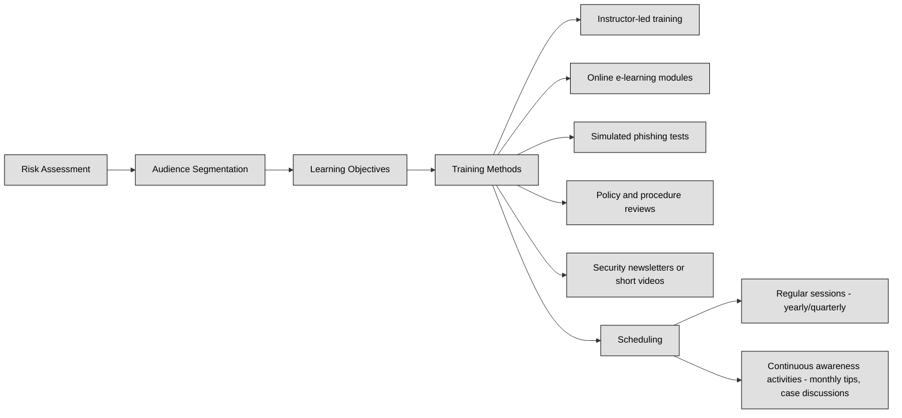

## 6.3.1 Account management ##

Account Management is the set of processes and controls used to create, monitor, update, and delete user accounts in an IT environment. Whether you're dealing with a corporate network, cloud platforms, or physical access systems, proper account management ensures that only the right people have the right access at the right time.

:link: Refer also to [Domain5 Identity and Access Management](https://github.com/lorenzoleonelli/CISSP-Zero-to-Hero/blob/main/DOMAIN5%3A%20Identity%20and%20Access%20Management%20(IAM)/5.0%20Preface.md#50-preface)

In cybersecurity, account management is critical because user accounts are often the first and most common entry point for attackers. Weak, stale, or overly-permissive accounts can allow attackers to bypass security defenses. Compromised accounts can be used to move laterally through systems, steal data, and escalate privileges. That's why modern security programs treat account management as a core defense measure, not just an administrative task.

When account management is handled poorly, systems are at higher risk of both internal and external attacks. Common account-related issues include:
- Orphaned accounts (accounts that still exist after the user has left the company).
- Default passwords or shared passwords.
- Accounts with excessive privileges ("admin rights everywhere").
- Old accounts that haven’t been logged into for months or years.
- Disabled logging or monitoring for account activity.

:necktie: A single compromised account can lead to complete system takeover if privileges are not properly controlled.

Account management typically covers three main areas:
| Category                  | Description | Examples / Key Points |
|----------------------------|-------------|------------------------|
| **Administrative Process** | Defines and enforces policies on how user accounts are handled, ensuring consistency and alignment with business/security goals. | - What information is needed to create an account? - Who can approve access? - How are roles and permissions assigned? - How often are accounts reviewed? - What is the offboarding process when someone leaves? |
| **Technical Implementation** | Covers systems and tools to manage accounts securely, ensuring reliable policy enforcement and visibility of violations. | - Use of centralized identity systems (Active Directory, LDAP, Azure AD, Okta, Google Workspace). - Enforced password policies (length, complexity, expiration). - Role-Based Access Control (RBAC). - Multi-Factor Authentication (MFA). - Logging and monitoring of account usage. |
| **Physical Controls** | Physical protections that prevent attackers from bypassing account protections by gaining direct access to devices or servers. | - Control access to buildings, server rooms, and workstations. - Use hardware tokens or smart cards for identity verification. - Enforce screen lockouts and device encryption. |

Account management is often structured around the Join-Move-Leave model:

| Account Lifecycle Stage | Description |
|------------------------|-------------|
| **Join** | When a new person joins the organization, an account is created for them based on their job role. Permissions are assigned following the principle of least privilege — only giving them the minimum access needed for their work. |
| **Move** | When a person changes roles, their account permissions should be updated. Old access (from the previous job) should be removed, and new permissions added based on the new responsibilities. Many breaches happen because old access was not removed during role changes. |
| **Leave** | When someone leaves the company, their account must be disabled or deleted immediately. Dormant accounts are one of the easiest ways for attackers to maintain access to a system after a breach. |

:ncktie: Account management is a combination of policy, technology, and people. When done right, it ensures that users can work efficiently — while attackers stay out.

### Open Questions ###

1. What is account management and why is it important in cybersecurity?

 
Show answer
 Account management is the process of creating, managing, and removing user accounts in a system. It’s important because accounts control access, and poor management can allow attackers to enter and move through systems unnoticed. 

2. How can poor account management lead to security breaches?

 
Show answer
 Poor account management can leave old, unused, or overly-permissive accounts active, which attackers can exploit to steal data, escalate privileges, or maintain long-term access to a network. 

3. What are the main elements of account management in a secure system?

 
Show answer
 The main elements are: administrative processes (policies and approvals), technical implementation (identity systems, access controls, monitoring), and physical security (protecting devices and servers from direct tampering). 

4. What does the "Join-Move-Leave" model mean in account management?

 
Show answer
 The "Join-Move-Leave" model describes the account lifecycle: creating accounts for new users (join), updating their access when roles change (move), and disabling or deleting accounts when they leave the organization (leave). 

5. How do technical controls like MFA and RBAC support account security?

 
Show answer
 Multi-Factor Authentication (MFA) makes it harder for attackers to use stolen passwords, while Role-Based Access Control (RBAC) limits what users can do, helping prevent unnecessary or dangerous access if an account is compromised. 

---

## 6.3.2 Management review and approval ##

Management Review and Approval is the process where leaders — not just technical teams — formally check and approve security policies, controls, test results, and risk decisions. This is important because cybersecurity is not only a technical problem; it’s also a business risk. Management must be aware of what protections are in place, what risks exist, and what decisions need to be made to reduce exposure. 

:necktie: Without management review, security activities might lack direction, proper funding, or business alignment.

Management is responsible for reviewing security assessment results, vulnerability scans, audit reports, and risk treatment plans. Their approval shows that the organization is taking ownership of its security — it also helps ensure that decisions are documented and that nothing is done informally or without oversight.

Many security frameworks and standards explicitly require management to perform these reviews and sign off on key decisions:
- ISO/IEC 27001 requires management to review the entire Information Security Management System (ISMS) at planned intervals. This includes analyzing audit results, performance metrics, nonconformities, and opportunities for improvement.
- NIST SP 800-53 emphasizes the need for security assessment results to be reviewed by authorizing officials (usually a management role) before systems are allowed to operate. This ensures risks are formally accepted or mitigated.
- SOC 2 (System and Organization Controls) audits require management to show evidence that they monitor and review the effectiveness of security controls. An auditor will ask to see these reviews during the SOC 2 reporting process.
- COBIT (Control Objectives for Information and Related Technologies) requires management oversight for governance and security processes. COBIT stresses the importance of continuous monitoring, formal approval of risk decisions, and making sure business and IT are aligned.

### Open Questions ###

1. Why is management review and approval important in cybersecurity?

 
Show answer
 Management review and approval are important because they ensure that security decisions are known, understood, and approved by business leaders — not just technical staff. It helps align security with business risk and makes sure nothing is left to chance. 

2. Which security frameworks specifically require management to review and approve security processes?

 
Show answer
 Frameworks like ISO 27001, NIST SP 800-53, SOC 2, and COBIT all require management to formally review and approve security processes, risk decisions, and control effectiveness. 

3. How does ISO 27001 handle management review?

 
Show answer
 In ISO 27001, management must regularly review the entire Information Security Management System (ISMS), check performance, look at audit results, and approve any improvements or changes. 

4. What role does management approval play before a system is put into production, according to NIST?

 
Show answer
 According to NIST SP 800-53, management (called an "authorizing official") must review security assessment results and formally approve whether a system is safe to operate before it is used in production. 

5. How does SOC 2 auditing check for management involvement in security?

 
Show answer
 In SOC 2 audits, management must show evidence that they review and monitor the effectiveness of security controls. Auditors often ask for meeting minutes, reports, or signatures proving this oversight happened. 

---

## 6.3.3 Key performance and risk indicators ##

A **Key Performance Indicator (KPI)** is a number or metric that shows how well a team, system, or process is performing compared to its expected goals. In cybersecurity, KPIs help you see if you’re doing the right things to maintain security, and if your operations are efficient.

KPIs are used to measure everyday performance. For example:
- "How fast are we patching security vulnerabilities?"
- "How many security incidents were detected and resolved this month?"
- "How long does it take to detect a threat?" (often called Mean Time To Detect, or MTTD)
- "How long does it take to fix a problem after detection?" (Mean Time To Respond, or MTTR)

:brain: A good KPI tells you: Are we keeping the promises we’ve made to protect the organization?

A Key Risk Indicator (KRI) is a metric that shows the likelihood or early signs of risk — meaning something is about to go wrong, or the environment is becoming unsafe. Where KPIs focus on measuring performance, KRIs focus on spotting danger.

In cybersecurity, examples of KRIs could be:
- "The number of unpatched critical vulnerabilities." If this number goes too high, you’re at serious risk of being attacked.
- "The number of failed login attempts." A spike might signal a brute-force attack is happening.
- "The percentage of users who fail phishing simulations." A high rate means attackers could likely succeed in a real-world phishing attempt.
- "The number of misconfigured cloud storage buckets." Misconfigurations often lead to data breaches.

:brain: KRIs help answer the question: Are we heading toward a security failure?

The following are some best-practices in real-world security management:

| Step | Description |
|------|-------------|
| **Pick the right metrics** | Don’t track everything — focus on what matters to your organization. Each business will have different security needs. |
| **Set clear thresholds** | For example, a KRI might trigger an alert if more than 5% of systems have critical vulnerabilities. A KPI might set a target of patching 90% of vulnerabilities in under 7 days. |
| **Automate measurement** | Use security tools, logs, dashboards, and monitoring platforms to track KPIs and KRIs in real-time. |
| **Share the data with the right people** | KPIs and KRIs should be reviewed regularly by both security teams and management, so the whole company knows where improvements are needed or where risks are increasing. |
| **Take action** | If a KPI shows you're not meeting goals, or a KRI shows danger is rising, it’s time to adjust your process or add new defenses. |

:necktie: In cybersecurity, KPIs and KRIs give you two sides of the same story: performance and risk. Good performance doesn’t always mean low risk, and low risk doesn’t always mean the team is performing at its best.
For example, you could have no security incidents (low risk) for months — but your KPI might reveal that patches are delayed, firewalls haven’t been updated, or backups are failing silently. This situation is dangerous, even if nothing bad has happened yet.

### Open Questions ###

1. What is the main purpose of a Key Performance Indicator (KPI) in cybersecurity?

 
Show answer
 A Key Performance Indicator (KPI) shows how well a security process is performing, helping teams check if they are meeting their goals, such as patching vulnerabilities on time or responding quickly to incidents. 

2. How is a Key Risk Indicator (KRI) different from a KPI?

 
Show answer
 A KRI warns about rising risks or early signs of possible security problems, while a KPI focuses on measuring daily performance against set targets. 

3. Can you give an example of a KPI and a KRI for patch management?

 
Show answer
 A KPI for patch management could be: "90% of critical patches are installed within 7 days." A KRI could be: "More than 20 systems have critical unpatched vulnerabilities," which signals higher risk. 

4. Why is it important to set clear thresholds for KPIs and KRIs?

 
Show answer
 Clear thresholds help teams understand when a metric is normal and when it signals a problem, allowing them to respond early and prevent incidents before they escalate. 

5. Why should both security teams and management review KPI and KRI reports regularly?

 
Show answer
 Regular review ensures that both the technical teams and business leaders know where the organization stands in terms of security performance and risk, so decisions can be made based on real data, not assumptions. 

----

## 6.3.4 Backup verification data ##

In cybersecurity, backups are one of the last lines of defense when something goes wrong — whether it’s a ransomware attack, accidental deletion, hardware failure, or a natural disaster. But having backups is only part of the solution. The real question is: will the backups actually work when you need them?

:bulb: Many organizations make the mistake of assuming that just because a backup job completed, the data is safe. In reality, backups can become corrupted, incomplete, or even unusable without anyone noticing — until it’s too late. That’s why verifying your backup data is critical.

Verification means actively testing your backups to make sure the files can be read, restored, and used as expected. This should be done on a regular schedule, not just once. It helps spot problems early, like:
- Files that were skipped or failed to copy.
- Backups that look complete but can’t be restored.
- Encryption or compression errors.
- Storage device failures (bad sectors, disk corruption).

When a real crisis hits, verified backups can make the difference between a quick recovery and a total disaster.
Best Practices for Backup Verification are:
1. Test Restores Regularly. Pick random backups and restore them to a test environment. Make sure the files open, the system boots, or the database runs — depending on what you backed up.
2. Use Checksums or Hashes. Some backup software can calculate hashes or checksums during the backup and verify them during restore. This ensures the data wasn't silently damaged during storage or transfer.
3. Automate Verification When Possible. Modern backup systems can automatically check for data corruption after writing. Enable these features and schedule regular checks.
4. Document and Audit Backup Tests. Like any other security control, backups need clear documentation. Keep records of test results and review them during security audits.

:bulb: No matter the media, always follow the 3-2-1 Rule: 3 copies of your data, on 2 different media types, with 1 copy offsite.

### Open Questions ###

1. Why is it not enough to just create backups without verifying them?

 
Show answer
 Because a backup can look complete but still be corrupted, incomplete, or unusable. Verification ensures the data can actually be restored when needed. 

2. What is the purpose of performing test restores on backup data?

 
Show answer
 Test restores help confirm that the backup data is valid, complete, and ready for recovery in case of an emergency. They simulate real-world restore situations. 

3. Name one method that backup systems can use to automatically check for data corruption.

 
Show answer
 Backup systems can use checksums or hash values to detect whether data has been changed, damaged, or corrupted during backup or storage. 

4. Why is it important to use different types of storage media for backups?

 
Show answer
 Using different types of media (like disks, tapes, and cloud storage) lowers the risk of losing all backups due to hardware failure, ransomware, or other single points of failure. 

5. How do retention periods help in managing backups safely and effectively?

 
Show answer
 Retention periods define how long backups should be kept, helping organizations balance storage costs, legal requirements, and the need to recover from past incidents. 

---

## 6.3.5 Training and awareness ##

Training and awareness are two of the most important tools for protecting an organization from security risks. Even the best firewalls, encryption, and security tools can fail if employees make simple mistakes like clicking on phishing emails, using weak passwords, or accidentally sharing sensitive data. That’s why people are often called the "weakest link" in cybersecurity. Good training and awareness help turn that weakness into strength.

**Training** is about teaching people specific skills. For example: how to create a strong password, how to report a suspicious email, or how to securely handle customer data. Training is usually more formal and can include classes, online courses, or hands-on exercises.

**Awareness** is about making sure people understand the importance of security and stay alert in their daily work. Awareness is often built through short messages, posters, reminders, and real-world examples of security incidents. It helps create a security-conscious culture.

Planning a training and awareness program starts with understanding the organization’s risks. If employees handle sensitive data, training should focus on secure data handling. If phishing is a common problem, focus on email security. Training needs to match real risks.

The steps for planning an effective training program are:

To improve, you must measure. Some useful metrics to evaluate the effectiveness of training include:

| Metric                     | Description                                                                                   |
|-----------------------------|-----------------------------------------------------------------------------------------------|
| Phishing click rates        | Before and after a training program, monitor how many employees fall for test phishing emails. A lower rate shows improved awareness. |
| Incident reporting          | Are employees reporting more suspicious activity? Higher reporting usually shows growing security awareness. |
| Quiz or test results        | After training, run short tests to check understanding.                                      |
| Policy compliance rates     | Are people following password, encryption, and access policies more consistently?            |
| Audit findings              | A drop in security-related audit failures can show the training is working.                  |

:necktie: Good training and awareness programs don’t end after a single session. Continuous improvement is key. Security threats evolve, so training needs to evolve too.

### Open Questions ###

1. Why are training and awareness important in cybersecurity?

 
Show answer
 Training and awareness are important because even the best technical defenses can fail if people make mistakes, like clicking on phishing links or using weak passwords. Educated employees reduce human risk. 

2. What is the difference between security training and security awareness?

 
Show answer
 Training focuses on teaching specific skills (like how to handle data or report incidents), while awareness focuses on helping people stay alert and think about security in their daily work. 

3. How should an organization decide what topics to cover in its security training?

 
Show answer
 An organization should first identify its main security risks and threats through risk assessments, and then create training that helps employees avoid or handle those specific risks. 

4. Why is it important to adjust training for different roles in the company?

 
Show answer
 Different roles face different risks, so training must be customized. For example, system administrators need technical knowledge, while HR staff must understand data privacy and phishing prevention. 

5. What are some common methods used to deliver security awareness?

 
Show answer
 Awareness can be built using posters, newsletters, short videos, reminder emails, team discussions, and real-world examples of security incidents. These methods help keep security on people's minds. 

6. How can simulated phishing emails help improve security awareness?

 
Show answer
 Simulated phishing emails test whether employees can spot fake or suspicious messages. This helps organizations measure awareness and gives people safe, real-world practice at recognizing attacks. 

7. Why should security training and awareness be continuous, not just one-time?

 
Show answer
 Cyber threats evolve all the time, so security training needs to be regular and ongoing. A one-time course isn’t enough to build strong habits or stay prepared for new attack techniques. 

8. What are useful metrics to measure the success of a security training program?

 
Show answer
 Useful metrics include phishing click rates, test or quiz scores, how often employees report suspicious activity, how many policy violations are found, and whether audit results improve over time. 

---

## 6.3.6 Disaster Recovery (DR) and Business Continuity (BC) ##

Disaster Recovery (DR) and Business Continuity (BC) plans are written to help organizations survive serious problems — like cyberattacks, hardware failures, natural disasters, or even human mistakes. These plans describe the steps to recover critical systems and continue serving customers, even if the business is facing a major disruption.

But just writing these plans isn’t enough. If you don’t test them, you won’t know whether they actually work. Testing shows if the plan is realistic, complete, and if everyone knows what to do in an emergency. Many businesses have learned the hard way that a plan can look perfect on paper but still fail during a real disaster, simply because it was never tested properly.

Testing helps identify missing steps, unclear instructions, outdated contact lists, or technical issues with backup systems before a real crisis hits. It also helps train employees on their roles, making sure that when something goes wrong, people stay calm and follow the process.

There are different ways to test a DR or BC plan. Some are simple, like a tabletop exercise, where team members talk through a scenario to see how the plan holds up. Others are more advanced, like full recovery simulations, where systems are shut down and restored to verify everything actually works as planned.

Testing should also include checking how quickly systems can be recovered (called RTO — Recovery Time Objective) and whether the recovered data is correct and complete (called RPO — Recovery Point Objective). Without these checks, you risk wasting time during a real event or, worse, restoring bad or old data.

Another reason to test is that people, systems, and business processes change over time. A plan that worked fine two years ago might fail today if new software or new staff members weren’t considered.

:necktie: Testing DR and BC plans turns theory into practice. It builds confidence, helps find weaknesses before attackers or disasters do, and increases the chances that your organization can recover smoothly and stay in business no matter what happens.

### Open Questions ###

Why is testing a Disaster Recovery (DR) and Business Continuity (BC) plan important?

 
Show answer
 Testing a DR and BC plan is important because it proves whether the plan actually works during a real incident, helping identify gaps and improving team readiness. 

What could happen if a DR or BC plan is not tested regularly?

 
Show answer
 If the plan is not tested, the organization risks being unprepared for a real disaster, which can cause longer outages, data loss, and financial or reputational damage. 

How often should an organization test its DR and BC plans?

 
Show answer
 A good rule is to test the plans at least once a year, but testing should also happen after major system changes, staff changes, or after real incidents to improve the plan. 

What are some common ways to test a DR or BC plan?

 
Show answer
 DR and BC plans can be tested with tabletop exercises, partial failover tests, or full system recovery simulations to check how well systems and teams respond. 

Why is it important to test Recovery Time Objective (RTO) and Recovery Point Objective (RPO) during DR tests?

 
Show answer
 Testing RTO and RPO ensures the company can restore services fast enough and without unacceptable data loss, meeting business and compliance expectations. 

---

