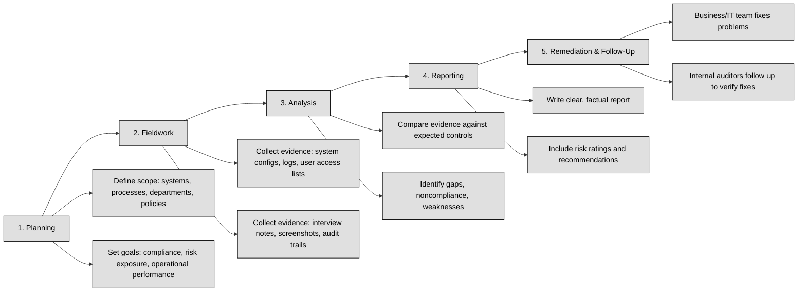
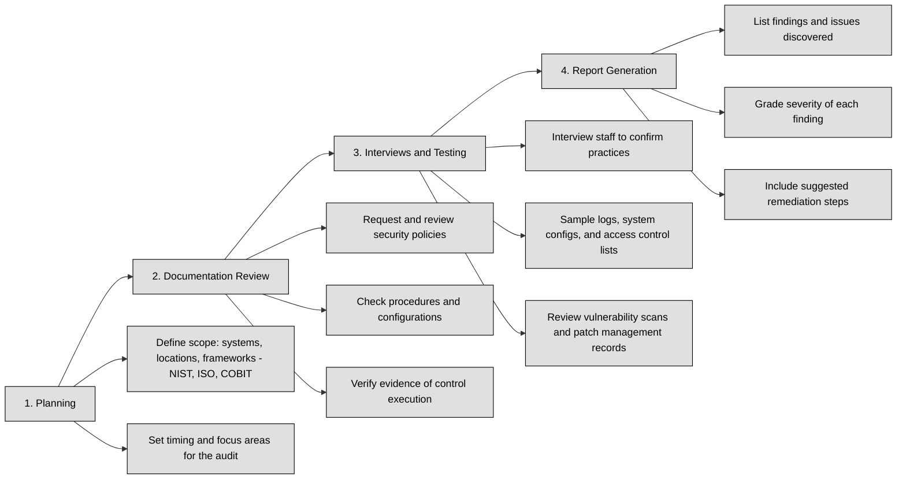

## 6.5.0 Preface ##

Auditing is one of the key ways organizations check whether their security policies, controls, and processes are actually working as intended. 

:necktie: Auditing as a formal, structured way to validate that systems are both compliant with standards and protected against threats.

Audits help uncover weak points in an organization’s defenses, gaps in compliance, or evidence that processes aren’t being followed. They’re not limited to technical systems — they can also apply to management, training, documentation, and even vendor security.

A full audit of every system, file, user, and process would be too big and too expensive for almost any organization. That’s why auditors often rely on sampling.

**Sampling** means checking a portion of the total data or systems instead of everything. For example, instead of reviewing every single user account on a server, an auditor might select a representative group of accounts and check those. If the sample shows consistent problems, it's a sign the whole system might have similar issues. If the sample is clean, the controls are likely working properly

Sampling saves time and money but still gives organizations reasonable confidence about their security posture. There are different sampling techniques, such as:
- Random sampling (select items at random to test)
- Stratified sampling (divide into groups and sample from each group)
- Judgmental sampling (based on the auditor’s experience, picking “high risk” areas to check)

:bulb: Sampling is especially useful when dealing with large and complex systems, like cloud environments, distributed networks, or organizations with multiple offices.

Several well-known frameworks guide auditors on what to check, how to check it, and what to document. These frameworks help create consistency, so audits are reliable and comparable:

| Standard / Framework                                             | Description                                                                                                                                                                                                                                                         |
| ---------------------------------------------------------------- | ------------------------------------------------------------------------------------------------------------------------------------------------------------------------------------------------------------------------------------------------------------------- |
| **SSAE 18 (Statement on Standards for Attestation Engagements)** | Mainly used for third-party service provider audits, such as cloud providers. Ensures vendors manage risk properly when handling customer data. Produces reports like SOC 1, SOC 2, and SOC 3, important for companies managing sensitive data on behalf of others. |
| **ISO/IEC 15408 (Common Criteria)**                              | International standard for evaluating the security properties of IT products. Provides guidance for verifying security claims by assessing both design and implementation.                                                                                          |
| **ISO/IEC 18045**                                                | Companion guide to ISO/IEC 15408, providing step-by-step instructions for auditors on evaluating product compliance with Common Criteria. ISO/IEC 15408 defines *what* to assess; ISO/IEC 18045 defines *how* to assess it.                                         |
| **ISO/IEC 27006**                                                | Defines requirements for organizations that certify others against ISO/IEC 27001 (Information Security Management Systems). Ensures auditors are competent and independent.                                                                                         |
| **NIST Special Publication 800-53A**                             | U.S. federal guidance providing detailed checklists to assess security and privacy controls in information systems. Standardizes audits for government and contractors.                                                                                             |
| **NIST Cybersecurity Framework (CSF)**                           | Broader guidance for managing cybersecurity risk, applicable to government and private organizations. Organized into five functions: Identify, Protect, Detect, Respond, and Recover. Used by auditors to measure cybersecurity maturity.                           |
| **FedRAMP Security Assessment Framework (SAF)**                  | U.S. government program for cloud services. Defines how third-party assessment organizations (3PAOs) test cloud products before federal use. Ensures cloud systems meet strict security controls before handling government data.                                   |

## 6.5.1 Internal (e.g., within organization control) ##

An internal audit is a structured, independent review performed inside an organization to make sure security controls, policies, and procedures are working as expected. While external audits are often done by third parties, internal audits are carried out by the company’s own security, compliance, or audit teams.

The goal of an internal audit is not to "catch" people making mistakes, but to confirm that the organization is actually doing what it says it’s doing — and to identify any gaps before attackers or regulators do.

An internal audit typically follows a clear cycle:

Internal audits are a proactive tool. They:
- Help the organization meet legal, regulatory, and customer security expectations.
- Catch security issues before they become real problems.
- Prepare teams for external audits or certifications.
- Build a culture of accountability and continuous improvement.

:necktie: A strong internal audit process helps turn assumptions into facts and creates a safer, more reliable environment.

### Open Questions ###

1. What is the main purpose of an internal audit in cybersecurity?

 
Show answer
 The main purpose of an internal audit is to check whether security controls, policies, and processes are actually being followed and whether they effectively protect the organization from risks. 

2. How does an internal audit differ from an external audit?

 
Show answer
 An internal audit is performed by the organization's own staff, while an external audit is conducted by an independent third party. Internal audits focus on continuous improvement, while external audits often check for regulatory or contractual compliance. 

3. What are some common areas that internal cybersecurity audits focus on?

 
Show answer
 Internal audits usually focus on access control, patch management, incident response readiness, policy compliance, and data protection (including backups and encryption). 

4. Why is the reporting phase of an internal audit important?

 
Show answer
 The reporting phase is critical because it clearly documents what was tested, what was found, and what should be fixed — giving both technical teams and management a clear roadmap for action. 

5. How do internal audits help improve an organization’s security posture over time?

 
Show answer
 Internal audits help uncover weaknesses early, guide remediation efforts, and create a habit of regular self-assessment, which over time strengthens the organization’s overall security and resilience. 

---

## 6.5.2 External (e.g., outside organization control) ##

An external audit is when an independent team — usually from a professional auditing firm or regulatory body — evaluates an organization’s security controls, policies, and practices. The goal is to confirm that the organization meets security standards, legal requirements, and its own internal policies.

Unlike internal audits, which are performed by your own staff, external audits bring in outside experts who are not part of your daily operations. This helps ensure that the review is objective, thorough, and free from internal bias or oversight blind spots.

External audits help an organization to:
- Validate its security posture from an independent and unbiased perspective.
- Demonstrate compliance with regulatory, contractual, or industry standards.
- Discover gaps and weaknesses that internal teams might miss.
- Build trust with customers, regulators, and leadership by providing formal proof of security maturity.

In some industries, regular external audits are not optional — they are mandatory for operating legally, handling sensitive data, or maintaining specific certifications (like PCI-DSS, ISO 27001, or SOC 2).
An external audit usually follows a structured process:

:necktie: External audits are a critical checkpoint for cybersecurity programs. They give leadership, regulators, and business partners confidence that an organization’s security isn’t just good on paper — it’s good in practice.
While internal teams handle day-to-day monitoring and risk management, external audits provide a fresh set of eyes to ensure nothing is missed and that security investments are producing the right results.

### Open Questions ###

ChatGPT said:

What is the main purpose of an external audit in cybersecurity?

 
Show answer
 The main purpose of an external audit is to have an independent party verify that an organization's security controls are working as intended and meet legal, contractual, and industry standards. This provides assurance to stakeholders that the organization is effectively managing cybersecurity risks. 

How does an external audit differ from an internal audit?

 
Show answer
 An external audit is performed by outside experts, while internal audits are conducted by employees or teams inside the organization. External audits provide an unbiased third-party perspective, offering objectivity and validation that internal reviews may lack. 

At what stages does an external audit usually happen?

 
Show answer
 External audits typically happen in four stages: planning, documentation review, interviews and testing, and final reporting. Each stage ensures that security controls are assessed thoroughly and consistently. 

Why are external audits considered more objective than internal reviews?

 
Show answer
 External auditors do not work for the organization and have no personal stake in the results. Their independence ensures a neutral and honest evaluation of the security posture, making findings more credible to regulators, partners, and customers. 

What are some common focus areas during an external cybersecurity audit?

 
Show answer
 Auditors usually focus on access control, change management, incident response readiness, policy compliance, and physical and network security. These areas help assess whether critical security processes and protections are effective and aligned with industry standards. 

---

## 6.5.3 Third-party (e.g., outside of enterprise control) ##

A third-party audit is an independent assessment of a vendor, supplier, or partner’s security controls. The goal is to confirm that the third party follows good security practices and meets the required standards — especially when they handle your organization’s data, systems, or services.

This process helps ensure that a company’s security isn't just strong inside its own walls, but also across its entire supply chain.

Third-party audits are usually performed by external, independent auditing firms or specialists — not by the company itself, and not by the vendor being audited. The auditor’s job is to be neutral and to deliver clear findings.

Sometimes the audit is part of a contractual agreement; other times it’s done before signing a contract, or during vendor re-qualification.

### Open Questions ###

1. Why are third-party audits important for cybersecurity?

 
Show answer
 Third-party audits are important because even if your internal systems are secure, a vendor or partner’s weak security could still expose your organization to breaches or data loss. They help ensure that external parties handling your data maintain adequate protections. 

2. Who typically performs a third-party audit, and why must they be independent?

 
Show answer
 Third-party audits are usually performed by independent external auditors. Independence is crucial to ensure the findings are unbiased and credible for both the organization and the vendor, providing trust in the audit results. 

3. What kind of security aspects are usually reviewed during a third-party audit?

 
Show answer
 A third-party audit typically reviews policies, technical security controls, physical protections, incident response readiness, and compliance with recognized standards. This ensures the vendor’s security posture meets industry expectations and contractual requirements. 

4. What are some common security frameworks used in third-party audits?

 
Show answer
 Common frameworks include SOC 2, ISO/IEC 27001, PCI DSS, and NIST SP 800-171. The choice depends on the type of data or service being evaluated and the regulatory or contractual requirements applicable. 

5. How do third-party audits help reduce supply chain risk?

 
Show answer
 Third-party audits help identify gaps in a partner’s security before problems occur, reducing the chances that a weak link in the supply chain could be exploited by attackers. They provide early warning and assurance that vendors meet security expectations. 

---

## 6.5.4 Location (e.g., on-premises, cloud, hybrid) ##

When planning or performing a security audit, it’s important to understand where the systems, data, and controls are located — this directly affects how the audit is done. In modern environments, organizations often use a mix of different setups: on-premises, cloud, or hybrid. Each location type brings different risks, tools, and audit considerations.

**On-Premises Audits.** On-premises means the systems, servers, and data storage are physically located inside the organization’s buildings, usually in company-owned data centers. Auditors can directly inspect physical security (locks, badges, CCTV), network devices, and server configurations. On-premises audits give clear visibility and control but require access to the physical location and staff.

**Cloud Audits.** In cloud environments, data and systems live on servers owned by cloud providers like AWS, Microsoft Azure, or Google Cloud. Auditors focus less on physical security and more on the shared responsibility model, where the cloud provider secures the infrastructure, but the customer is responsible for configurations, identity management, and data protection. Cloud audits rely heavily on documentation, logs, security policies, and sometimes provider certifications (like ISO 27001 or SOC 2 reports).

**Hybrid Audits.** Many companies combine both approaches — some systems run on-premises while others are hosted in the cloud. This is called a hybrid environment. Hybrid audits must cover both the physical world and the virtual/cloud world. This means auditors will verify internal processes, cloud configurations, data flows between systems, and how security is maintained across both locations.

