## 7.03 Perform Configuration Management (CM) (e.g., provisioning, baselining, automation) ##

In cybersecurity and IT management, change is inevitable — but chaos must never be.
Configuration management is the discipline that keeps us anchored to constant evolution.
Without it, even the strongest security measures can be eroded by drift, inconsistency, and human error. 

In configuration management, each critical element of our systems is called a **Configuration Item (CI)**.

A CI can be:
- A server
- A network switch
- A database
- An application
- A firewall rule
- A document, like a system configuration guide

:necktie: If you don’t know what pieces you have, you can't secure them, update them, or replace them correctly.

:necktie: Tracking CIs helps avoid surprises when systems fail or are attacked — because you already know exactly what you're protecting.

The **Configuration Management Plan (CMP)** outlines:
- What CIs are included
- How changes are reviewed and approved
- How baselines are created and maintained
- How records are kept up to date

A CMP ensures every adjustment is documented, tested, and deliberate — not just "Joe from IT making a quick fix on Friday night."

:necktie: The CMP supports traceability, auditability, and control — three core pillars of secure environments.

```mermaid

flowchart TD
    A["Configuration Management"]:::main --> B["Configuration Items"]:::mid
    A --> C["Configuration Management Plan"]:::mid
    A --> D["Security and Control Benefits"]:::mid

    %% Configuration Items
    B --> B1["Servers"]:::detail
    B --> B2["Network switches"]:::detail
    B --> B3["Databases and applications"]:::detail
    B --> B4["Firewall rules"]:::detail
    B --> B5["Configuration documents"]:::detail

    %% Configuration Management Plan
    C --> C1["Defines which CIs are included"]:::detail
    C --> C2["Describes change review and approval process"]:::detail
    C --> C3["Establishes baselines and version control"]:::detail
    C --> C4["Keeps records accurate and up to date"]:::detail

    %% Benefits
    D --> D1["Ensures traceability of every change"]:::detail
    D --> D2["Supports auditability and accountability"]:::detail
    D --> D3["Prevents unauthorized or quick modifications"]:::detail
    D --> D4["Maintains stability during constant evolution"]:::detail

    %% Styles
    classDef main fill:#444,stroke:#000,stroke-width:2px,color:#fff
    classDef mid fill:#777,stroke:#333,stroke-width:1px,color:#fff
    classDef detail fill:#eee,stroke:#555,stroke-width:1px,color:#000

    classDef center fill:#ffffff,color:#000000,stroke:#000000,stroke-width:1px,font-weight:bold
    classDef node fill:#e0e0e0,color:#000000,stroke:#000000,stroke-width:1px

```

**Provisioning** is the act of setting up IT resources — servers, user accounts, cloud instances — according to predefined standards. Imagine provisioning like opening a new restaurant:
You don't just let chefs bring whatever ingredients they like; you give them an approved supplier list to maintain food safety and quality.

Provisioning ensures systems:
- Start off secure
- Have only necessary services
- Follow organizational policies from the first moment

:brain: **Hardening** is the process of configuring a system securely by removing unnecessary components and tightening settings to reduce vulnerabilities. It is crucial during provisioning to ensure that new systems are secure from the start, minimizing risks before they become operational.

In modern environments, provisioning and configuring servers manually is too slow — and error-prone.

With **Infrastructure as Code (IaC)**, we define our infrastructure in files (like YAML, JSON, or Terraform templates). Think of it as programming your data center.You can version control it, review it, and deploy it with the press of a button.

:bulb: IaC standardizes environments, speeds up recovery after incidents, and automates security controls from the ground up.

Configuration management can't happen without a reliable, real-time asset inventory.

In cybersecurity, asset inventories tell you:
- What devices are active
- What software is running
- What network paths exist

Tools like **CMDBs (Configuration Management Databases)** help organize this information, but even simple spreadsheets (updated religiously!) can work for small organizations.

A baseline is the approved, secure configuration for a system. Think of it like a dress code for a formal event. If a guest shows up in jeans and sneakers, you instantly know something's wrong.

Baselines allow:
- Fast detection of unauthorized changes
- Easier audits
- Consistent deployment across environments

:bulb: Images, like **system snapshots** or **gold master images**, serve as baselines by capturing a secure, fully configured state of a machine. They can be quickly deployed to provision new systems consistently, ensuring all devices start from a trusted, hardened configuration. This helps maintain security standards and speeds up recovery if a system needs to be rebuilt.

Finally, the magic ingredient: **Automation**. Automation in configuration management isn't about replacing humans — it's about removing human error from repetitive, critical tasks.

Examples:
- Automatically scan systems for configuration drift
- Auto-remediate deviations (e.g., reset an insecure setting)
- Auto-provision secure VMs using IaC templates

Think of automation like autopilot in aviation: pilots still supervise, but systems handle the repetitive parts perfectly — freeing pilots to focus on anomalies and judgment calls.

### Open Questions ###

1. Why is configuration management critical in cybersecurity and IT management?  

  
Show answer

Configuration management is critical because it prevents drift, inconsistency, and human error from eroding security in constantly evolving IT environments.

2. What is a Configuration Item (CI) in configuration management?  

  
Show answer

A Configuration Item (CI) is any critical component of a system — like a server, database, application, or firewall rule — that must be tracked and managed.

3. What key document acts as the "blueprint" for managing configuration items securely?  

  
Show answer

The Configuration Management Plan (CMP) acts as the blueprint for identifying, changing, and maintaining configuration items securely and systematically.

4. How does a Configuration Management Plan (CMP) strengthen security?  

  
Show answer

A CMP strengthens security by ensuring every change is reviewed, tested, documented, and controlled, avoiding risky ad hoc modifications.

5. In cybersecurity terms, what does provisioning mean?  

  
Show answer

Provisioning is the process of setting up IT resources according to predefined secure standards to ensure systems start hardened and compliant.

6. Why is hardening essential during provisioning?  

  
Show answer

Hardening is essential during provisioning because it removes unnecessary features and secures settings to reduce vulnerabilities from the very beginning.

7. How does Infrastructure as Code (IaC) enhance configuration management?  

  
Show answer

Infrastructure as Code (IaC) enhances configuration management by allowing infrastructure to be defined, versioned, and deployed automatically and consistently.

8. Why is maintaining an up-to-date asset inventory crucial in cybersecurity?  

  
Show answer

Maintaining an up-to-date asset inventory is crucial because you can't protect or manage systems you don't know exist.

9. How do system images serve as baselines?  

  
Show answer

System images serve as baselines by capturing a secure, fully configured machine state that can be replicated consistently across new deployments.

10. What role does automation play in configuration management?  

  
Show answer

Automation in configuration management removes human error from repetitive tasks like detecting drift, fixing deviations, and securely provisioning systems.

---

