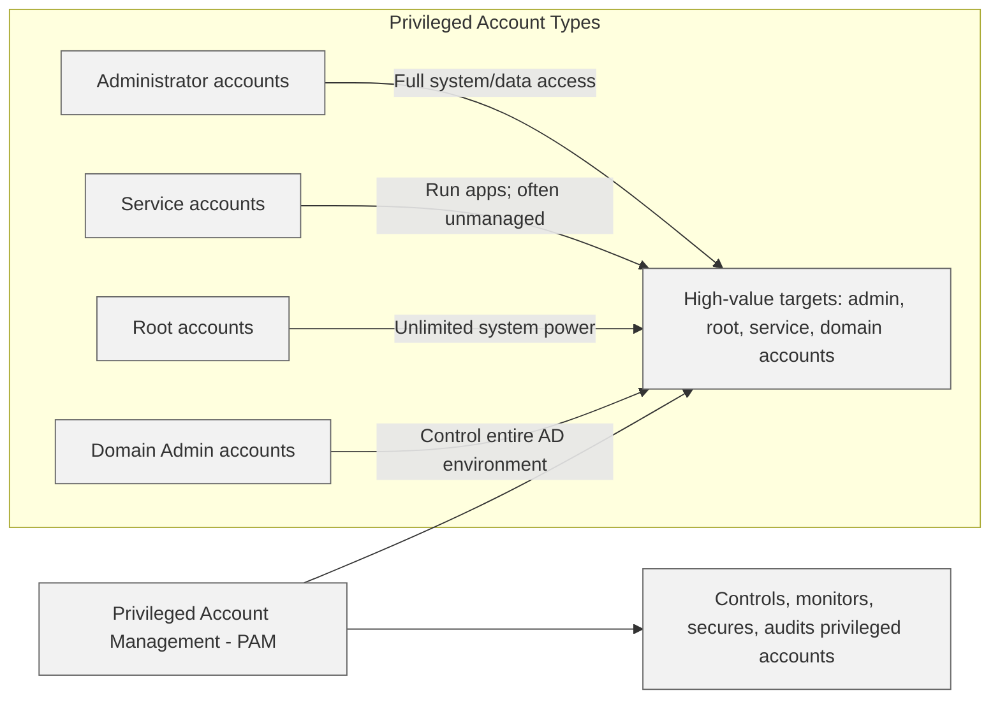

## 7.4.1 Need-to-know/least privilege ##

In cybersecurity, two of the oldest and most powerful principles are need to know and least privilege. They are timeless because they directly tackle human risk: curiosity, error, ambition, and sometimes malice.
Imagine you’re building a high-security vault. Not everyone needs the combination. Not everyone should even know where the vault is. In cybersecurity, the "vault" is sensitive data, critical systems, and security operations.

> ℹ*Need to know says:* just because you have a badge doesn’t mean you get access. You must have a specific, justifiable need for that exact information at that moment.
>*Least privilege says:* even if you need access, you should only get the minimum level of rights necessary to do your job — and no more.

Both principles work together. They create a layered defense where users have access to what they must have, not what they could want. Why? Because insiders are responsible for a massive percentage of breaches, whether intentionally or accidentally. A curious employee, a compromised account, or a disgruntled admin can do devastating damage — unless we architect our environments smartly.

> ℹNeed to know originally comes from the military. Think of wartime spies: if captured, the less they know, the less they can reveal. In cybersecurity, information is power — but also a liability if mishandled.

> ⚠ Someone could have the highest clearance in the organization, but if their duties don’t require access to a particular project, they should be denied access.

For example:
- A database administrator may have full access to database structures but should not automatically view sensitive HR salary data.
- A security analyst monitoring network traffic doesn’t need access to encrypted customer financial records.

**Need to know is dynamic** — it can change based on current roles and current projects. That’s why access reviews and role re-certifications are critical operational tasks.

> ✓ If "need to know" is about what information you access, "least privilege" is about what powers you are granted.

Least privilege ensures for example:
- A user installs a printer without gaining power to modify security policies.
- A developer can deploy code to a testing server but cannot access the production customer database.
- An intern can review public marketing materials but cannot touch legal contracts.

Implementing least privilege reduces:
- Accidental misconfigurations
- Malicious actions
- The blast radius of a compromised account

In highly sensitive environments, we add another layer: **security clearances**. Clearance is about trustworthiness, verified through background checks and screening processes. Clearance alone does not guarantee access — it simply means the person is considered trustworthy enough if they have a need to know.
There are typically different clearance levels (for example confidential, secret, top secret) and access to information is further compartmentalized based on projects and operations (think “compartments” in intelligence agencies).

Example:
- Two employees may both have "Secret" clearance.
- Only one of them has a "need to know" regarding a covert research project.
- Therefore, only one is authorized to access that data.

> ✓ Security clearance ensures the right kind of people are working with sensitive material. Need to know and least privilege ensure those people only access what they truly require.

### Open Questions ###

1. Why is the principle of "need to know" critical even for individuals who possess a high-level security clearance?  

  
Show answer

Because clearance only confirms trustworthiness, not operational necessity. Even if someone is trustworthy, access to information should be granted strictly based on whether their current job duties require it, limiting potential exposure.

2. What is the main difference between "least privilege" and "need to know" in cybersecurity access control?  

  
Show answer

Need to know is about what information you can access; least privilege is about what powers or capabilities you are granted. Need to know controls access to information, while least privilege controls the scope of actions a user can perform.

3. In a practical IT environment, what is one major risk of giving all users administrative privileges by default?  

  
Show answer

The risk is accidental or malicious system compromise. Users with administrative privileges can unintentionally misconfigure systems or be targeted by attackers who can then easily escalate privileges across the network.

4. How does the "least privilege" principle help limit the impact of a successful cyberattack?  

  
Show answer

It reduces the attack surface and limits damage. If an account is compromised, the attacker only gains minimal access, slowing their progress and giving defenders more time to detect and respond.

5. What role do periodic access reviews play in supporting the principle of least privilege?  

  
Show answer

Access reviews ensure that permissions and privileges remain aligned with current job roles. Without them, users accumulate unnecessary rights over time ("privilege creep"), increasing the risk of insider threats and breaches.

6. Why should organizations separate administrative accounts from standard user accounts for system administrators?  

  
Show answer

Because separating accounts limits exposure during normal operations. If administrators use standard accounts for daily activities and separate privileged accounts only when needed, it reduces the risk from phishing, malware, and user error.

7. If two employees both hold the same security clearance level, can they access the same information? Why or why not?  

  
Show answer

No, because access still depends on a demonstrated need to know. Even if clearance levels match, individuals must have a specific, current need for the information in order to access it.

8. What is the risk if an organization relies solely on security clearances without enforcing need to know and least privilege?  

  
Show answer

The organization faces increased insider risk and data exposure. Clearances without strict access controls could allow users to access more information than necessary, increasing the chance of breaches or leaks.

9. How does Privileged Access Management (PAM) help enforce least privilege in organizations?  

  
Show answer

PAM tools enforce least privilege by granting elevated rights only temporarily and only for specific tasks. They also require approvals, log all activities, and often integrate multifactor authentication to secure privileged sessions.

10. Why is it important to monitor and log all activities performed by accounts with administrative privileges?  

  
Show answer

Monitoring administrative activities provides traceability and accountability. If something goes wrong — such as unauthorized changes or a breach — organizations can quickly identify what happened, who was involved, and take corrective action.

---

## 7.4.2 Separation of Duties (SoD) and responsibilities ##

Segregation of Duties (SoD) is the `practice that stops any single individual from having unchecked power or control over critical processes`. It’s a security philosophy rooted in an understanding of human nature: mistakes happen, temptations arise, and nobody should be in a position to harm an organization — intentionally or accidentally — without others noticing.

> ℹ SoD ensures no single person can both commit and conceal errors, fraud, or sabotage. It’s about building a resilient organization, not one vulnerable to a single point of failure.

> 🔗 Refer also to 1.8.2 in [1.8 Contribute to and enforce personnel security policies and procedures](../DOMAIN1%20-%20Security%20and%20Risk%20Management/1.8%20Contribute%20to%20and%20enforce%20personnel%20security%20policies%20and%20procedures.md)

**Two-person control** (sometimes called dual control) is exactly what it sounds like: `two qualified individuals must work together to complete a sensitive action`.
Think of launching a nuclear missile. Movies often show two officers turning keys at the same time — a vivid example of two-person control. No single individual, no matter how loyal or competent, should have the ability to unleash something that important alone.

Two-person control might apply for example  to:
- Deploying critical software updates
- Issuing or revoking digital certificates
- Accessing sensitive cryptographic keys
- Making changes to firewall or access control configurations

By requiring two people, organizations reduce the risk of malicious insiders, errors, and oversight failure. It’s a layer of protection, a second set of eyes, and a psychological deterrent all in one.

> ℹ Two-person control does more than catch mistakes — it forces collaboration and encourages accountability. When someone knows a peer is verifying their work, they’re more likely to double-check it themselves.

> ⚠By **rotating people** through different roles and responsibilities over time, organizations prevent individuals from building unassailable silos of knowledge and control. It’s about preventing anyone from becoming irreplaceable — because in cybersecurity, nobody should be irreplaceable.

*Imagine an IT administrator who’s been managing the same critical system for eight years without oversight. They might set up backdoors, bypass processes, or simply develop habits nobody questions. Not necessarily out of malice — sometimes, it’s just convenience or "the way it’s always been."*

When you rotate jobs:
- `Hidden bad practices` are exposed
- `Fresh perspectives` find overlooked vulnerabilities
- `No` one person can maintain `secret control` indefinitely

> ✓ Rotation is a natural audit. It creates an environment where "that’s just how it's done" is no longer an acceptable answer.

> ℹIn practice, organizations might require security administrators, database managers, or auditors to switch roles temporarily or permanently at regular intervals. Even limited rotations, like covering another administrator’s duties for a month, are valuable.

Job rotation also strengthens `organizational resilience`: if someone leaves unexpectedly, the knowledge doesn’t leave with them.

*Imagine forcing an employee to take two consecutive weeks off work — not just a perk, but a critical security measure. That’s the logic behind mandatory vacations.When someone who manages critical systems steps away, it creates an opportunity to:
- Review their work
- Spot anomalies or irregularities
- Detect long-running schemes or mistakes*

If someone is involved in wrongdoing — say, siphoning off funds, manipulating logs, or hiding unauthorized changes — they often must be present to cover their tracks. Forced absence disrupts that ability.

A classic example comes from the banking world: many cases of embezzlement were uncovered only when employees were on vacation and colleagues noticed discrepancies.
In cybersecurity, the same principle applies. Mandatory vacations help detect:
- Log manipulation
- Unauthorized data access
- Configuration drift
- Bypass of security controls

Moreover, vacations reduce burnout among security and IT staff — another key risk factor for errors and security incidents.

Importantly, for vacations to be effective, organizations must actively monitor systems and operations during an employee's absence, not just "hold the fort."

> 🔗 Refer also to 1.8.2 in [1.8 Contribute to and enforce personnel security policies and procedures](../DOMAIN1%20-%20Security%20and%20Risk%20Management/1.8%20Contribute%20to%20and%20enforce%20personnel%20security%20policies%20and%20procedures.md)

### Open Questions ###

1. What is the primary purpose of segregation of duties in cybersecurity?

 
Show answer
 The primary purpose of segregation of duties is to ensure that no single individual has unchecked control over critical systems or processes, reducing the risk of fraud, errors, or sabotage. 

2. How does two-person control reduce risk in critical operations?

 
Show answer
 Two-person control requires two qualified individuals to complete sensitive tasks together, creating a second layer of verification and accountability that reduces both mistakes and insider threats. 

3. Why is job rotation important for organizational security?

 
Show answer
 Job rotation prevents individuals from building unassailable control over systems, helps expose hidden vulnerabilities, and ensures operational knowledge is distributed across multiple team members. 

4. What risks are mitigated by enforcing mandatory vacations?

 
Show answer
 Mandatory vacations force individuals to step away from their duties, allowing anomalies or long-running misconduct to surface when others monitor their systems and responsibilities. 

5. How does segregation of duties protect against insider threats?

 
Show answer
 Segregation of duties protects against insider threats by making malicious acts harder to commit alone and easier to detect through enforced collaboration and transparency. 

6. In cybersecurity, give an example of where two-person control might be used.

 
Show answer
 An example of two-person control in cybersecurity is requiring two administrators to approve critical firewall rule changes before they are applied to production systems. 

7. What is the relationship between job rotation and hidden vulnerabilities?

 
Show answer
 Job rotation helps uncover hidden vulnerabilities because new individuals can spot bad practices, unauthorized changes, or security weaknesses that entrenched employees might overlook. 

8. Why are mandatory vacations considered an audit tool?

 
Show answer
 Mandatory vacations act as an audit tool by removing a person from their environment, which can reveal unauthorized activities or security irregularities that require constant cover-up. 

9. How does segregation of duties contribute to organizational resilience?

 
Show answer
 Segregation of duties builds organizational resilience by ensuring systems and operations do not depend on the integrity or availability of a single individual. 

10. Why is relying on “trust me” systems dangerous in cybersecurity?

 
Show answer
 Relying on "trust me" systems is dangerous because it assumes individuals are infallible; segregation of duties designs security that doesn’t depend on perfect human behavior. 

---

## 7.4.3 Privileged account management ##

Privileged Account Management (PAM) `refers to the strategies, processes, and tools used to control, monitor, secure, and audit the use of privileged accounts`. These accounts — administrator accounts, service accounts, root accounts, and others — have elevated rights that can configure systems, access sensitive data, and control networks.

Privileged accounts come in many flavors:

| Account Type                  | Description                                                                                                  |
| ----------------------------- | ------------------------------------------------------------------------------------------------------------ |
| Administrator accounts        | Can create and delete other users, change configurations, and access all data.                               |
| Service accounts              | Run applications and often need access to system resources — but they’re frequently forgotten and unmanaged. |
| Root accounts                 | (Especially in Unix/Linux) have unlimited power over a system.                                               |
| Domain administrator accounts | Can control an entire Active Directory environment.                                                          |

Each type is a high-value target for attackers — and often a weak link if left unmanaged.

> ℹ Effective PAM isn't just about passwords; it’s about principles and practices that reduce risk.

The principle of least privilege means giving users the minimum level of access they need to perform their job — no more, no less.

In PAM, this translates to:
- Only granting admin rights when needed
- Removing rights immediately when no longer necessary
- Limiting lateral movement for attackers

> ℹ CISSP loves asking about least privilege because it’s a foundational concept in cybersecurity architecture.

In PAM:
- Admins might have access to system settings, but a different team reviews major changes.
- Auditing rights are separated from operational rights.

> ℹ Separation of duties creates natural checkpoints that protect systems.

Dedicated PAM solutions, like CyberArk, BeyondTrust, or Thycotic, are designed to manage privileged credentials effectively. These systems can:
- `Vault passwords` in encrypted repositories.
- `Rotate passwords` automatically after each use.
- `Monitor sessions` to detect suspicious behavior.
- `Record privileged` activities for auditing.

> ✓ Think of a PAM solution as a `smart safe`: It not only holds the keys but also tracks who uses them, when, and why.

Here's a table summarizing core features:

| Feature             | Purpose                          | Real World Effect                              |
|---------------------|----------------------------------|------------------------------------------------|
| Password Vaulting   | Secure storage of credentials    | No more passwords written on sticky notes      |
| Session Monitoring  | Watch and record privileged sessions | Catch bad behavior early                    |
| Password Rotation   | Frequently change passwords      | Limits window of opportunity for attackers     |
| Access Justification| Require users to justify access  | Deters unnecessary privileged use              |

Beyond installing a PAM system, organizations must:
- **Conduct privileged account discovery**: You can’t protect what you don’t know exists. Regularly scan the network for hidden or forgotten accounts.
- **Implement just-in-time (JIT) access**: Provide elevated access only when needed, then immediately revoke it. It's like renting a car — you get it only when you need it, and you return it immediately.
- **Enforce multi-factor authentication (MFA)** for all privileged accounts: Passwords alone are never enough.
- **Set up alerts**: If someone accesses a critical server at 2 AM without a scheduled change window, the SOC (Security Operations Center) should know immediately.

Despite best intentions, **PAM often fails due to human factors and system complexity**, for example in the following cases:

- **Password Sharing**: Teams sometimes share admin credentials “for convenience.” This defeats accountability. Use named accounts and strict controls.
- **Overprovisioning**: Granting "temporary" admin rights and forgetting to remove them later. Automate de-provisioning wherever possible.
- **Blind Spots**: Service accounts running critical processes often get neglected. Attackers love to exploit these accounts because nobody’s watching them.

### Open Questions ###

1. Why are privileged accounts considered "high-value targets" for attackers?  

  
Show answer

They offer broad control over systems and data, making them an efficient target for attackers seeking maximum impact.

2. What cybersecurity principle dictates that users should only be granted the minimum access necessary to perform their tasks?  

  
Show answer

Least privilege.

3. How does "separation of duties" help improve security in privileged account management?  

  
Show answer

It prevents any single individual from having unchecked power over critical operations, reducing fraud and error risks.

4. What is the purpose of a password vault in a PAM system?  

  
Show answer

To securely store privileged credentials and control their access.

5. In a PAM system, what does password rotation achieve?  

  
Show answer

It limits credential exposure time, reducing the risk of compromised passwords being exploited.

6. What is a common risk associated with service accounts if they are not properly managed?  

  
Show answer

They often retain excessive, unmanaged access with static credentials, creating hidden vulnerabilities.

7. Why is multi-factor authentication (MFA) especially important for privileged accounts?  

  
Show answer

It ensures that even if a password is compromised, an additional authentication factor is required to gain access.

8. What is "just-in-time access" in the context of PAM?  

  
Show answer

Temporary privileged access granted only when needed and immediately revoked after use.

9. How does session monitoring in a PAM system reduce security risks?  

  
Show answer

It provides visibility into privileged activities, enabling the detection of anomalous or unauthorized behavior.

10. How does cloud computing challenge traditional privileged account management practices?  

  
Show answer

It introduces dynamic, short-lived credentials like API keys and requires new access management models like Zero Trust.

---

## 7.4.4 Job Rotation ##

*Imagine this: you're the CISO of a mid-sized financial institution. You walk into the SOC (Security Operations Center) and notice that the same analyst has been handling log monitoring for the past 18 months. He’s excellent at his job — but nobody else knows his exact process, and frankly, he doesn’t document much. One day, he gets poached by a larger firm. Suddenly, that knowledge — along with visibility into some deeply technical patterns — disappears with him. That’s when you realize: knowledge silos are security risks too.*

**Job Rotation** is a deliberate policy of `moving personnel through different roles` or responsibilities within an organization over time. It’s not just an HR initiative — in cybersecurity, it’s a strategic control to reduce risk, detect fraud, enhance operational resilience, and retain knowledge.

> ✓ Job rotation is about breaking dependency on any one person, while building a security-conscious, flexible, and cross-functional workforce.

Security is built on layers — but people can become both a critical asset and a single point of failure. Job rotation ensures that others will eventually step into that role, either temporarily or permanently, forcing transparency and improving oversight.

Let’s go deeper into why this practice is so powerful in information security:

| Benefit                            | Description                                                                                                                                                                                                                                                                                                                                                                                                                            |
| ---------------------------------- | -------------------------------------------------------------------------------------------------------------------------------------------------------------------------------------------------------------------------------------------------------------------------------------------------------------------------------------------------------------------------------------------------------------------------------------- |
| **Fraud Detection and Prevention** | People are less likely to commit fraud if they know someone else will soon step into their shoes. It’s like switching the dealer in a poker game — it disrupts any chance of long-term manipulation. Rotating roles periodically increases the chance that irregularities will be noticed, especially in finance, auditing, or system admin roles. Think of job rotation as an internal audit mechanism that runs naturally over time. |
| **Cross-Training and Redundancy**  | If only one person knows how to respond to a ransomware attack, you have a resilience problem. Rotation creates institutional memory and makes teams more agile. When a person steps into another role, they gain new perspective and experience — and that makes the entire team stronger.                                                                                                                                            |
| **Boosting Policy Compliance**     | Security policies often exist on paper but aren’t enforced in practice. When roles rotate, bad habits or non-compliant behavior often surface. A fresh pair of eyes can quickly spot misconfigurations, outdated controls, or undocumented exceptions.                                                                                                                                                                                 |

Common challenges and solutions in implementing job rotation policies are:

| Challenge                                 | Solution                                                 |
| ----------------------------------------- | -------------------------------------------------------- |
| Resistance from employees                 | Educate on benefits, involve HR, and reward adaptability |
| Risk of knowledge loss during transitions | Pair with documentation and overlap periods              |
| Operational disruption                    | Start with lower-risk roles and scale gradually          |
| Too rigid rotation schedule               | Make it policy-based but adaptable to business needs     |

### Open Questions ###

1. What is the primary security benefit of implementing job rotation?  

  
Show answer

It helps detect fraud or policy violations by introducing oversight when new individuals take over sensitive roles. This oversight makes it harder for long-term misuse of privileges to go unnoticed.

2. How does job rotation align with the principle of least privilege?  

  
Show answer

It limits long-term privilege buildup by granting only the necessary access for the duration of each rotation. Once the role changes, old privileges are revoked, reducing the risk of unnecessary access.

3. Why is job rotation considered both a preventive and a detective control?  

  
Show answer

It discourages long-term abuse by preventing individuals from holding unchecked control indefinitely, and it helps uncover misconfigurations or suspicious activity through fresh oversight from new role holders.

4. How can job rotation support business continuity and disaster recovery efforts?  

  
Show answer

It ensures that multiple team members are capable of handling critical tasks during emergencies or absences. This reduces reliance on a single person and improves organizational resilience.

5. What practical challenge must organizations address to successfully implement job rotation?  

  
Show answer

They must provide thorough documentation and effective cross-training to maintain productivity during transitions. Without these, operations can be disrupted, and knowledge gaps may appear.

---

## 7.4.5 Service level agreements (SLA) ##

Service Level Requirements (SLR) are a wishlist crafted by the business, outlining what they expect from a service from a security and performance standpoint. SLRs are often created during the planning or procurement phase and are shaped by risk assessments, business impact analyses (BIA), and compliance requirements.

This is not a legally binding contract—it’s a requirement. But it’s important because it sets the stage for negotiating realistic and enforceable SLAs with vendors or internal IT teams.

Why SLRs Matter:
-They reflect the real-world risk appetite of the organization.
- They define what matters most (e.g., response times, uptime, forensic readiness).
- They serve as the foundation for the SLA.

Once you've defined your SLRs, you translate them into Service Level Agreements (SLAs). These are formal contracts between service providers (internal or external) and the customer. They specify:
- What services will be delivered,
- How performance will be measured,
- What happens if expectations aren't met.

> ⚠ SLAs must be realistic, measurable, and enforceable.

Security-specific SLA clauses might include:
- Incident response timeframes (e.g., "Severity 1 incidents will be responded to within 1 hour").
- Patch deployment SLAs (e.g., "Critical vulnerabilities will be patched within 5 business days").
- Uptime and availability (e.g., "99.99% uptime for the SIEM platform").
- Data retention periods, encryption standards, or log delivery times.

Once the SLA is signed, many organizations make the mistake of filing it away like a forgotten warranty. That’s dangerous. A dormant SLA is worse than having none at all. This is where SLA monitoring becomes essential.

What Is SLA Monitoring? It’s the ongoing process of measuring, tracking, and reporting whether the service provider (or internal team) is meeting their promised service levels.

**SLA monitoring** is usually:
- **Automated**: Using dashboards or SIEM tools to track uptime, ticket response times, etc.
- **Periodic**: With monthly or quarterly reviews.
- **Tied to KPIs**: Such as Mean Time to Detect (MTTD) and Mean Time to Respond (MTTR).

### Open Questions ###

1. What is the main difference between a Service Level Requirement (SLR) and a Service Level Agreement (SLA)?  

  
Show answer

An SLR defines what the business wants in terms of service performance and security; an SLA is a formal, enforceable contract based on those requirements. In other words, the SLR is the "wish list," while the SLA is the "commitment."

2. Why is SLA monitoring considered essential in security operations?  

  
Show answer

Without monitoring, there's no way to verify if promised security service levels—such as incident response times—are actually being met. Monitoring ensures accountability and continuous service improvement.

3. How can unrealistic SLRs lead to ineffective SLAs in cybersecurity contracts?  

  
Show answer

If an SLR demands a response time that is technically or financially impractical, the resulting SLA will either be ignored or frequently breached. This creates operational risk, unmet expectations, and strained relationships between provider and customer.

4. What types of metrics are commonly used to measure SLA compliance in a SOC environment?  

  
Show answer

Metrics like Mean Time to Detect (MTTD), Mean Time to Respond (MTTR), and ticket acknowledgment times are commonly tracked. These provide measurable indicators of SOC performance and effectiveness.

5. Why should security-specific clauses be included in SLAs with third-party service providers?  

  
Show answer

They ensure that crucial security expectations—like breach notification timeframes, patch management, and vulnerability remediation—are contractually enforced and measurable. Without them, security responsibilities may be vague or unenforceable.

