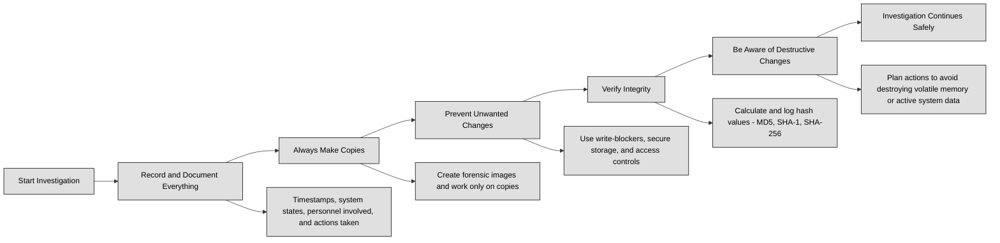

## 7.1.0 Preface ##

In cybersecurity, sooner or later you'll face a situation where an investigation is needed. Whether it’s a data breach, insider misuse, policy violation, or external attack, understanding the purpose and type of the investigation is crucial for gathering evidence properly, protecting your organization, and staying compliant with the law.

There are three main types of investigations you’ll come across:

| Investigation Type            | Description                                                                                                                                                                                                                                                                                                                                                                                                                                                                                                                                                                                                                                                                                     |
| ----------------------------- | ----------------------------------------------------------------------------------------------------------------------------------------------------------------------------------------------------------------------------------------------------------------------------------------------------------------------------------------------------------------------------------------------------------------------------------------------------------------------------------------------------------------------------------------------------------------------------------------------------------------------------------------------------------------------------------------------- |
| Administrative Investigations | Sometimes called **operational** or **internal**, these are run by organizations to enforce their own internal rules, policies, and security standards. The focus isn’t necessarily on criminal charges but on ensuring employees, vendors, or contractors follow company policies, code of conduct, or employment agreements. The goal is to find out if rules were broken and take action — such as retraining the employee, firing them, or strengthening weak processes. Evidence collected may stay internal unless the issue escalates into a civil lawsuit or criminal case. Chain of custody is important, but the process is typically faster and less formal than in criminal or civil cases. |
| Criminal Investigations       | Focus on detecting, proving, and prosecuting violations of the law. Conducted by police, federal agencies, and prosecutors, with strict rules around evidence collection, chain of custody, and legal procedures. Evidence must meet criminal court standards: reliable, complete, and collected without violating rights. Most criminal cases must meet the “beyond a reasonable doubt” standard. Examples include hacking, ransomware, fraud, identity theft, or unauthorized data breaches. Cybersecurity professionals supporting these cases must avoid contaminating evidence and work alongside law enforcement.                                                                         |
| Civil Investigations          | Happen when an organization or individual seeks compensation or resolution rather than punishment. Common in business conflicts, intellectual property theft, breach of contract, or cases requiring quantification of damages. The burden of proof is lower than in criminal cases (usually "preponderance of the evidence"). Evidence handling still matters, especially for court presentation. Cybersecurity experts may gather logs, snapshots, or system records to support claims, such as vendor misuse of customer data or licensing violations.                                                                                                                                       |

We can recap the investigation types as follows:

| Investigation Type           | Purpose                                | Who Handles It                     | Evidence Usage                   | Example Scenario                       |
| ---------------------------- | -------------------------------------- | ---------------------------------- | -------------------------------- | -------------------------------------- |
| Administrative / Operational | Enforce internal rules and policies    | Internal security / HR / legal     | Internal (may escalate to legal) | Employee violates data handling policy |
| Criminal                     | Prove violation of criminal law        | Law enforcement, prosecutors       | Must meet strict legal standards | Ransomware attack or system intrusion  |
| Civil                        | Resolve disputes and seek compensation | Legal teams, private investigators | Used in court for damages        | Vendor steals proprietary source code  |

:bulb: **Digital Forensics and Incident Response (DFIR)** is a specialized field within cybersecurity focused on identifying, investigating, and mitigating security incidents. Digital forensics involves collecting, preserving, and analyzing digital evidence from systems, networks, and devices to understand how an incident occurred and who was responsible. Incident Response (IR) focuses on detecting threats in real-time, containing breaches, and recovering business operations while minimizing damage. Together, DFIR helps organizations strengthen security postures and supports legal and regulatory actions after cyber incidents.

:link: **EDRM (Electronic Discovery Reference Model)** is a framework that guides how digital evidence is identified, preserved, collected, and presented during legal investigations and court cases.
It helps organizations handle **electronically stored information (ESI)** in a structured way — making sure nothing is lost, tampered with, or misinterpreted.
The EDRM process typically follows these stages:

- Information Governance: Organize and manage data before any legal action.
  
- Identification: Find potentially relevant data.
  
- Preservation: Protect data from alteration or deletion.
  
- Collection: Gather the preserved data securely.
  
- Processing: Filter and prepare data for review.
  
- Review: Analyze the data for relevance and legal privilege.
  
- Analysis: Understand patterns, timelines, and facts.
  
- Production: Share the data with opposing counsel or the court.
  
- Presentation: Use the data as evidence in legal proceedings.

The model is available here: [https://edrm.net/edrm-model/current/](https://edrm.net/edrm-model/current/)

### Open Questions ###

What is the main purpose of administrative investigations in cybersecurity?

 
Show answer
 Administrative investigations aim to enforce an organization’s internal rules, policies, and security standards. They focus on ensuring that employees, vendors, or contractors comply with company policies and take action if rules are broken, such as retraining, disciplinary measures, or improving weak processes. 

How do criminal investigations differ from administrative investigations?

 
Show answer
 Criminal investigations focus on detecting, proving, and prosecuting violations of the law, often conducted by law enforcement or prosecutors. They follow strict rules for evidence collection and chain of custody and must meet the “beyond a reasonable doubt” standard, unlike administrative investigations which are internal and less formal. 

What is the purpose of civil investigations in cybersecurity?

 
Show answer
 Civil investigations aim to resolve disputes or seek compensation rather than punish offenders. They are common in cases like intellectual property theft, breach of contract, or vendor misuse of data, and the burden of proof is usually lower than in criminal cases. 

Who typically handles each type of investigation: administrative, criminal, and civil?

 
Show answer
 Administrative investigations are handled by internal security, HR, or legal teams. Criminal investigations are conducted by law enforcement and prosecutors. Civil investigations are managed by legal teams or private investigators. 

What is the role of digital forensics in cybersecurity investigations?

 
Show answer
 Digital forensics involves collecting, preserving, and analyzing digital evidence from systems, networks, and devices to understand how an incident occurred, who was responsible, and how to prevent similar incidents in the future. 

How does incident response (IR) complement digital forensics?

 
Show answer
 Incident response focuses on detecting threats in real-time, containing breaches, and restoring operations while minimizing damage. Combined with digital forensics, it helps organizations respond quickly to incidents and supports legal or regulatory investigations. 

What is the purpose of the Electronic Discovery Reference Model (EDRM)?

 
Show answer
 EDRM provides a structured framework for handling electronically stored information (ESI) during legal investigations. It ensures that data is properly identified, preserved, collected, processed, reviewed, analyzed, produced, and presented as evidence in court. 

What are the main stages of the EDRM process?

 
Show answer
 The main stages of EDRM include: Information Governance (organize and manage data), Identification (find relevant data), Preservation (protect data from alteration), Collection (securely gather data), Processing (filter and prepare), Review (analyze for relevance), Analysis (understand patterns and facts), Production (share with opposing counsel or court), and Presentation (use as evidence in legal proceedings). 

---

## 7.1.1 Evidence collection and handling ##

When it comes to cybersecurity investigations, evidence collection and handling are the foundation of any solid case, whether it's for an internal administrative review, a civil lawsuit, or criminal prosecution. Understanding the types of evidence, the rules that make evidence admissible in court, and the best practices for handling digital evidence is essential for incident responders, forensic analysts, and cybersecurity professionals.

The types of evidences we may deal with are:
1. **Real Evidence.** Real evidence refers to physical objects involved in the incident. In cybersecurity, this can include hard drives, USB devices, network appliances, printed documents, and even physical security items like keycards or surveillance recordings. These items must be carefully preserved and documented, as they can directly prove or disprove a claim.
2. **Documentary Evidence.** Documentary evidence includes any written or recorded material. In digital investigations, this typically involves logs, emails, system configuration files, contracts, policies, screenshots, and reports. Two important rules apply to documentary evidence:
  - Best Evidence Rule: Whenever possible, the original document should be presented rather than a copy. In digital forensics, this means collecting bit-by-bit forensic images instead of simple file copies, and maintaining the original data intact.
  - Parol Evidence Rule: When a written agreement exists, no oral or implied evidence is allowed to contradict or supplement the written terms. For example, in cases involving service level agreements (SLAs) or contracts, the terms written in the document take precedence over verbal claims.
3. **Testimonial Evidence.** Testimonial evidence is a statement or oral testimony given by witnesses. This could be an employee's explanation of their actions during an incident or an expert witness interpreting technical details in court. While testimonial evidence can support or clarify other evidence, it is often considered weaker due to human memory limitations and potential bias.
4. **Demonstrative Evidence.** Demonstrative evidence helps illustrate or explain other evidence. It could be diagrams, charts, timelines, forensic reconstructions, or video animations that depict how a cyberattack unfolded or where a system was vulnerable.

| Evidence Type          | Description                                                                                                                                                       | Notes / Key Points                                                                                                                                                  |
| ---------------------- | ----------------------------------------------------------------------------------------------------------------------------------------------------------------- | ------------------------------------------------------------------------------------------------------------------------------------------------------------------- |
| Real Evidence          | Physical objects involved in the incident. Examples: hard drives, USB devices, network appliances, printed documents, keycards, surveillance recordings.          | Must be carefully preserved and documented as they directly prove or disprove a claim.                                                                              |
| Documentary Evidence   | Written or recorded material. Examples: logs, emails, system configuration files, contracts, policies, screenshots, reports.                                      | **Best Evidence Rule:** Collect original documents (bit-by-bit forensic images).   **Parol Evidence Rule:** Written agreements take precedence over oral claims. |
| Testimonial Evidence   | Statements or oral testimony from witnesses. Examples: employee explanations, expert witness interpretations.                                                     | Supports or clarifies other evidence but may be weaker due to human memory limitations and potential bias.                                                          |
| Demonstrative Evidence | Illustrates or explains other evidence. Examples: diagrams, charts, timelines, forensic reconstructions, video animations showing attack flow or vulnerabilities. | Helps the audience understand complex evidence or attack scenarios; used to complement other evidence types.                                                        |

:link: [NIST SP 800-86](https://csrc.nist.gov/pubs/sp/800/86/final) is intended to help organizations in investigating computer security incidents and troubleshooting some information technology (IT) operational problems by providing practical guidance on performing computer and network forensics

For evidence to be accepted in a legal context, it must meet three primary criteria:
- **Relevance:** The evidence must have a direct connection to the case or incident.
- **Materiality:** The evidence must have significant importance to the matter under investigation.
- **Competence:** The evidence must be collected legally and handled properly according to established procedures. Any evidence obtained without appropriate authorization, or in a way that compromises its integrity, may be considered inadmissible.

Maintaining a clear, well-documented chain of custody is crucial for the integrity and admissibility of evidence. The chain of custody tracks the life cycle of a piece of evidence from the moment it is discovered until its final presentation in court or resolution.

The chain of custody should include:
- Who collected the evidence.
- When and where it was collected.
- How it was collected.
- How it was stored and protected.
- Every transfer or handoff, including time, date, and the individuals involved.

Breaking the chain of custody, or failing to document a handoff, can result in the evidence being excluded from court proceedings.

In legal terms, **hearsay** refers to "an out-of-court statement offered to prove the truth of the matter asserted." Generally, hearsay is not admissible unless an exception applies. For example, system logs can sometimes be considered hearsay unless you can demonstrate their authenticity through metadata, audit trails, or corroboration from a qualified custodian.
Incident response teams should always be mindful of this rule when preparing evidence for possible legal action. Clear documentation and integrity verification help prevent issues related to hearsay.

In general, Incident Response Best Practices for Evidence Handling can be summed up as:

### Open Questions ###

1. What are the main types of evidence encountered in a cybersecurity investigation?

 
Show answer
 The main types of evidence include real, documentary, testimonial, and demonstrative evidence. Each serves a unique purpose in building a case and must be handled with care. 

2. Why is the best evidence rule important in digital forensics?

 
Show answer
 The best evidence rule requires presenting the original document or data whenever possible. In cybersecurity, this means using bit-by-bit forensic images to ensure authenticity and credibility. 

3. What is the purpose of the parol evidence rule in legal investigations?

 
Show answer
 The parol evidence rule prevents oral or implied terms from contradicting written agreements. This ensures that contracts and formal documents carry the most legal weight in disputes. 

4. How does testimonial evidence differ from documentary evidence in terms of reliability?

 
Show answer
 Testimonial evidence is based on human memory and subjectivity, while documentary evidence is typically more reliable and verifiable. Testimonies are useful for context but should be corroborated with records. 

5. What criteria must be met for evidence to be admissible in court?

 
Show answer
 For evidence to be admissible, it must be relevant, material, and competent. This means it must relate directly to the case, be significant, and be legally and properly collected. 

6. Why is maintaining the chain of custody so critical in handling digital evidence?

 
Show answer
 The chain of custody documents every step in the life of a piece of evidence. It ensures that the evidence is authentic and hasn’t been altered, which is crucial for legal proceedings. 

7. Can system logs be considered hearsay? If so, how can their admissibility be improved?

 
Show answer
 Yes, system logs can be considered hearsay unless properly authenticated. Providing metadata, audit trails, and expert testimony can help establish their legitimacy in court. 

8. What are some techniques used to prevent accidental modification of digital evidence?

 
Show answer
 To prevent modification, analysts use write-blockers, secure storage, and controlled environments. This maintains the original data’s integrity throughout the investigation. 

9. Why is it important to make copies of evidence instead of using the original data?

 
Show answer
 Copies, such as forensic images, are used to preserve the original evidence. Working on the original can alter or destroy crucial data, especially in volatile memory. 

10. How can responders verify that digital evidence remains unchanged during the investigation?

 
Show answer
 Hash values like MD5 or SHA-256 are calculated before and after copying evidence. Matching hashes confirm that no changes occurred, ensuring data integrity. 

---

## 7.1.2 Reporting and documentation ##

When you think about evidence in a cybersecurity investigation, most people picture hard drives, logs, packet captures, or screenshots. But evidence alone isn't enough to win a case, convince stakeholders, or even make an incident report worth reading. What separates "raw data" from "court-ready proof" is how you report it, document it, and stand behind it. In many ways, the story you tell through evidence is as important as the data itself.

As a cybersecurity professional, your future will involve more than simply identifying technical clues. You'll need to understand how to handle and present those clues in a way that others—lawyers, auditors, regulators, managers, or even a jury—can trust, understand, and act upon.

:bulb: Imagine this: You discover a malware infection in your company's production environment. You isolate the machine, preserve the drive, and even gather logs from the affected servers. But two months later, when the breach goes to court or is reviewed by your internal security committee, you realize your notes on the time and method of collection are missing. Or worse, you discover that your evidence lacks clear hashes proving its integrity. At that moment, all the technical brilliance you applied becomes legally and practically useless. Evidence reporting and documentation aren't administrative chores; they're the tools that convert digital artifacts into credible, usable proof. Done right, your documentation and reporting will allow your evidence to "speak for itself," even when you're not in the room.

Before diving into reporting formats or templates, let’s focus on the qualities every piece of evidence must have. These principles are your measuring stick, both in court and in the field:
- **Accuracy.** If evidence does not reflect the reality of what happened, it's meaningless. Accuracy starts with correct data collection (such as using proper tools like write blockers for forensic images) and continues through detailed, honest documentation.
- **Authenticity.** Can you prove this piece of evidence hasn't been altered? Authenticity relies on things like cryptographic hashes, tamper-evident seals, access controls, and chain-of-custody logs. If someone challenges the evidence in court, you should be able to show where it's been and who had access to it, minute by minute.
- **Comprehensibility.** Evidence that's impossible to understand is as good as no evidence at all. Your reports should make the context and relevance of the evidence clear, even to non-technical stakeholders. Screenshots, timelines, and short, plain-language descriptions are your allies.
- **Convincing.** Good evidence should leave little room for doubt. This isn't about manipulation; it's about thoroughness. When all the metadata aligns, the story flows logically, and the integrity checks pass, your evidence becomes hard to dispute.
- **Objective.** Your job is not to tell a story that "helps your side," but to present facts as they are. The credibility of the whole security team can be shattered if your documentation suggests bias, cherry-picking, or speculation.
- **Admissible.** This is the ultimate test: would a court allow it? To be admissible, evidence must meet legal criteria like relevance, materiality, and competence. Following strict handling procedures and documenting every step of collection increases the chance your evidence will hold up under scrutiny.

A well-documented investigation is a time machine. Even months or years later, a clear report lets anyone walk through your steps and understand what happened. Here’s how to approach it:
- Document in Real Time Memories fade and systems change. Write everything down as soon as you do it: the time you imaged a drive, the tool version you used, the exact commands or procedures you followed, and who was present.
- Be Methodical, Not Creative This is one area where creativity can hurt. Stick to known frameworks, templates, and checklists. Consistency reduces errors and enhances trust.
- Tell a Story, Not Just Facts Facts alone are dry and often confusing. Shape them into a narrative: what was discovered, when, what actions were taken, why those decisions were made, and what the outcomes were.
- Support with Metadata and Screenshots A human-readable timeline is great, but supporting it with evidence hashes, log file timestamps, screenshots, and diagrams makes your work irrefutable.

Incident reports act as a passport for your evidence to move through internal reviews, compliance audits, and legal scrutiny. A typical incident report includes:
- Summary of the incident
- Who discovered it and when
- Steps taken to secure and collect evidence
- Tools and methods used (including version numbers)
- Chain-of-custody record
- Integrity verification (hashes before and after collection)
- Conclusions, recommendations, and pending actions

A well-prepared report doesn't just defend your actions; it gives your organization the power to make informed decisions, patch vulnerabilities, and prepare for regulatory questions.

:necktie: Evidence is more than a file on a USB stick or a printout of logs. It is the silent witness to security incidents—and your job is to make sure its voice is heard, clearly and credibly. In cybersecurity, where so much happens invisibly and at machine speed, your ability to document and report effectively can mean the difference between a resolved case and a failed prosecution. Take pride in the process, not just the outcome.

### Open Questions ###

1. Why is evidence reporting and documentation critical in cybersecurity investigations?

 
Show answer
 Evidence reporting and documentation are essential because they turn raw data into credible proof that can be used in court, audits, or internal reviews. Properly documenting and reporting evidence ensures its authenticity, reliability, and comprehensibility, making it easier for others to trust and act upon it. Without clear documentation, the technical work done during an investigation can lose its legal and practical value. 

2. What are the key principles that evidence must adhere to in order to be credible in a cybersecurity investigation?

 
Show answer
 The key principles of credible evidence include: - **Accuracy:** Ensuring the evidence reflects the reality of the incident. - **Authenticity:** Proving the evidence hasn't been tampered with. - **Comprehensibility:** Making the evidence clear and understandable. - **Convincing:** Providing thorough, logically consistent evidence. - **Objective:** Presenting the facts without bias. - **Admissibility:** Ensuring the evidence meets legal criteria for relevance, materiality, and competence. 

3. How does accuracy in evidence collection impact a cybersecurity investigation?

 
Show answer
 Accuracy is the foundation of trustworthy evidence. If the evidence doesn't accurately reflect what occurred during an incident, it risks being dismissed or misinterpreted. Accurate documentation of the collection method, time, tools used, and conditions ensures that the evidence is valid and defensible in a legal or investigative context. 

4. What role does authenticity play in evidence documentation, and how can it be ensured?

 
Show answer
 Authenticity ensures that the evidence has not been altered, which is crucial for its acceptance in legal proceedings. It can be ensured through cryptographic hashes, tamper-evident seals, chain-of-custody logs, and detailed records of who accessed the evidence and when. Authenticity is critical for maintaining the integrity of the evidence throughout the investigation process. 

5. Why is it important for evidence to be comprehensible to non-technical stakeholders?

 
Show answer
 Evidence must be comprehensible because it needs to be understood by a range of stakeholders, such as legal teams, managers, and auditors, who may not have technical expertise. Clear and concise documentation—supported by metadata, timelines, and simple explanations—ensures that all parties can make informed decisions based on the evidence presented. 

6. Explain how objectivity in reporting evidence can affect the credibility of an investigation.

 
Show answer
 Objectivity ensures that the evidence is presented without bias or personal opinion, which helps maintain its credibility. If the documentation is perceived as biased, it can undermine trust in the investigation, especially in legal or regulatory settings. Objective reporting ensures that facts are presented as they are, without attempting to sway the outcome of the investigation. 

7. What is the significance of the "admissibility" of evidence in legal or regulatory contexts?

 
Show answer
 Admissibility refers to whether evidence meets legal standards for being used in court or regulatory reviews. To be admissible, evidence must be relevant, material, and competent. If evidence is not properly documented or handled, it risks being excluded from consideration, which can hinder the investigation or legal process. 

8. How does the concept of "chain of custody" ensure the integrity of evidence?

 
Show answer
 The chain of custody is a record that details every person who handled the evidence and every location it was stored, from collection to presentation in court. This documentation ensures that the evidence has not been tampered with and provides transparency into its handling. A break in the chain of custody can raise doubts about the integrity and authenticity of the evidence. 

9. What are the best practices for documenting an incident to ensure that the evidence can be effectively used later on?

 
Show answer
 Best practices for documentation include: - **Document in real time:** Record actions and observations immediately to ensure accuracy. - **Be methodical:** Use established templates and checklists to maintain consistency. - **Tell a story:** Present the facts in a narrative format to make them easier to follow. - **Support with metadata:** Include hash values, timestamps, and other relevant data to back up claims. - **Maintain integrity:** Ensure all collected evidence is properly secured and its integrity verified. 

10.How does a well-prepared incident report help in cybersecurity investigations?

 
Show answer
 A well-prepared incident report serves as a comprehensive summary of the incident, detailing the steps taken, tools used, evidence collected, and the timeline of events. It helps the organization assess the damage, understand the root cause, and decide on mitigation strategies. In legal or regulatory contexts, a solid report provides a clear and defensible record of actions and findings. 

---

## 7.1.3 Investigative techniques ##

In the world of cybersecurity, technical skill will get you far, but it won't get you all the way. At some point, you'll realize that catching the hacker, identifying the source of an insider leak, or tracing the path of data exfiltration isn't enough. You also need to prove it. And in the professional world — especially in regulated environments or when legal action looms — proving something means following a disciplined investigation process.

In any investigation, whether digital or physical, you can't just grab what you find and call it "evidence." Evidence must be obtained legally and ethically to be admissible, reliable, and useful. Understanding how evidence is gathered is just as important as knowing what to gather.
There are five key paths to legally acquiring evidence, each with specific scenarios and limitations:

1. **Voluntary Surrender.** Sometimes the simplest path is the most overlooked. If a user, employee, or third party willingly turns over data or hardware, that's voluntary surrender. This is the cleanest and least contested form of evidence acquisition, as consent is clear. Think of an employee handing over a USB stick for inspection after noticing suspicious files. The catch? Consent can be withdrawn unless a formal agreement or custody process is established.
2. **Subpoena.** A subpoena is a formal legal order that compels a person or organization to hand over documents, records, or evidence. In cybersecurity investigations, this might be used to request logs from an ISP, chat histories from a service provider, or archived emails. Subpoenas are powerful but require time and proper legal procedures. The advantage is clear: refusal can carry legal penalties, making this an essential tool in both criminal and civil cases.
3. **Plain View Doctrine.** If during a lawful activity, evidence is in plain sight, it can be legally seized and used. Imagine an IT administrator performing routine maintenance and stumbling upon an unencrypted folder labeled "Payroll_Leak" containing sensitive data being prepared for exfiltration. As long as the admin had authorized access to that system, the discovery is legitimate. The plain view doctrine prevents criminals from hiding behind the argument of search limitations when the evidence is visible and discoverable without special effort.
4. **Search Warrant.** When suspicion is strong but access is restricted, authorities may obtain a search warrant. This is a court order granting permission to search specific premises and seize specific evidence. In digital investigations, warrants might authorize the imaging of a server or the confiscation of physical storage devices. The warrant must be specific; overreach can result in the exclusion of improperly gathered evidence.
5. **Exigent Circumstances.** Sometimes the clock is ticking too fast for paperwork. Exigent circumstances allow for evidence collection without prior authorization if delay could result in data destruction, harm, or further criminal activity. For instance, if an attacker is actively wiping logs from a compromised machine, security staff might justify immediate evidence capture before the trail is lost.

| Method                | **Definition**                                                                                                        | **Scenario**                                                                                   | **Advantage**                                                                           | **Limitation**                                                                        |
| --------------------- | --------------------------------------------------------------------------------------------------------------------- | ---------------------------------------------------------------------------------------------- | --------------------------------------------------------------------------------------- | ------------------------------------------------------------------------------------- |
| Voluntary Surrender   | Evidence willingly turned over by a user, employee, or third party.                                                   | An employee hands over a USB stick after noticing suspicious files.                            | Cleanest and least contested form of evidence acquisition due to clear consent.         | Consent can be withdrawn unless a formal agreement or custody process is established. |
| Subpoena              | A formal legal order compelling a person or organization to provide documents or evidence.                            | Requesting logs from an ISP or archived emails from a service provider.                        | Refusal carries legal penalties, making it a powerful tool in criminal and civil cases. | Requires time and proper legal procedures to obtain.                                  |
| Plain View Doctrine   | Evidence discovered in plain sight during lawful activity can be legally seized.                                      | An IT admin performing routine maintenance finds an unencrypted folder labeled "Payroll_Leak." | Legally allows seizure of visible evidence without special effort.                      | Only applies if the observer had lawful access; evidence not hidden.                  |
| Search Warrant        | Court order granting permission to search specific premises and seize specific evidence.                              | Imaging a server or confiscating storage devices after suspicion of wrongdoing.                | Authorizes lawful seizure while ensuring evidence can be used in court.                 | Must be specific; overreach can result in exclusion of evidence.                      |
| Exigent Circumstances | Evidence can be collected immediately without prior authorization if delay risks destruction, harm, or further crime. | Active attack where logs are being wiped from a compromised machine.                           | Allows immediate capture of critical evidence before it is lost.                        | Must justify urgency; misuse can be challenged legally.                               |

Now that we understand the lawful avenues for gathering evidence, let’s talk about the practical fieldwork — the techniques you'll actually use to piece together the facts. Think of these as our four investigative pillars:

1. **Data Capture.** This is the bread and butter of digital forensics. Data capture includes imaging hard drives, copying log files, extracting volatile memory (RAM), and capturing network traffic. The goal is to create a faithful, unaltered snapshot of digital information. Using proper tools (write blockers, hash verification, forensic suites like EnCase or FTK) ensures that you preserve the original evidence and work only with validated copies. Why is this important? Because digital evidence is incredibly fragile. Powering off a machine can erase volatile data. Opening a file can change its access timestamps. Data capture, done early and correctly, locks in the state of the system before human error or malicious actors can muddy the waters.
2. **Interviews.** Interviews are a goldmine for context. They are typically non-confrontational conversations aimed at gathering facts, timelines, and observations. Think of talking to system administrators, end-users, or third-party vendors. The key here is building rapport and asking open-ended questions. You’re not just hunting for yes/no answers, but for clues the person might not even realize are important: “When did you first notice the unusual activity?” or “Can you describe what you were doing just before the system crashed?”
3. **Interrogations.** Unlike interviews, interrogations are adversarial. They are designed to challenge and verify known facts, especially when dealing with suspected perpetrators. This technique requires careful preparation, documentation, and usually the involvement of legal counsel. The tone is structured and designed to test inconsistencies. In cyber incidents, this could be used when an employee is suspected of data theft or intentional policy violations.
4. **External Requests.** Sometimes the evidence you need lives outside your organization’s walls. External requests involve reaching out to ISPs, cloud providers, social media platforms, or law enforcement partners to obtain relevant data. These requests must follow formal channels and often require subpoenas, NDAs, or collaboration agreements. Knowing the timelines and the correct points of contact is crucial, as delays can result in the loss of time-sensitive logs or communications.

:necktie: The heart of a cybersecurity investigation isn’t in fancy tools or titles; it’s in methodical thinking and ethical action. Evidence gathering and investigative techniques aren’t just about following a process — they’re about telling the truth in a way that can stand up to scrutiny, whether from management, regulators, or a courtroom.

### Open Questions ###

1. What are the five legal methods for gathering evidence in a cybersecurity investigation?

 
Show answer
 The five legal methods are: voluntary surrender, subpoena, plain view doctrine, search warrant, and exigent circumstances. Each method provides a structured and lawful approach to collecting evidence while preserving its admissibility and integrity in investigations. 

2. How does voluntary surrender work in the context of evidence collection?

 
Show answer
 Voluntary surrender occurs when someone willingly hands over evidence, such as a device or data, without coercion or legal order. This method is clean and uncontested, but formal custody procedures may be required to maintain the ongoing validity and integrity of the evidence. 

3. When is a subpoena typically used in digital investigations?

 
Show answer
 A subpoena is a legal order used to compel individuals or organizations to provide specific documents or data. In digital investigations, it is often used to obtain logs, emails, or messages from third-party providers like ISPs or cloud services. 

4. What is the plain view doctrine, and how does it apply to cybersecurity cases?

 
Show answer
 The plain view doctrine allows investigators to seize evidence that is clearly visible during a lawful operation. In cybersecurity, this applies when evidence, such as an unencrypted file on a system an investigator is authorized to access, is discovered without additional intrusion or search. 

5. Why must a search warrant be specific in a digital investigation?

 
Show answer
 A search warrant must clearly define the location and type of evidence to avoid overreach. Vague or overly broad warrants can result in the exclusion of improperly collected evidence from court proceedings. 

6. What qualifies as exigent circumstances during evidence collection?

 
Show answer
 Exigent circumstances are emergency situations where waiting for legal authorization could lead to data destruction, further harm, or loss of evidence. In these cases, immediate action is justified, such as capturing volatile memory before it is lost. 

7. What is the purpose of data capture in a digital forensic investigation?

 
Show answer
 Data capture involves obtaining and preserving digital evidence—like hard drive images, system logs, and memory snapshots—while ensuring its integrity. Techniques such as hash verification are used to maintain forensic soundness for legal or regulatory review. 

8. How are interviews different from interrogations in cybersecurity investigations?

 
Show answer
 Interviews are non-adversarial and aim to gather context and information from users or administrators. Interrogations are structured and confrontational, often targeting suspected malicious insiders to obtain admissions or clarify suspicious behavior. 

9. When would a cybersecurity team need to issue external evidence requests?

 
Show answer
 External evidence requests are necessary when data resides outside the organization, such as on cloud platforms, social media, or third-party services. Legal backing like subpoenas, NDAs, or court orders is typically required to ensure compliance and admissibility. 

10. Why is methodical documentation so important during the investigation process?

 
Show answer
 Thorough documentation preserves evidence integrity, ensures credibility, and enables findings to be trusted in audits, legal cases, or internal reviews. It demonstrates that the investigation followed proper procedures from start to finish and provides a defensible record of actions taken. 

---

## 7.1.4 Digital forensics tools, tactics, and procedures ##

When a cybersecurity incident strikes, the instinct is often to focus on defense and containment. But once the dust settles, your real mission begins: investigating what happened, how it happened, and who was behind it. This is the heart of digital forensics, the detective work of cybersecurity. It’s one part technical mastery, one part disciplined process, and one part curiosity.

Let’s start with the tools. A good investigator doesn’t just rely on instinct — they rely on well-proven instruments that protect, preserve, and interpret digital evidence. Let’s break these down into two essential categories: Acquisition Tools and Analysis Tools.

| Category            | Tool / Technique       | Definition                                                                 | Purpose                                                                                      | Examples / Notes                                                                 |
|---------------------|------------------------|----------------------------------------------------------------------------|----------------------------------------------------------------------------------------------|----------------------------------------------------------------------------------|
| **Acquisition Tools** | Write Blockers & Drive Imagers | Hardware/software that lets you read a device without modifying its data.   | Ensures evidence integrity during imaging; prevents accidental writes.                        | Acts like a glass display case—observe but don’t alter.                           |
|                     | Faraday Containers     | Signal-blocking bags or boxes.                                              | Prevents remote wiping or tampering of mobile/laptop evidence during seizure.                 | Used in the field to isolate devices from networks.                               |
|                     | Video & Audio Recording| Recording tools during seizure or analysis.                                 | Captures environment, interactions, and system states to add context and credibility.         | Provides defensible documentation if investigation faces scrutiny.                |
| **Analysis Tools**   | Network Traffic Analysis | Tools to replay and analyze packet captures.                                | Detect anomalies, trace exfiltration, or reveal command-and-control communications.           | Wireshark, Zeek.                                                                  |
|                     | Log Analysis           | Parsing and correlation of system/application logs.                         | Builds timelines, reveals unauthorized access, and identifies suspicious activities.          | Firewall logs, server logs, authentication logs.                                 |
|                     | Data Recovery Tools    | Specialized tools to recover deleted or overwritten data.                   | Retrieves lost evidence and reconstructs files critical to investigations.                    | Can determine intent or recover hidden activities.                                |
|                     | Virtual Machines (VMs) | Isolated sandbox environments.                                              | Safely analyze malware or suspicious code without endangering production systems.              | Run and dissect malicious software securely.                                      |
|                     | Code Analysis          | Static/dynamic examination of malware or binaries.                          | Understands exploit/malware behavior through reverse engineering.                             | IDA Pro, Ghidra.                                                                  |
|                     | Hashing Tools          | Create unique digital fingerprints for files.                               | Verify data integrity between originals and copies; ensures no tampering or corruption.       | SHA-256, MD5 (less recommended).                                                 |
|                     | Forensic Toolkits      | Comprehensive investigation suites.                                         | Standardize acquisition, analysis, and reporting in a defensible manner.                      | FTK, EnCase, Autopsy.                                                             |

:bulb: At the core of all this is a mindset: precision, patience, and proof. In forensics, speed must never compromise thoroughness.

### Open Questions ###

1. Why is using a write blocker essential during the digital evidence acquisition process?

 
Show answer
 A write blocker prevents any data from being written or altered on the source device during evidence acquisition, ensuring the original evidence remains unchanged and legally admissible. 

2. What role does a Faraday container play in securing mobile or wireless digital evidence?

 
Show answer
 A Faraday container blocks external signals, preventing remote wiping or tampering with wireless-capable devices after they are seized, securing the evidence from active interference. 

3. How can hashing help ensure the integrity of digital evidence throughout an investigation?

 
Show answer
 Hashing creates a unique fingerprint for each file, allowing investigators to prove that evidence remains unaltered throughout the process by comparing hashes before and after handling. 

4. Why is the planning phase critical before starting the collection of digital evidence?

 
Show answer
 Planning ensures that evidence collection is systematic, thorough, and legally sound. It prevents accidental destruction, ensures all critical sources are covered, and helps maintain the chain of custody. 

5. What is the difference between network traffic analysis and log analysis in a forensic investigation?

 
Show answer
 Network traffic analysis focuses on real-time or captured data flowing across systems (like packet captures), while log analysis examines recorded system events and user actions. Both offer complementary insights in an investigation. 

6. Why are virtual machines (VMs) useful tools during malware or code analysis in digital forensics?

 
Show answer
 Virtual machines allow investigators to safely analyze suspicious code or malware in an isolated environment, minimizing the risk of infecting real systems while enabling full behavioral observation. 

7. What’s the difference between looking for visible evidence and seeking hidden or preserved data during analysis?

 
Show answer
 Visible evidence might show immediate clues, but hidden or preserved data — like deleted files, slack space, or encrypted volumes — often contains deeper truths about an attack’s timeline or the perpetrator’s intent. 

8. Why is documentation of every step important in the digital forensic process?

 
Show answer
 Documentation creates a defensible, verifiable record of how evidence was handled, ensuring integrity in court or during audits. If the process isn’t documented, it’s as if it never happened. 

9. When would you use data recovery tools during a cybersecurity investigation?

 
Show answer
 Data recovery tools are used when evidence has been deleted, partially overwritten, or corrupted, enabling investigators to retrieve crucial information that might otherwise be lost. 

10.Why should digital forensic investigations always prioritize clear goals before technical action?

 
Show answer
 Clear goals prevent wasted effort, reduce bias, and help ensure the right evidence is collected and analyzed. This focus is especially critical when resources are limited or time-sensitive decisions are needed. 

---

## 7.1.5 Artifacts (e.g., data, computer, network, mobile device) ##

No attacker leaves a system untouched, no breach happens without a trace, and no exfiltration is ever entirely invisible. Whether you're tracking a skilled cybercriminal or investigating an insider gone rogue, evidence is always left behind. The real challenge? Knowing where and how to find it.

That’s where understanding investigation artifacts and applying Locard’s Exchange Principle can give you an edge.
A century ago, Dr. Edmond Locard — often called the "Sherlock Holmes of Lyon" — taught the world an essential forensic truth: "*Every contact leaves a trace.*"

In cybersecurity, this principle is no different. Every time a hacker interacts with a system, whether it’s through a phishing email, remote access, or malware deployment, they alter something. It could be a new file, an unexpected network connection, a timestamp shifted by microseconds, or a suspicious process running in memory.
Your job, as a security professional, is to spot these disturbances in the digital "fabric" and tie them back to the threat. Even if the attacker believes they covered their tracks, the absence of normal behavior can itself become evidence.

:necktie: Locard’s Principle is your mental model for assuming that every action in cyberspace leaves artifacts worth investigating.

Let’s unpack the main places where this evidence hides.

**Data** is the most direct and obvious evidence, but it’s also the most flexible and easily manipulated. Artifacts might include:
- Files and Documents: Modified, deleted, or renamed.
- Metadata: Who created a file, when it was last accessed, and by whom.
- Database entries: New or missing records.
- Configuration changes: Evidence of tampering with system settings or application configurations.

Here’s why this matters: in real incidents, attackers often leave behind data artifacts as a side effect of their main goal. If they steal files, delete logs, or alter configurations to maintain persistence, these traces become critical proof points.
Imagine walking into a crime scene in the physical world. You look for fingerprints, footprints, or scratches. In the digital world, your "crime scene" is the computer, and its internal state is your evidence.

Artifacts here might include:
- Event Logs: Windows Event Viewer, Linux syslogs.
- Process Lists: What was running at the time of compromise?
- Scheduled Tasks: Malicious persistence mechanisms.
- Registry Entries (Windows): Modifications or newly added keys.

:bulb: The computer’s operating system is like a witness with a perfect memory — but only if you capture its state before it’s altered or rebooted. That’s why proper imaging and volatile memory capture are so heavily emphasized in digital forensics.

If computers are the crime scene, networks are the getaway route. Every connection to or from a system leaves traces, even if the attacker uses encryption, proxies, or Tor.
Key network artifacts might include:
- Firewall Logs: Blocked or allowed traffic patterns.
- NetFlow Records: Source, destination, and data volume.
- Packet Captures (PCAP): Direct evidence of conversations, sometimes even reconstructed files.
- DNS Queries: A sneaky but common channel for exfiltration and command-and-control.

Why is this gold for an investigator? Because network traffic is often stored in central locations — independent of whether the endpoint is wiped or altered. Attackers might control the victim machine, but they usually can't erase evidence from upstream routers or cloud firewall logs.

In today’s workplace, **mobile devices** are often as important as desktops — sometimes even more so. Mobile devices offer investigators:
- Call and Message Logs: Evidence of communication.
- Geolocation Data: Where the device was at key times.
- Application Data: Especially from cloud-synced apps like WhatsApp, Google Drive, or Dropbox.
- Cache and Artifacts: Even deleted photos or chats can leave fingerprints.

In the world of BYOD (Bring Your Own Device), this gets even more complicated — and interesting. Even if the breach happened on a company server, an insider might have copied sensitive files onto their phone. Locard's Principle would apply here, too: there’s always a trace, even across devices.
So why is all this important? Because in an investigation, you don’t get second chances. Once you start pulling data, if you do it incorrectly — if you miss the hidden artifacts, fail to preserve timestamps, or neglect proper chain-of-custody — your case can fall apart.

That’s why digital forensics isn’t just about running the right tools, but about cultivating the right mindset: one of careful observation, methodical work, and knowing which artifacts offer the most valuable clues.

When you think like an investigator, you start connecting dots the moment you step into an incident. The clues might be subtle — a changed file hash, a deleted log entry, or a foreign IP address — but they’re always there.

:necktie: Evidence isn't always where you expect, but it’s always somewhere.

### Open Questions ###

1. What does Locard’s Exchange Principle state, and why is it so important for cybersecurity investigations?

 
Show answer
 Locard’s Principle states that “every contact leaves a trace.” In cybersecurity, this means any interaction with a system — from login attempts to malware installation — alters something. Understanding this helps investigators stay alert to subtle changes in data, system state, or logs that attackers may leave behind. 

2. Why are network artifacts often considered more reliable than endpoint artifacts during a cybersecurity investigation?

 
Show answer
 Network artifacts are often more reliable because they are usually stored centrally, making them harder for attackers to alter. Attackers who compromise an endpoint typically don't have access to the organization's network infrastructure, so logs from firewalls, proxies, and network appliances are less likely to be manipulated. 

3. An IT investigator finds a suspicious process running on a server named updatecheck.exe. What category of artifacts does this belong to?

 
Show answer
 The suspicious process updatecheck.exe is a computer artifact. Specifically, it's related to active processes, which are key indicators of what was running on the system at the time of the incident. 

4. A security analyst discovers that an attacker exfiltrated data using DNS queries. What type of artifact did the attacker leave behind?

 
Show answer
 The attacker left behind network artifacts — specifically in the DNS logs or packet captures — which could show abnormal patterns consistent with data exfiltration via DNS tunneling. 

5. Why is capturing volatile memory (RAM) important during forensic investigations on a compromised computer?

 
Show answer
 RAM contains real-time, volatile evidence such as active processes, network connections, and encryption keys, all of which are lost once the device is powered off. Capturing RAM ensures critical information is preserved for later analysis. 

6. What kinds of investigation artifacts can mobile devices provide during an inquiry?

 
Show answer
 Mobile devices can provide a variety of artifacts, including call logs, text messages, GPS data, cached files, application data, and records of deleted files — all of which can help reconstruct user behavior and potential data compromise. 

7. How does understanding Locard’s Principle change the way a cybersecurity professional approaches an incident response?

 
Show answer
 Understanding Locard’s Principle encourages cybersecurity professionals to assume that every attack leaves traces, no matter how small. This approach promotes careful and thorough examination of systems, logs, and metadata during investigations. 

8. Why must forensic investigators preserve both the original data and its metadata during evidence collection?

 
Show answer
 Metadata provides essential context, including timestamps, file paths, ownership, and access history. If metadata is not preserved accurately, the timeline and credibility of the evidence could be questioned, especially in legal proceedings. 

9. What type of artifact would an investigator most likely retrieve from a company firewall during an investigation?

 
Show answer
 An investigator would retrieve network artifacts, such as log entries showing traffic flow, source and destination IP addresses, port usage, connection timestamps, and sometimes rule-based event alerts. 

10. During an insider threat investigation, an employee claims they never transferred company files. The analyst finds a cloud sync app's cache on their mobile device with recent activity. Which principle and artifact type apply here?

 
Show answer
 Locard’s Principle applies because the act of transferring files leaves behind traces, even if the user denies it. The artifact type is mobile device artifacts, specifically cached data and sync logs from the cloud application. 

