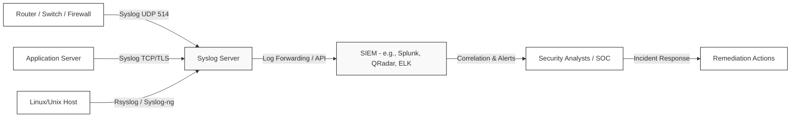
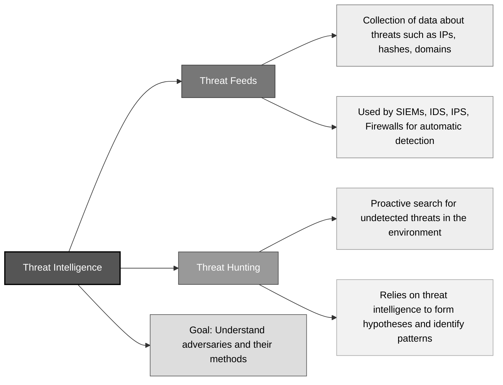
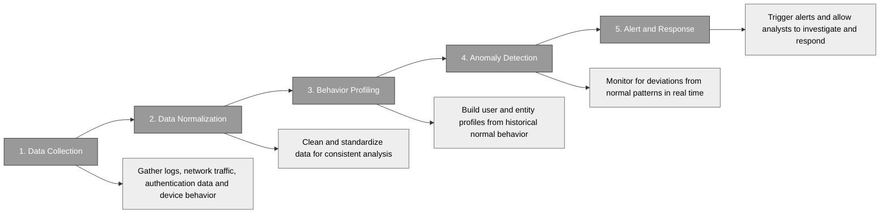

## 7.2.1 Intrusion detection and prevention Systems (IDPS) ##

One of the most common mistakes security newcomers make is thinking that cybersecurity is all about building tall walls — strong passwords, encryption, firewalls. But experienced practitioners know better: no matter how high the walls, someone will eventually attempt to sneak in or probe for weaknesses. This is where Intrusion Detection Systems (IDS) and Intrusion Prevention Systems (IPS) become your best allies.

Think of IDS and IPS as the cybersecurity equivalent of motion detectors, security cameras, and automatic door locks — but in digital form. They're not there to prevent someone from approaching your perimeter (that's a firewall’s job); they're there to detect or block malicious actions when other controls fail or when something suspicious happens inside your "digital castle.”

An **Intrusion Detection System (IDS)** is like a digital security guard whose job is to watch, analyze, and alert. It detects suspicious activities but won’t actively block them. Think of it as a smoke detector: it will sound the alarm, but it won’t stop the fire.

An **Intrusion Prevention System (IPS)** goes a step further: not only does it detect, but it takes action. If IDS is your smoke detector, IPS is your sprinkler system — the moment malicious behavior is detected, it actively blocks or mitigates the threat, often before the damage is done.

Now the question is: how do IDS and IPS decide what is "suspicious"?

| Detection Approach | Description | Strengths | Weaknesses |
|--------------------|-------------|-----------|------------|
| **Knowledge-Based (Signature-Based) Detection** | Relies on predefined patterns of known threats. Like a bouncer checking faces against a “Most Wanted” list — if data matches a known malware signature, it’s flagged or blocked. | - Highly accurate for known threats   - Low false positives for well-defined patterns | - Cannot detect new/unknown threats (zero-days)   - Requires constant signature updates |
| **Behavior-Based (Anomaly-Based) Detection** | Looks for deviations from normal activity. Like neighbors noticing a strange van circling at 2 a.m. — suspicious even if not on a watch list. | - Can catch unknown or emerging attacks   - Useful in dynamic environments | - Higher risk of false positives   - Needs time to learn “normal” behavior |
| **Combined Approach** | Smart security teams use both methods to balance precision and coverage. | - Strong coverage across known and unknown threats | - More complexity in deployment and management |

Any IDS/IPS deployment must be evaluated based on how well it distinguishes real threats from harmless activity. You’ll often hear four key terms:
- **True Positive:** The system correctly identified a real attack.
- **False Positive:** The system flagged something harmless as malicious (this leads to alert fatigue and desensitization).
- **True Negative:** The system correctly ignored benign activity.
- **False Negative:** The system failed to detect a real attack (the worst-case scenario).

In the real world, no system is perfect. The goal is always to minimize false negatives (missed attacks) while keeping false positives (nuisance alerts) low enough that security teams don’t start ignoring the system.

:necktie: Balancing false positives and false negatives is the art and science of IDS/IPS tuning.

Another important distinction lies in where the IDS or IPS is deployed.
- **Host-Based IDS (HIDS)** lives on individual machines. It watches for suspicious local events: logins, file changes, unusual processes.
- **Network-Based IDS (NIDS)** sits on the network and monitors traffic flowing between systems.

Both are valuable, and both serve distinct purposes. In most secure environments, you’ll find them working together — one watching the perimeter, the other monitoring internal activity.

:link: [NIST SP 800-94](https://csrc.nist.gov/pubs/sp/800/94/final) is the Guide to Intrusion Detection and Prevention Systems (IDPS)

### Open Questions ###

1. What is the main difference between an Intrusion Detection System (IDS) and an Intrusion Prevention System (IPS)?  

  
Show answer

The main difference is that IDS detects and alerts about suspicious activity without taking direct action, while IPS both detects and actively prevents or blocks the malicious traffic or behavior.

2. In cybersecurity, how does knowledge-based detection differ from behavior-based detection?  

  
Show answer

Knowledge-based detection uses known signatures of threats to identify attacks, while behavior-based detection looks for anomalies — deviations from normal behavior — to detect potential new or unknown attacks.

3. Why might behavior-based detection generate more false positives compared to knowledge-based detection?  

  
Show answer

Behavior-based detection learns what “normal” looks like and flags deviations. This can result in more false positives, especially in dynamic environments where normal behavior changes frequently but isn't malicious.

4. What is a “false negative” in the context of IDS/IPS, and why is it considered dangerous?  

  
Show answer

A false negative happens when the system fails to detect an actual attack. This is dangerous because it gives a false sense of security, allowing malicious activity to go unnoticed and unaddressed.

5. Why would an organization choose to run an IDS in passive mode rather than active mode?  

  
Show answer

Organizations may run IDS in passive mode to avoid accidentally blocking legitimate business traffic or services, especially when the detection rules aren’t yet fully fine-tuned and could generate false positives.

6. Explain the difference between Host-Based IDS (HIDS) and Network-Based IDS (NIDS).  

  
Show answer

HIDS monitors activity and changes within a specific host or device (like file changes or logins), while NIDS monitors network traffic across the entire network to detect suspicious patterns or packets.

7. What is meant by the term "true positive" when discussing IDS alerts?  

  
Show answer

A "true positive" occurs when the IDS correctly detects and reports an actual attack, allowing the security team to investigate and respond in time.

8. How can a combination of host-based and network-based IDS improve an organization’s security posture?  

  
Show answer

Using both HIDS and NIDS provides visibility at two levels: network-wide threats and host-specific threats. This layered approach helps detect threats that might evade one system but get caught by the other.

9. Give an example of a real-world situation where knowledge-based detection would be more effective than behavior-based detection.  

  
Show answer

When an attacker uses a well-known exploit, such as a specific vulnerability in a software version (e.g., EternalBlue for SMB vulnerabilities), knowledge-based detection would immediately spot the signature and raise an alert faster than behavior-based detection.

10. Why is tuning IDS/IPS systems an important part of security operations?  

  
Show answer

Tuning is essential to minimize false positives (avoiding alert fatigue) and false negatives (avoiding missed attacks). A well-tuned IDS/IPS ensures the system is trustworthy and useful, rather than noisy or blind.

## 7.2.2 Security Information and Event Management (SIEM) ##

Every firewall, router, application server, cloud service, and endpoint in your organization is constantly generating logs, status messages, and security events. Hidden inside that ocean of data are the clues you need to spot cyberattacks, misconfigurations, and insider threats before they turn into business disasters.

But here's the problem: no human, no matter how talented, can manually review millions of events per second across a modern network. That's where SIEM comes into the picture — the Security Information and Event Management system.

:necktie: In the world of cybersecurity, the challenge isn’t a shortage of data — it’s drowning in it.

SIEM is a specialized platform designed to collect, centralize, and make sense of all the security-related data your environment produces. It’s the detective in the security team that never sleeps, tirelessly pulling together seemingly unrelated information from every corner of your digital estate, and transforming raw logs into actionable intelligence.

But SIEM is more than just a log collector. If you picture your security operations center (SOC) as a control room, the SIEM is the central dashboard. It turns chaos into clarity, alerting your analysts when patterns suggest trouble and allowing them to drill down into the evidence.

In the early days, SIEM systems were typically on-premises: racks of servers humming away in the data center, running software like Splunk, ArcSight, or QRadar. These systems required skilled administrators and a lot of hardware, which made them expensive and, in some cases, hard to scale. With the rise of cloud computing, new models emerged. Cloud-native SIEM solutions (like Microsoft Sentinel or IBM QRadar on Cloud) eliminate the need to maintain physical infrastructure, offering scalability on demand. These solutions often come with advanced machine learning capabilities right out of the box, allowing smaller security teams to punch above their weight.

There’s also the hybrid model — a mix of on-premises and cloud — especially useful for organizations with strict regulatory requirements that prevent some data from leaving their physical control, but which still want cloud flexibility for analytics and long-term storage.

:necktie: No matter the type, the goals remain the same: make the noise manageable, and highlight the signals that really matter.

Let’s break down the services a SIEM provides:

| Concept        | Definition                                                                 | Example                                                                                                   | Why It Matters                                                                                   |
|----------------|-----------------------------------------------------------------------------|-----------------------------------------------------------------------------------------------------------|--------------------------------------------------------------------------------------------------|
| **Centralization** | SIEM gathers logs from multiple sources into one platform, providing a unified view of events. | A phishing email triggers logs across the email server, endpoint, network, and firewall. Without centralization, the attack timeline is fragmented. | Prevents missed incidents by giving analysts a complete picture of malicious activity. |
| **Normalization**  | Translates diverse log formats into a common, standardized language.     | A firewall logs *ERR_BLOCK*, another logs *DENY*, and an app logs *ACCESS_REFUSED*. SIEM normalizes them all under “blocked connection.” | Enables accurate correlation and querying across different systems. |
| **Correlation**    | Connects related events across systems to detect suspicious patterns.    | One failed login isn’t suspicious, but dozens of failed logins followed by success within seconds indicates a brute-force attack. | Finds real threats by linking behavior patterns, reducing noise and false alarms. |
| **Alerting**       | Notifies the right team when suspicious activity is detected, enriched with context. | SIEM generates an alert for suspicious logins, including related logs, user info, and past incidents. | Ensures timely response — alerts become the start of an investigation, not the end. |

### Open Questions ###

1. Why is centralization an essential feature in a SIEM system, especially during a cybersecurity incident?  

  
Show answer

Centralization ensures that logs and security events from multiple systems are collected and available in one place. This allows security teams to reconstruct the full timeline of an incident across devices, rather than missing connections due to siloed data. Without centralization, critical clues can easily be overlooked.

2. How does normalization help a SIEM system make sense of data from multiple sources?  

  
Show answer

Normalization translates logs from different systems into a consistent, standardized format. Since every device has its own way of logging events, normalization allows the SIEM to compare and process data from diverse sources accurately, making correlation and analysis possible.

3. In the context of SIEM, what is correlation, and why is it more powerful than reviewing individual log entries?  

  
Show answer

Correlation links multiple events from different systems to reveal patterns of malicious activity. A single log entry might seem harmless, but when combined with related events (like failed logins, privilege escalation, and data transfer) it can expose a coordinated attack that wouldn’t be visible otherwise.

4. What is the main difference between a traditional on-premises SIEM and a cloud-native SIEM solution?  

  
Show answer

An on-premises SIEM is hosted on the organization’s own infrastructure, requiring internal maintenance and hardware. A cloud-native SIEM, by contrast, runs in the cloud and offers scalable storage and computing resources, often with advanced analytics like machine learning, without the burden of managing physical servers.

5. Why is it important for SIEM alerting to provide context along with the notification, rather than just flagging a single suspicious event?  

  
Show answer

Providing context with an alert helps security analysts act faster and more accurately. Instead of seeing just one suspicious event, analysts can immediately view related data — such as affected users, systems, past behaviors, and surrounding logs — which improves decision-making and reduces wasted effort on false alarms.

---

## 7.2.3 Security Orchestration, automation and response (SOAR) ##

Cybersecurity isn’t just about firewalls, rules, and alerts anymore — it’s about how quickly and intelligently you can respond. The threats are faster, more automated, and more adaptive than ever before. So your defense must be as well. This is where SOAR, Machine Learning, and AI step into the spotlight.

Think of SOAR (Security Orchestration, Automation, and Response)  as the brain and nervous system of your security operations center (SOC). It doesn’t replace your analysts; it supercharges them. Imagine a typical day in a SOC: thousands of alerts, many of them false positives. Analysts are constantly switching tools — the SIEM, ticketing systems, threat intel feeds, logs, firewalls — while manually documenting every step. It’s exhausting, slow, and error-prone. SOAR takes those fragmented workflows and weaves them into a cohesive, automated system. It connects the tools, enforces consistency, and executes repetitive tasks faster than any human could. But it doesn’t act blindly. That’s where **playbooks** and **runbooks** come in.

Here’s an analogy: A playbook is like your GPS route — it tells you where you’re going and why. A runbook is the set of exact turns you’ll make — the how.
- **Playbooks** define high-level logic. For example: “If a phishing email is detected, extract sender data, check against known indicators of compromise (IOCs), isolate the endpoint, and notify HR.”
- **Runbooks** automate the actual steps: “Query threat intel database → Extract domain → If domain reputation is low → Block domain on the mail gateway → Generate ticket in system X.”

:bulb: In practice, this means that a SOAR platform can detect a suspicious login from a foreign country, enrich the alert with geolocation data and user behavior history, auto-disable the account if it meets the risk threshold, notify the SOC, and document everything in your case management system — all within seconds.

Picture this: A user reports a suspicious email. The SOAR system kicks in:
1. Extracts attachments and URLs
2. Checks against threat intelligence feeds
3. Sandboxes any files to analyze behavior
4. Scans all mailboxes to identify similar emails
5. Quarantines them automatically
6. Creates a detailed case report
7. Notifies HR if necessary

What used to take a team hours can now happen in under a minute — consistently and accurately. This is the kind of workflow SOAR enables. And it’s not limited to phishing — malware analysis, brute-force response, insider threat triage — anything repeatable can be orchestrated.

But automation alone isn’t enough. Threats evolve. Attackers don’t always leave signatures. That’s where **machine learning (ML)** comes into play. ML gives systems the ability to learn from data rather than being programmed with rigid rules.
For example, consider user behavior. A rule-based system might say: “If a user logs in from China, alert.” But what if that user works in China?
A machine learning model instead learns what “normal” looks like for that user — login times, locations, applications accessed — and flags deviations intelligently. This is known as **anomaly detection**.
ML also shines in areas like:
- Email filtering (identifying spam and phishing)
- Endpoint protection (detecting unusual process behaviors)
- Threat intelligence correlation (finding hidden connections between indicators)

Whereas machine learning is about pattern recognition and prediction, **artificial intelligence** adds context and reasoning. AI systems can prioritize alerts based on asset criticality, assess intent from a series of actions, or suggest likely next steps in an attack chain.

In SOAR environments, AI helps triage events — not just saying “this looks bad,” but suggesting why and what to do about it. It’s like having a junior analyst who’s read every security casebook and can make educated recommendations — instantly.

:necktie: Why use SOAR? To scale your team’s effectiveness and reduce human error. Why trust ML and AI? Because attackers are already using them, and traditional defenses can’t keep up. What’s the risk? Automation without governance is dangerous. Every playbook needs review. Every ML model needs training. Every AI suggestion needs oversight.

### Open Questions ###

1. What is the primary function of a SOAR platform in a security operations center (SOC)?

 
Show answer
 SOAR (Security Orchestration, Automation, and Response) platforms are designed to automate and coordinate security operations workflows, allowing security teams to respond faster and more consistently to threats. By integrating tools and automating repetitive tasks, SOAR reduces manual effort, improves incident response times, and helps manage alert fatigue. 

2. How do playbooks and runbooks differ in the context of SOAR workflows?

 
Show answer
 Playbooks represent high-level decision logic and response strategies — essentially the “what” and “why” of an incident response. Runbooks, on the other hand, contain the detailed, automated steps — the “how” — such as executing scripts, querying systems, or blocking IPs. Together, they define and automate security responses from logic to execution. 

3. Why is machine learning particularly useful for detecting insider threats or unusual behavior?

 
Show answer
 Machine learning excels at identifying deviations from learned patterns. In the context of insider threats, ML can profile normal user behavior and alert on anomalies, such as unusual login times, access to sensitive files, or unexpected data transfers — even when such activity doesn't match a known signature or rule. 

4. What is one major risk associated with deploying SOAR solutions without proper governance?

 
Show answer
 Without oversight, automated responses can cause unintended disruptions — such as isolating the wrong system, blocking legitimate users, or deleting critical logs. Poorly designed or unreviewed playbooks can amplify mistakes at machine speed, making governance, testing, and human-in-the-loop controls essential. 

5. How does artificial intelligence enhance the effectiveness of a SOAR platform beyond traditional automation?

 
Show answer
 AI adds context-aware decision-making to automation. It can prioritize alerts based on asset criticality, suggest next steps in an attack sequence, and help analysts make sense of complex incidents. While automation handles known scenarios, AI helps in dynamic, ambiguous ones by mimicking analytical reasoning. 

## 7.2.4 Continuous monitoring and tuning ##

Imagine trying to drive a car where the speedometer updates every ten minutes. You’d never know if you were too fast, too slow, or headed into danger. That’s what managing cybersecurity without continuous monitoring looks like. In today’s dynamic threat landscape, continuous monitoring and tuning are not luxuries — they’re necessities. They form the nervous system of an organization’s security posture, constantly checking, alerting, and adjusting to keep everything in balance.

Security is not a one-time activity. Threats evolve, business processes change, systems age, and users make mistakes. Continuous monitoring bridges the gap between static defenses and a fluid environment. It gives you ongoing situational awareness — not just of threats, but of the effectiveness of your defenses and the health of your systems.

In practical terms, it answers questions like:
- Is the patch we deployed last week still working?
- Are login attempts spiking at 3 AM every Friday?
- Has a critical process suddenly stopped logging data?

You don’t want to learn about a breach from a journalist. Continuous monitoring helps you know first.

Just as a car’s engine needs tuning to run smoothly, so does your monitoring strategy. Without tuning, alerts overwhelm analysts, false positives pile up, and genuine threats hide in the noise. Tuning means setting thresholds, updating rules, refining filters, and adjusting how tools behave based on what you’re learning. It’s iterative and strategic — too aggressive and you’ll miss subtle threats (false negatives); too lenient and you’ll drown in alerts (false positives). Tuning isn’t a “set and forget” task. It’s a cycle: observe, analyze, adjust. A good security team is always learning from incidents, near misses, and benign anomalies to improve the system.

In the following we recap the key aspects to consider in continuous monitoring:

| Principle | Description | Example |
|-----------|-------------|---------|
| **Defined Reference Point** | Monitoring is only useful if you know what “normal” looks like. A baseline of expected behavior gives you context for detecting anomalies. | If a user normally logs in from 9 to 5 in New York, a login at midnight from Singapore should raise eyebrows. |
| **Automation** | Manual monitoring is impossible at scale. Automation executes repetitive tasks quickly and consistently, empowering analysts to focus on real threats. | A SIEM can automatically correlate firewall logs, authentication events, and endpoint activity to trigger alerts when conditions match a rule. |
| **Frequency** | The monitoring frequency should match the risk level. Critical systems may require real-time checks, while others may suffice with periodic reviews. | Real-time monitoring for financial transactions vs. daily checks for printer logs. |
| **Appropriate Metrics** | Metrics must be meaningful and actionable. In security, the focus is on detecting threats rather than just performance tuning. | Failed login rates, privilege escalations, and unauthorized data access are more valuable than CPU usage. |
| **Defined Action Plans** | Monitoring without response is passive. Every alert should trigger a clear, predefined action to save time during incidents. | A ransomware alert triggers isolation of the endpoint, escalation to the SOC, and an investigation runbook. |
| **Balance of Cost and Value** | Monitoring everything is costly. Smart monitoring balances coverage, cost, and value by prioritizing what’s essential. | Dropping low-value logs (e.g., printer status) while focusing on high-value sources like authentication and firewall logs. |

Your monitoring system needs eyes and ears everywhere. That’s where **SIEM (Security Information and Event Management)** platforms shine. SIEMs collect and analyze logs from all corners of your environment — firewalls, servers, endpoints, applications — to give you a centralized, correlated view of what’s happening.

:link:  For details about SIEM systems, look [7.2.2](https://github.com/lorenzoleonelli/CISSP-Zero-to-Hero/edit/main/DOMAIN7%3A%20Security%20Operations/7.02%20Conduct%20logging%20and%20monitoring%20activities.md#722-security-information-and-event-management-siem)

**Syslog**, on the other hand, is a protocol used to send log messages from devices to a central server. Think of it like the postal service of event logs. Devices shout, “Hey, I saw this!” and syslog ensures the messages get delivered to a logging server or SIEM.

The following diagram shows how Syslog messages flow through a typical enterprise logging setup — from network devices and servers to the central Syslog server and onward to a SIEM for correlation and analysis:

:necktie: Together, syslog and SIEM form a powerful combo: syslog gathers, SIEM thinks.

Let’s say you’re monitoring 10,000 login events per day. Do you really need every single one? Use **sampling** — the practice of collecting a representative subset of data. This reduces processing overhead and storage costs, while still giving you visibility into trends and anomalies.
**Clipping levels** help reduce noise. You define thresholds below which events are ignored. For example, you might only log failed login attempts if they exceed five in a row. Clipping isn’t about ignoring data recklessly; it’s about reducing irrelevant chatter.

:bulb: Over-clipping can blind you to subtle attacks. Always reassess these thresholds regularly, especially after incidents. 

Logs are your memory in cybersecurity. They record what happened, when, and often why. Without proper **log management**, you're flying blind. Good log management means:
- Retention: How long you keep logs depends on compliance and business needs.
- Integrity: Logs must be protected from tampering — if they can be altered, they lose evidentiary value.
- Access control: Who can view or modify logs should be strictly limited.
- Analysis capability: If logs aren’t searchable or understandable, they’re just digital noise.

:necktie: Continuous monitoring and tuning transform your organization from reactive to proactive. It’s the difference between being surprised by threats and seeing them coming.

### Open Questions ###

1. Why is a defined reference point critical in continuous monitoring?  

  
Show answer

A defined reference point provides a baseline of normal behavior, allowing the monitoring system to detect anomalies. Without this baseline, identifying suspicious deviations becomes unreliable.

2. How does automation enhance the effectiveness of a continuous monitoring program?  

  
Show answer

Automation allows for faster, consistent, and scalable processing of security data, enabling real-time responses and freeing up analysts to focus on interpreting significant events rather than managing repetitive tasks.

3. What determines the appropriate frequency for collecting security data?  

  
Show answer

The frequency should be based on the criticality of the asset or process being monitored. High-risk systems might require real-time monitoring, while lower-risk systems might be checked periodically.

4. Why are meaningful metrics essential in continuous monitoring?  

  
Show answer

Meaningful metrics ensure that monitoring produces actionable insights, helping analysts focus on indicators that directly reflect security health or potential threats.

5. What is the purpose of having defined action plans associated with alerts?  

  
Show answer

Defined action plans ensure that alerts trigger immediate and appropriate responses, reducing confusion and delays during incident handling, especially in high-pressure situations.

6. How should an organization balance the cost and value of its monitoring strategy?  

  
Show answer

Organizations must prioritize monitoring activities based on risk and business value, ensuring essential data is captured without overwhelming the system or inflating costs unnecessarily.

7. What role does a SIEM play in continuous monitoring?  

  
Show answer

A SIEM centralizes, normalizes, and correlates security data from diverse sources, providing a comprehensive view of the environment and enabling advanced analytics and alerting.

8. How does syslog support a centralized monitoring system?  

  
Show answer

Syslog is a protocol that enables devices to send log messages to a central server, allowing logs to be collected from disparate sources for unified analysis and storage.

9. What is the difference between sampling and clipping levels in log management?  

  
Show answer

Sampling involves collecting only a subset of data to reduce overhead, while clipping levels set thresholds to ignore insignificant events, both aiming to optimize the volume and relevance of collected data.

10. Why is proper log management crucial for both security operations and compliance?  

  
Show answer

Proper log management ensures log integrity, availability, and usefulness, which are essential for detecting incidents, conducting forensic analysis, and meeting regulatory requirements.

---

## 7.2.5 Egress Monitoring ##

In cybersecurity, one of the ultimate nightmares isn’t just that someone breaks into your system — it’s that they break out with your crown jewels. Data exfiltration — the unauthorized movement of sensitive information from a system — is the silent heist that ruins reputations, triggers regulatory fines, and shatters trust. Understanding exfiltration, how to detect it, and how to stop it is not just academic theory for the CISSP exam — it’s survival knowledge for every cybersecurity professional. Let’s dig deep into the "what," "why," and "how."

**Exfiltration** refers to the unauthorized transmission of data from a system to an external destination.Think of it like a spy movie: the villain isn't fighting their way out with alarms blaring — they’re slipping away quietly with a flash drive in their pocket or a hidden tunnel to the outside world.
Exfiltration can happen for example through:
- USB drives
- Cloud uploads
- Email attachments
- DNS tunneling
- Covert channels (even hiding data inside pictures!)

:bulb: In the infamous Snowden case, classified information was exfiltrated using simple USB storage. In the Target breach (2013), attackers moved payment card data out via malware-controlled servers overseas — undetected for months.
In short: You don’t just need to block the break-in. You need to monitor the exits.

**Data Loss Prevention (DLP)** solutions act like vigilant customs officers at an airport: they inspect what is trying to leave, making sure no forbidden goods cross the border. DLP's job is simple to state but hard to execute:
- Identify sensitive data (e.g., credit card numbers, source code, customer lists)
- Monitor how that data moves inside and outside the organization
- Block unauthorized transmission or access

Key DLP techniques are:
| Feature            | Description                                                                                     |
|--------------------|-------------------------------------------------------------------------------------------------|
| **Content Inspection** | DLP tools scan data for specific patterns (e.g., regex patterns matching credit card numbers). |
| **Context Analysis**   | Understand the who, where, and how — not just what. For example, why is an HR intern emailing hundreds of employee records? |
| **Policy Enforcement** | Define and automate what should happen when a violation is detected: alert, block, quarantine. |

:necktie: Why DLP is hard:
- False positives are everywhere. Is that 16-digit number a credit card or just an invoice number?
- Business needs vs security: Sales teams want freedom to move fast; security needs to monitor carefully.
This constant balancing act is the art of DLP deployment.

When you hear "egress" and "ingress," think doors:
- **Ingress** = who/what is coming in
- **Egress** = who/what is going out
You don’t just protect your house by locking the front door — you monitor all doors and windows, incoming and outgoing.

| Monitoring Type   | Focus                                                                 | Examples                          |
|-------------------|----------------------------------------------------------------------|-----------------------------------|
| **Ingress Monitoring** | Detecting threats entering the network                                | Malware, Intrusions, Phishing attempts |
| **Egress Monitoring**  | Detecting threats trying to leave with data                           | Data exfiltration, Botnet communications, Unauthorized uploads |

Effective monitoring relies on:
- Regex (Regular Expressions): Pattern-matching techniques to identify sensitive information, like Social Security numbers or keywords like "confidential."
- Behavioral Analytics: Building baselines of normal user behavior and flagging anomalies (e.g., why is the finance server suddenly sending 500MB of data at 2AM?)
- Signature-based Detection: Recognizing known attack patterns (useful but limited — can't detect new methods).
- Heuristic/Anomaly Detection: Guessing when behavior is suspicious, even without a known signature.

### Open Questions ###

1. What is the primary purpose of a Data Loss Prevention (DLP) solution in cybersecurity?  

  
Show answer

The primary purpose of a DLP solution is to detect, monitor, and prevent unauthorized attempts to move sensitive data outside the organization's trusted boundary.

2. How does regular expression (regex) help DLP systems in protecting sensitive data?  

  
Show answer

Regular expressions allow DLP systems to scan for specific patterns (like credit card numbers, social security numbers) within content, even when file types or formats vary.

3. Why is behavioral analysis important for detecting exfiltration attempts?  

  
Show answer

Behavioral analysis detects deviations from normal user activity patterns, helping identify exfiltration attempts that would not match known signatures or static patterns.

4. What is the difference between ingress and egress monitoring?  

  
Show answer

Ingress monitoring watches inbound network traffic for threats entering the organization, while egress monitoring watches outbound traffic to detect sensitive data leaving.

5. Give an example of how exfiltration could happen through a seemingly harmless method.  

  
Show answer

An employee could email confidential client data to their personal Gmail account, bypassing formal export controls if outbound email isn't properly monitored.

6. What role does pattern-based detection play in egress monitoring?  

  
Show answer

Pattern-based detection identifies structured sensitive data formats leaving the organization, such as finding a string matching the structure of credit card numbers or medical IDs.

7. Why might relying only on signature-based monitoring be insufficient for preventing data exfiltration?  

  
Show answer

Signature-based monitoring only detects known threats, meaning new, unknown, or modified exfiltration methods could bypass detection unless supplemented with behavioral or pattern-based tools.

8. How can encrypted traffic complicate egress monitoring efforts?  

  
Show answer

Encrypted traffic can hide the contents of data transmissions, making it difficult for monitoring tools to inspect and detect sensitive information leaving the network.

9. What is a real-world consequence of failing to detect data exfiltration promptly?  

  
Show answer

Failing to detect exfiltration promptly can lead to major data breaches, regulatory fines, reputational damage, and significant financial losses for the organization.

10. How does tuning DLP and egress monitoring rules improve security outcomes?  

  
Show answer

Tuning DLP and monitoring rules reduces false positives, aligns detection with the organization's actual risk profile, and ensures security teams focus on real threats rather than noise.

 
 ---

## 7.2.6 Log management ##

When people think of cybersecurity, they often imagine firewalls blocking attacks or teams hunting threats across sprawling networks. But behind all the action, something quieter and equally critical is happening: log management. Logs are the "black boxes" of your systems. They record everything—user logins, system errors, file changes, and even subtle signs of an attack. In fact, without proper logs, detecting a breach is like trying to solve a crime without witnesses, video footage, or fingerprints. You’re simply guessing.

Log management is the entire lifecycle of handling log data: generation, transmission, storage, analysis, and disposal. Done well, it allows organizations to monitor security, troubleshoot issues, meet compliance requirements, and reconstruct incidents after they happen.Done poorly—or worse, ignored—it becomes a giant security hole.

Imagine an airline not maintaining flight logs. Pilots would have no reliable record of system failures, near misses, or even routine maintenance. Cybersecurity is no different: without logs, you're flying blind.

:brain: Good log management answers key questions:
- What happened?
- When did it happen?
- Who did it?
- Where did it happen from?

:necktie: Logs must be collected centrally, protected from tampering, and retained for appropriate periods based on regulatory and business needs (sometimes months, sometimes years).

**Auditable events** are actions or occurrences that must be recorded and, often, trigger a deeper review. These events typically include:
- Authentication attempts (both successes and failures)
- Access to sensitive data
- Privilege escalations
- Changes to security settings
- Installation of new software

Now, think about **thresholds**. You can't investigate every login failure—people forget passwords! But if there are 50 failed login attempts in 5 minutes from the same user, that’s suspicious.Thresholds define how much or how often an event must occur before it’s flagged for action.

:bulb: Picture a hospital emergency room. If one person walks in coughing, it's normal. But if 50 people rush in coughing within an hour, you have a crisis. Thresholds help you separate isolated incidents from patterns that signal serious trouble.

Logs are evidence. If someone can alter them, they can erase their tracks. This makes log protection not just a technical necessity, but a legal one.

Protecting logs involves several best practices:
- **Access Control:** Only authorized personnel should be able to view or manage logs.
- **Integrity Checks:** Use hashes to detect if a log has been tampered with.
- **Encryption:** Logs should be encrypted in transit and at rest to prevent snooping.
- **Separation of Duties:** Those who manage systems shouldn’t be able to edit the logs that record their activity.

:bulb: In many insider threat cases, attackers first attempt to delete or alter logs after malicious actions. Smart organizations send logs in real-time to a separate, secured server—out of reach of the attacker’s permissions.

:necktie: If it's not logged, it didn't happen. If it's logged but not protected, it might as well not have happened.

Most people don't wake up excited to review gigabytes of system logs. But every breach investigation, every forensic triumph, every compliance audit that goes well—starts with good log management. Log management is the cybersecurity equivalent of health insurance. You don't appreciate it daily, but when disaster strikes, it's the only thing that keeps your world from collapsing. 
:brain: As a security professional, you need to approach logs as both historical records and active sensors. 
By managing them properly, defining auditable events and thresholds wisely, and protecting the integrity of log data fiercely, you build the foundation for leading secure, resilient organizations.

### Open Questions ###

1. Why is log management considered a foundational element of cybersecurity?

 
Show answer
 Good log management ensures organizations can monitor their environment, detect security incidents, troubleshoot effectively, meet regulatory requirements, and reconstruct security events after they happen. It acts as the backbone for visibility and accountability in cybersecurity operations. 

2. What critical questions should good log management be able to answer during an investigation?

 
Show answer
 Good log management should be able to answer: 
  
  What happened? 
  
  When did it happen? 
  
  Who was involved? 
  
  Where did it happen from?
  
  These questions are critical to building a clear timeline and understanding the scope of an incident. 

3. In the context of auditable events, why are thresholds important?

 
Show answer
 Thresholds help distinguish between normal behavior and suspicious activity by defining how often an event must occur before it demands attention. This reduces noise, prevents alert fatigue, and ensures security teams can prioritize genuine risks. 

4. What are three examples of events that should always be audited in a security-focused environment?

 
Show answer
 Critical events to audit include: 
  
  - Authentication attempts (both successful and failed)
  - Access to sensitive data
  - Any changes to security settings or privileges

These ensure accountability and provide evidence in case of suspicious activities. 

5. Why is protecting the integrity of log data essential for both security operations and legal purposes?

 
Show answer
 Protecting the integrity of log data is essential because logs serve as evidence during incident investigations and legal proceedings. If logs are tampered with, they lose their credibility, weakening both security response and potential legal cases. 

6. How does separating the duties of system administrators and log managers enhance log security?

 
Show answer
 Separating system administrator and log manager roles ensures that individuals who might cause or witness security incidents cannot alter the records of their own activities. This enforces accountability and preserves the objectivity of the logs. 

7. What are two key methods used to protect logs during transmission and storage?

 
Show answer
 Two key methods are: 
  - Encrypting logs both during transmission and at rest to prevent unauthorized access 
  - Using cryptographic hashes to verify log integrity and detect any tampering 
  
  These ensure confidentiality, integrity, and evidentiary value. 

---

## 7.2.7 Threat intelligence (e.g., threat feeds, threat hunting) ##

Threat intelligence is not just a collection of scary headlines about breaches. It’s analyzed, actionable knowledge about potential or existing threats that helps organizations make informed security decisions.

Think of it this way: raw data is like random weather reports. Threat intelligence is a focused weather forecast specifically warning you of a hurricane moving toward your town.
Threat Intelligence is important because security teams are already drowning in alerts. Without intelligence to prioritize what matters most, defenses get spread too thin—and real threats slip through.

Good threat intelligence answers questions like:
- Who is attacking?
- What are their tactics, techniques, and procedures (TTPs)?
- What vulnerabilities are being exploited?
- What assets are being targeted?
- How urgent is the threat?

The most common types of Threat Intelligence are:
- Strategic: Big-picture trends, such as a rise in ransomware attacks on healthcare.
- Tactical: Indicators of compromise (IP addresses, file hashes) linked to active campaigns.
- Operational: Specific warnings about ongoing attacks against your industry.
- Technical: Immediate technical indicators like malware signatures.

:necktie: Without a clear understanding of why threat intelligence matters, even the best tools become just noise generators. Intelligence lets you move from reactive to proactive.

If threat intelligence is the weather forecast, **threat feeds** are the meteorological data streams feeding that forecast. A threat feed provides continuous updates on threats, often in an automated way.

Examples of threat feeds include:

- Lists of malicious IPs or domains
- Malware signatures
- Vulnerability disclosures
- Indicators of compromise (IOCs)

However, not all feeds are created equal. Some are curated by cybersecurity experts, others are mass-scraped from the internet. And here's the catch: if you consume threat feeds blindly without context or prioritization, you risk overwhelming your team with false positives.

| Threat Feed Quality Factors | Details                                                   |
|-----------------------------|-----------------------------------------------------------|
| Timeliness                  | Is the feed updated quickly enough to catch fast-moving threats? |
| Relevance                   | Does it apply to your industry and geography?             |
| Accuracy                    | Are the indicators well-vetted to reduce false positives? |
| Source Trustworthiness      | Is the feed maintained by a credible organization?        |

:necktie: Threat feeds are the ingredients. Threat intelligence is the meal. You must cook wisely.

**Threat hunting** flips the traditional defensive model on its head. Instead of waiting for alerts, hunters proactively look for signs of threats that might have evaded detection. It's like sending scouts beyond your castle walls, looking for footprints and broken branches instead of waiting for the enemy to break down the gate.

Threat hunting combines:
- Hypothesis-driven investigation (e.g., "What if a threat actor already compromised an internal host?").
- Advanced analytics (user behavior analytics, anomaly detection).
- Human intuition and experience.

Hunters look for:
- Lateral movement inside the network.
- Use of stolen credentials.
- Persistence mechanisms like rogue scheduled tasks.
- Signs of data exfiltration.

| Hunting Technique       | Description                                              |
|--------------------------|----------------------------------------------------------|
| Pattern-based hunting    | Search for known attack patterns and artifacts.          |
| Anomaly-based hunting    | Look for deviations from normal system or user behavior. |
| Intelligence-driven hunting | Focused hunts based on recent threat intelligence reports. |

:necktie: Threat hunting is about assumption busting. It starts where automated systems end.

**SOAR** is a suite of technologies designed to automate and orchestrate security tasks, enabling security operations centers (SOCs) to respond to threats more efficiently. It brings together three key elements: Orchestration, Automation, and Response.
- **Orchestration** refers to the process of coordinating various security tools and processes within the organization. Imagine a conductor leading an orchestra—different instruments (or in this case, security tools) play in harmony to create a seamless security operation.
- **Automation** is the magic that takes mundane, repetitive tasks out of the hands of human analysts. For example, if a malicious IP address is detected, a SOAR system can automatically block it across the network without requiring manual intervention, speeding up the process and reducing human error.
- **Response** is the ability to handle incidents in real-time by executing predefined playbooks. These playbooks outline step-by-step instructions for responding to specific threats, ensuring consistency and quick execution, regardless of which analyst is on shift.

As the number of cyberattacks grows and becomes more sophisticated, security teams struggle to keep up. There’s simply too much data and too many threats to analyze manually, let alone respond to. This is where SOAR comes in. By automating routine processes and orchestrating tools, SOAR significantly reduces the time to detect, respond, and remediate threats. Instead of security professionals drowning in alerts, they can focus on high-value tasks like threat hunting or strategic decision-making.

In real-world terms, think of a business facing a Distributed Denial-of-Service (DDoS) attack. The security team’s first step is usually to validate the attack, then block the malicious traffic, and finally, notify leadership. With SOAR, these steps can be automated and executed faster, improving response time and limiting the damage. This automation also reduces the burden on analysts, allowing them to focus on more complex issues.

Suppose an organization’s firewall detects an anomalous IP address engaging in suspicious activity. This alert is forwarded to the SOAR system, which automatically correlates it with threat intelligence sources to assess whether it’s a known threat. The SOAR system then checks predefined rules to decide whether to block the IP address, add it to a watchlist, or escalate it for further investigation by a human analyst. This automated flow ensures that the right action is taken quickly, without delay.

Moreover, SOAR platforms are designed to integrate with a wide variety of security tools—firewalls, SIEMs (Security Information and Event Management systems), endpoint protection, threat intelligence platforms, and more. This means that when an alert is triggered in one tool, SOAR ensures that other tools are updated accordingly, streamlining the process and providing a unified view of security events.

### Open Questions ###

1. What is the key difference between raw data and threat intelligence in cybersecurity?  

  
Show answer

Threat intelligence is analyzed, actionable knowledge that informs decision-making, while raw data is unfiltered information that lacks context or prioritization.

2. Why can relying solely on threat feeds without proper filtering be dangerous for a security team?  

  
Show answer

If you rely only on threat feeds without filtering, you risk overwhelming analysts with false positives, making it harder to identify real threats and decreasing the effectiveness of the security program.

3. What are some factors that determine the quality of a threat feed?  

  
Show answer

The quality of a threat feed depends on timeliness, relevance to the organization's environment, accuracy (low false positives), and the trustworthiness of the source.

4. In threat hunting, why is hypothesis-driven investigation important?  

  
Show answer

Hypothesis-driven investigation is important in threat hunting because it focuses the search on specific potential threats, allowing hunters to detect stealthy attacks that automated systems might miss.

5. How do threat intelligence, threat feeds, and threat hunting complement each other in a cybersecurity program?  

  
Show answer

Threat intelligence identifies the threats to prioritize, threat feeds provide real-time indicators, and threat hunting actively searches for hidden threats, together creating a proactive and resilient security posture.

---

## 7.2.8 User and Entity Behavior Analytics (UEBA) ##

As cyber threats continue to grow in both number and complexity, traditional security measures such as firewalls and antivirus software are no longer enough to protect an organization’s digital assets. In response to this evolving landscape, the cybersecurity industry has introduced more sophisticated techniques, one of which is User and Entity Behavior Analytics (UEBA). UEBA is a cutting-edge tool that provides organizations with the ability to detect anomalous behavior within their network by analyzing the behavior of users and entities (e.g., devices, applications, servers) in real-time.

At its core, UEBA is a security solution that uses machine learning, statistical analysis, and data mining to analyze the behavior of users and entities in order to detect unusual patterns that could indicate potential security threats. Unlike traditional security systems that rely on predefined signatures (e.g., for known malware), UEBA looks for behavioral anomalies—actions that deviate from the norm—regardless of whether the behavior corresponds to a known threat.

For example, if an employee who typically works from 9 AM to 5 PM suddenly logs in at 3 AM from an IP address in another country, that might raise a red flag. Similarly, if a server starts transmitting large amounts of data to an unfamiliar external address, UEBA can identify this as unusual behavior, potentially signaling a data exfiltration attempt.

The real strength of UEBA lies in its ability to understand “normal” behavior for each user or entity, and then flag behavior that diverges from that baseline. This is crucial because many cyberattacks, such as insider threats or advanced persistent threats (APTs), may not be detected by traditional methods that only focus on known signatures or known attack patterns. UEBA shifts the focus to behavior—an approach that can uncover novel or hidden attacks.

To appreciate the power of UEBA, it’s essential to understand how it functions. UEBA solutions typically gather vast amounts of data from across an organization's network—this data can come from logs, event monitoring systems, and other security tools. The system then analyzes this data using advanced machine learning algorithms and other analytics techniques to identify patterns of user and entity behavior.

The Process of UEBA Implementation is basically made of 5 steps:
1. **Data Collection:** The first step is gathering data from various sources within the organization, including network traffic, user activity logs, device behavior, authentication records, and more. This raw data is the foundation for behavior analysis.
2. **Data Normalization:** Once the data is collected, it is standardized and cleaned up. Since this data comes from various sources, normalization ensures that it can be analyzed in a consistent manner.
3. **Behavior Profiling:** The next step involves creating profiles for individual users and entities based on their normal behavior. These profiles are built using historical data, which is analyzed to understand each user’s typical activities, such as login times, locations, and actions performed on the network. Similarly, entities (e.g., servers, devices) have their own profiles based on expected usage patterns.
4. **Anomaly Detection:** Once these profiles are in place, the UEBA system continuously monitors activity across the network in real-time. If a user or entity performs an action that deviates significantly from their established pattern—say, accessing sensitive files they typically don’t interact with or initiating a large data transfer—an alert is triggered.
5. **Alert and Response:** When an anomaly is detected, the system generates an alert that is prioritized based on the severity of the behavior. Security analysts are then able to investigate the alert, determine whether it indicates a legitimate threat, and take appropriate action. For example, if the anomaly is benign (e.g., a legitimate employee working late from a new location), the alert may be closed. However, if the anomaly suggests malicious activity, such as an attempted data breach, the response might involve further investigation, blocking access, or notifying the relevant stakeholders.

UEBA adds value to an organization’s security posture by shifting the focus away from just detecting known threats to identifying potential zero-day exploits, insider threats, and compromised accounts. Some of the key areas where UEBA excels include:

| Use Case                     | Description |
|-------------------------------|-------------|
| **Insider Threat Detection**  | One of the most difficult threats to detect is an insider threat—whether it’s a malicious employee, a disgruntled worker, or someone with compromised credentials. Traditional methods might fail to catch these threats because the attacker already has legitimate access to the network. UEBA excels here because it monitors user behavior over time and can spot unusual access patterns, such as an employee downloading sensitive files they don’t normally work with or accessing resources at unusual hours. This behavior would raise a red flag and trigger an alert. |
| **Advanced Persistent Threats (APTs)** | APTs are sophisticated, long-term attacks where the adversary often takes steps to remain undetected for as long as possible. APTs may involve slow, deliberate data exfiltration or lateral movement within the network. Because these attacks are subtle and do not immediately manifest as traditional malware or known exploits, they can evade detection by traditional security measures. UEBA, however, is adept at spotting unusual patterns and gradual anomalies that would otherwise go unnoticed. |
| **Compromised Accounts**      | When a user’s credentials are compromised, attackers can use them to move around the network and access sensitive data. UEBA can help detect these types of attacks by identifying abnormal login patterns, such as access from unfamiliar locations or at odd times. Moreover, UEBA can spot suspicious activities, like a user accessing a high volume of data or interacting with files they’ve never worked with before. |

### Open Questions ###

1. What does UEBA stand for and what is its primary purpose in cybersecurity?  

  
Show answer

UEBA stands for User and Entity Behavior Analytics, and its primary purpose is to detect anomalies in the behavior of users and entities within a network. By analyzing behavioral patterns, UEBA helps identify potential threats that traditional security measures might miss.

2. How does UEBA differ from traditional security tools that focus on signature-based detection?  

  
Show answer

Unlike traditional security tools, which primarily rely on signature-based detection (looking for known malware or attack patterns), UEBA uses machine learning and statistical analysis to detect deviations from normal behavior. It focuses on identifying unknown or novel threats based on the activities of users and entities, rather than relying solely on predefined attack signatures.

3. What types of security threats can UEBA help detect, and why is it particularly useful for identifying insider threats?  

  
Show answer

UEBA is particularly effective at detecting threats such as insider attacks, advanced persistent threats (APTs), and compromised accounts. It is valuable for detecting insider threats because it monitors and compares user behavior over time, flagging deviations like unusual access patterns or data transfers that might indicate malicious intent.

4. How does UEBA create profiles for users and entities, and what role do these profiles play in detecting anomalies?  

  
Show answer

UEBA creates behavior profiles by analyzing historical data about how users and entities typically interact with the system. These profiles include details like login times, access frequency, and which resources are typically accessed. When an action deviates significantly from this profile—such as logging in from an unusual location or accessing files they don’t usually interact with—the system flags it as an anomaly that might indicate malicious activity.

5. Can you provide a real-world example of how UEBA helped detect a security incident?  

  
Show answer

In a real-world scenario, UEBA helped a financial institution detect a compromised account. An executive’s credentials were stolen through phishing and used to access the network at an unusual time and from a foreign location. The UEBA system flagged this behavior as an anomaly, which led the security team to investigate and thwart the data exfiltration attempt.

---

