## 7.5.1 Media management ##

Picture a locked filing cabinet filled with sensitive documents. Now imagine someone leaves the key in the lock, walks away, and never labels what’s inside. It’s not hard to see how security quickly unravels. The same principle applies to media—any physical or digital form that stores information. In today’s hybrid environments, where USB drives, backup tapes, SSDs, and even old-school DVDs still roam, managing media securely is critical.

Before diving into labeling and marking, it's important to clarify what we mean by "media." It includes:
- **Physical media** such as tapes, printed documents, USB drives, and external hard drives.
- **Electronic/digital media** like virtual machines, cloud backups, SSDs, and archived emails.

Media, by its nature, travels. A backup tape might go from a data center to a cold-storage facility. A USB might move between engineers or from a vendor to your IT team. These transitions are where data becomes vulnerable. Labeling, marking, and proper handling are the controls that accompany this media on its journey.

At its core, labeling is about classification. You’re telling anyone who comes into contact with a piece of media: Here’s what’s inside, and here’s how you should treat it. Labels may include classification levels (e.g., Confidential, Secret), the data owner, and any applicable handling restrictions.

Imagine you're a SOC analyst in a large financial organization. You find a USB stick in the SOC break room. If it's labeled “Confidential – Trading Algorithms – Return to Jane Smith,” you’re immediately in control. You know its value, its owner, and you can take action. Without the label, it's an unknown risk.

More importantly, labels aren't just for people—they can inform automated systems too. Data Loss Prevention (DLP) tools, for example, can scan metadata and classify files, enforcing encryption or blocking transfers based on sensitivity.

:brain: If it's worth protecting, it's worth labeling.

Labeling and marking are often confused, but they serve complementary roles. While a label is the classification level itself, marking is additional context—sometimes legal, procedural, or operational.

These markings are crucial for regulatory compliance. An external hard drive labeled simply as “Confidential” may not be enough. But if it's marked “PCI Data – Do Not Ship Outside Country,” that one sentence could prevent a legal catastrophe.

Markings guide behavior—not just for cybersecurity teams but for all staff, including legal, HR, and even facilities management.

:link: Refer also to [2.2 Establish information and asset handling requirements](https://github.com/lorenzoleonelli/CISSP-Zero-to-Hero/blob/0f4b8e36747e035772f0505595bd3c4edaee9e78/DOMAIN2%3A%20Asset%20Security/2.02%20Establish%20information%20and%20asset%20handling%20requirements.md#22-establish-information-and-asset-handling-requirements)

Once labeled and marked, how media is handled becomes the operational piece of the puzzle. Handling rules determine how media is:
- Stored (locked cabinet, encrypted volume, offsite archive)
- Accessed (by whom, under what conditions)
- Transported (courier, encrypted container, sealed envelope)
- Disposed of (shredding, degaussing, secure erasure)

Here’s a real-world case to illustrate the importance: a U.S. healthcare provider was fined millions after an unencrypted backup tape containing patient records was lost during transit to an offsite facility. The data was labeled and marked correctly—but handling procedures were ignored. It was not in a tamper-proof container, and the courier wasn’t trained. A breakdown in the chain of custody became a national headline.

:necktie: The best technology can't compensate for a USB labeled “stuff” and tossed in a desk drawer. Label with precision, mark with care, and handle with discipline.

### Open Questions ###

1. What is the primary purpose of labeling media in a secure environment?

 
Show answer
 It helps identify the sensitivity of the data stored and communicates how the media should be protected. 

2. How does marking differ from labeling in the context of media security?

 
Show answer
 Labeling indicates the classification level, while marking provides additional context like retention, legal constraints, or jurisdiction. 

3. Why is handling critical even if labeling and marking are done correctly?

 
Show answer
 Without proper handling, sensitive media—even if labeled and marked—can be lost, stolen, or accessed inappropriately, leading to data breaches. 

4. What risk arises from failing to mark media with regulatory constraints like "GDPR applies"?

 
Show answer
 It may result in non-compliance, legal penalties, and mishandling of data that should be protected under specific laws. 

5. How can media control logs enhance security operations?

 
Show answer
 They track the movement, access, and disposal of media, ensuring accountability and traceability throughout its lifecycle. 

6. Give an example of a handling procedure for transporting sensitive physical media.

 
Show answer
 Using a tamper-proof container with a secure courier service, along with logging and a signed chain of custody. 

7. What common mistake can lead to the loss of sensitive media during disposal?

 
Show answer
 Assuming deletion is sufficient for disposal and failing to securely wipe, degauss, or physically destroy the media. 

8. How does media labeling contribute to effective DLP (Data Loss Prevention) enforcement?

 
Show answer
 Labeled media can be automatically recognized by DLP systems, allowing enforcement of encryption, blocking transfers, or monitoring access. 

---

## 7.5.2 Media protection techniques ##

All data-holding media follows a journey. As a security professional, your role is to ensure that journey is governed by controls every step of the way.

The media lifecycle consists of:

```mermaid
flowchart LR
    A[Creation] -->|Media is procured or created for use<br> e.g., USB drives, tapes, smartphones| B[Use]
    B[Use] -->|Media stores data and is actively used within systems| C[Transport]
    C[Transport] -->|Media may be moved between departments, sites, or even countries| D[Storage]
    D[Storage] -->|Media may be retained for compliance or future use| E[Sanitization]
    E[Sanitization] -->|Data is securely removed when media is retired| F[Disposal]
    F[Disposal] -->|Media is destroyed or recycled,<br>ensuring data is unrecoverable| G[End of Lifecycle]

classDef center fill:#ffffff,color:#000000,stroke:#000000,stroke-width:1px,font-weight:bold
    classDef node fill:#e0e0e0,color:#000000,stroke:#000000,stroke-width:1px
```

A single weak point in this cycle — especially during transport, reuse, or disposal — can unravel your entire security program. Understanding each phase lets you apply the right protection method at the right time.

Imagine sending your laptop by mail across country borders — would you do it without tracking, a password, or encryption? Unfortunately, many organizations still do. When physical media is moved between secure environments, it’s particularly vulnerable. There's no firewall around a FedEx truck.

Effective transport requires:
- Chain of custody: Keep a documented log of who handled the media, when, and where.
- Tamper-evident packaging: If a drive is intercepted, it should be obvious.
- Encryption: Treat data on transportable media as though it's already been lost — encrypt it before it leaves.

Many believe deleting a file makes it disappear. But deleted files are just pointers removed from a table — the data can still sit intact on the disk. Forensics teams — and attackers — can easily retrieve it.

Methods of Sanitization are among others:
- Clearing: Overwriting data with random characters — good for internal reuse when data isn’t highly sensitive.
- Purging: More intensive, such as multi-pass overwrites or degaussing magnetic media.
- Destruction: Physical obliteration — crushing, shredding, incinerating — used when the media leaves your control or held highly classified data.

Sanitization must be fit-for-purpose. You wouldn't use a dry erase marker to redact a permanent marker — and the same logic applies to storage. The method must match the sensitivity and media type.

:link: Use [NIST 800-88 Revision 1](https://csrc.nist.gov/pubs/sp/800/88/r1/final) as your go-to guide for recommended sanitization methods

Disposal is the final act of the media lifecycle — and if done wrong, it’s the one that can haunt you forever.

Secure disposal requires:
- Final sanitization (or direct destruction)
- Documentation and approval
- Destruction certificates (for third-party vendors)
- Auditing of disposal practices

:necktie: Media must be treated as classified until proven safe — no exceptions. If you wouldn't toss your company’s financial records in a public trash can, you shouldn't do it with an old drive either.

USB drives, SD cards, and external hard disks have revolutionized mobility. But they’ve also become a nightmare for data leakage.

These devices are:
- Small enough to be lost easily
- Often unencrypted
- Frequently used in unmanaged, bring-your-own-device (BYOD) environments

For example, Edward Snowden reportedly used a USB drive to smuggle classified NSA documents — an action made easier by a lack of portable media control.

As a security professional, you should:
- Disable USB ports or restrict their use via group policy
- Mandate encryption for all flash drives
- Use Data Loss Prevention (DLP) software to monitor file transfers

These devices are like thumb-sized vaults — and they need controls accordingly.

### Open Questions ###

1. Why is encryption considered essential when transporting removable media containing sensitive information?

 
Show answer
 Encryption protects data from unauthorized access if media is lost or intercepted during transit. Even if the physical device is compromised, encryption ensures that the contents remain unreadable without the proper decryption keys. 

2. What are the primary differences between clearing, purging, and destruction in media sanitization, and when should each be used?

 
Show answer
 Clearing prepares media for reuse within a trusted environment by overwriting data with non-sensitive information. Purging goes further, removing data to prevent recovery even with advanced forensic tools. Destruction physically renders the media unusable, ensuring data is permanently unrecoverable. Each method is chosen based on the sensitivity of the data and the risk of recovery. 

3. How can poor disposal practices of outdated digital devices lead to data breaches, and what steps can be taken to prevent this?

 
Show answer
 If devices are not properly sanitized before disposal, residual data may be accessed by unauthorized individuals, leading to breaches of sensitive or regulated information. Preventive steps include secure wiping, degaussing magnetic media, and physical destruction such as shredding or incineration. 

4. Why are USB flash drives and mobile devices considered high-risk media types, and what controls should be in place to mitigate these risks?

 
Show answer
 Their portability, lack of built-in encryption, and high likelihood of being lost or stolen make USB drives and mobile devices particularly risky. Mitigation controls include mandatory encryption, strict device control policies, Mobile Device Management (MDM) solutions, and user awareness training to minimize unsafe practices. 

5. Explain the stages of the media lifecycle and how security considerations must be applied at each stage to maintain confidentiality and integrity.

 
Show answer
 The media lifecycle includes creation, use, storage, transport, reuse/sanitization, and disposal. Security considerations at each stage include applying access control, classification labeling, encryption during transport, regular sanitization before reuse, and secure destruction at end-of-life. Applying safeguards consistently ensures both confidentiality and integrity of data throughout its lifecycle. 

---

## 7.5.3 Data at rest/data in transit ##

**Data at rest** refers to data that is stored on persistent media and not actively moving through networks. Think of documents saved on hard drives, databases sitting in cloud storage, or archived emails on a file server. This state may seem secure—it’s not flying through the internet—but it's a prime target for attackers. Why? Because it often contains the organization's crown jewels: intellectual property, customer databases, financial records, and more. If compromised, the consequences can be catastrophic.

Consider an attacker who gains unauthorized access to an unencrypted backup server. That attacker could walk away with terabytes of sensitive data without ever triggering a network alarm.

How Is It Protected? We don’t guard static data with a padlock—we use encryption, access controls, and physical safeguards.
- Full Disk Encryption (FDE) ensures that even if a device is stolen, the data is unreadable without the key.
- File-level encryption adds granularity—specific files remain protected even if copied.
- Role-Based Access Control (RBAC) helps limit access to only those who truly need it.

One subtle but powerful method? Data classification. Labeling data by sensitivity helps prioritize protection. You wouldn't leave your passport in the glovebox, right? Likewise, you shouldn't leave customer SSNs in unclassified file shares.

**Data in transit (or data in motion)** is any data actively moving between devices, locations, or applications—like an email being sent, a database query crossing the network, or a video call streaming live content. This is when data is most exposed. Like a message in a bottle crossing the sea, data can be intercepted, modified, or impersonated if not properly protected.

Think about using free airport Wi-Fi. You log into your company’s webmail. If the site isn't using HTTPS, someone running a packet sniffer nearby might capture your credentials. One careless connection could lead to a full-scale breach.
Even more frightening? Attackers may perform man-in-the-middle (MitM) attacks, impersonating services and intercepting data silently.
We use a combination of encryption protocols and validation mechanisms to secure data in motion, for example:

- Transport Layer Security (TLS) is the modern standard for encrypting internet traffic. It ensures both confidentiality and authenticity.
- Virtual Private Networks (VPNs) create secure tunnels for traffic to move across untrusted networks.
- IPSec can secure data at the network layer, offering robust options for site-to-site or end-to-end encryption.
- Mutual authentication, digital certificates, and session key management ensure the identity of communication endpoints.

:bulb:  It’s not just about external communication. Even internal network traffic should be encrypted—think east-west traffic in a data center. Why? Because perimeter-only security is obsolete in a post-zero-trust world.

:brain: Let’s borrow an analogy from air travel. Think of your data as a passenger.
At rest = Passenger at the airport lounge. Comfortable, but still needs boarding pass checks and security.
In transit = Passenger mid-flight. At high risk unless strapped in with safety features and monitored closely.
As a security professional, your job is to secure both the lounge and the aircraft, ensuring the data has a safe journey from origin to destination—and remains protected even if the plane is grounded.

### Open Questions ###

1. Why is data in transit generally considered more vulnerable than data at rest, and what types of attacks typically target it?

 
Show answer
 Data in transit is more exposed because it travels across potentially insecure networks where attackers can intercept it. Common attack techniques include man-in-the-middle (MitM) attacks, packet sniffing, and session hijacking. These methods exploit the fact that data may pass through multiple devices and networks outside of organizational control. 

2. How does full disk encryption help protect data at rest, and what are its limitations in a real-world scenario?

 
Show answer
 Full disk encryption protects data at rest by encrypting all the contents of a storage device, preventing unauthorized access if the device is lost or stolen. However, its limitations include ineffectiveness when the system is already powered on and compromised, or if attackers gain valid user credentials. It is a strong layer of defense but not a complete solution on its own. 

3. In a zero-trust network model, how should internal data in transit be treated differently compared to traditional network security approaches?

 
Show answer
 In a zero-trust model, all internal data in transit is treated as untrusted and must be both encrypted and authenticated. Unlike traditional models that assume internal networks are inherently safe, zero trust applies continuous verification and protection, minimizing risks from insider threats and lateral movement. 

4. What role does proper key management play in ensuring the effectiveness of both at-rest and in-transit encryption?

 
Show answer
 Proper key management is essential to the effectiveness of encryption because it ensures that keys are securely generated, stored, rotated, and destroyed. Without robust key practices, even strong encryption algorithms can be undermined, making data vulnerable to compromise through stolen or mismanaged keys. 

5. Can you describe a real-world incident where failure to protect data in transit led to a security breach, and what could have prevented it?

 
Show answer
 In the 2013 Target breach, attackers intercepted unencrypted internal network traffic, which allowed them to move laterally and access sensitive customer data. Strong encryption of internal communications, combined with network segmentation, could have prevented the attackers from capturing and exploiting this information. 

---

