## 7.5.1 Media management ##

Picture a locked filing cabinet filled with sensitive documents. Now imagine someone leaves the key in the lock, walks away, and never labels what’s inside. It’s not hard to see how security quickly unravels. The same principle applies to media—any physical or digital form that stores information. In today’s hybrid environments, where USB drives, backup tapes, SSDs, and even old-school DVDs still roam, managing media securely is critical.

Before diving into labeling and marking, it's important to clarify what we mean by "media." It includes:
- **Physical media** such as tapes, printed documents, USB drives, and external hard drives.
- **Electronic/digital media** like virtual machines, cloud backups, SSDs, and archived emails.

Media, by its nature, travels. A backup tape might go from a data center to a cold-storage facility. A USB might move between engineers or from a vendor to your IT team. These transitions are where data becomes vulnerable. Labeling, marking, and proper handling are the controls that accompany this media on its journey.

At its core, labeling is about classification. You’re telling anyone who comes into contact with a piece of media: Here’s what’s inside, and here’s how you should treat it. Labels may include classification levels (e.g., Confidential, Secret), the data owner, and any applicable handling restrictions.

Imagine you're a SOC analyst in a large financial organization. You find a USB stick in the SOC break room. If it's labeled “Confidential – Trading Algorithms – Return to Jane Smith,” you’re immediately in control. You know its value, its owner, and you can take action. Without the label, it's an unknown risk.

More importantly, labels aren't just for people—they can inform automated systems too. Data Loss Prevention (DLP) tools, for example, can scan metadata and classify files, enforcing encryption or blocking transfers based on sensitivity.

:brain: If it's worth protecting, it's worth labeling.

Labeling and marking are often confused, but they serve complementary roles. While a label is the classification level itself, marking is additional context—sometimes legal, procedural, or operational.

These markings are crucial for regulatory compliance. An external hard drive labeled simply as “Confidential” may not be enough. But if it's marked “PCI Data – Do Not Ship Outside Country,” that one sentence could prevent a legal catastrophe.

Markings guide behavior—not just for cybersecurity teams but for all staff, including legal, HR, and even facilities management.

:link: Refer also to [2.2 Establish information and asset handling requirements](https://github.com/lorenzoleonelli/CISSP-Zero-to-Hero/blob/0f4b8e36747e035772f0505595bd3c4edaee9e78/DOMAIN2%3A%20Asset%20Security/2.02%20Establish%20information%20and%20asset%20handling%20requirements.md#22-establish-information-and-asset-handling-requirements)

Once labeled and marked, how media is handled becomes the operational piece of the puzzle. Handling rules determine how media is:
- Stored (locked cabinet, encrypted volume, offsite archive)
- Accessed (by whom, under what conditions)
- Transported (courier, encrypted container, sealed envelope)
- Disposed of (shredding, degaussing, secure erasure)

Here’s a real-world case to illustrate the importance: a U.S. healthcare provider was fined millions after an unencrypted backup tape containing patient records was lost during transit to an offsite facility. The data was labeled and marked correctly—but handling procedures were ignored. It was not in a tamper-proof container, and the courier wasn’t trained. A breakdown in the chain of custody became a national headline.

:necktie: The best technology can't compensate for a USB labeled “stuff” and tossed in a desk drawer. Label with precision, mark with care, and handle with discipline.

### Open Questions ###

1. What is the primary purpose of labeling media in a secure environment?

 
Show answer
 It helps identify the sensitivity of the data stored and communicates how the media should be protected. 

2. How does marking differ from labeling in the context of media security?

 
Show answer
 Labeling indicates the classification level, while marking provides additional context like retention, legal constraints, or jurisdiction. 

3. Why is handling critical even if labeling and marking are done correctly?

 
Show answer
 Without proper handling, sensitive media—even if labeled and marked—can be lost, stolen, or accessed inappropriately, leading to data breaches. 

4. What risk arises from failing to mark media with regulatory constraints like "GDPR applies"?

 
Show answer
 It may result in non-compliance, legal penalties, and mishandling of data that should be protected under specific laws. 

5. How can media control logs enhance security operations?

 
Show answer
 They track the movement, access, and disposal of media, ensuring accountability and traceability throughout its lifecycle. 

6. Give an example of a handling procedure for transporting sensitive physical media.

 
Show answer
 Using a tamper-proof container with a secure courier service, along with logging and a signed chain of custody. 

7. What common mistake can lead to the loss of sensitive media during disposal?

 
Show answer
 Assuming deletion is sufficient for disposal and failing to securely wipe, degauss, or physically destroy the media. 

8. How does media labeling contribute to effective DLP (Data Loss Prevention) enforcement?

 
Show answer
 Labeled media can be automatically recognized by DLP systems, allowing enforcement of encryption, blocking transfers, or monitoring access. 

---

## 7.5.2 Media protection techniques ##

All data-holding media follows a journey. As a security professional, your role is to ensure that journey is governed by controls every step of the way.

The media lifecycle consists of:

```mermaid
flowchart LR
    A[Creation] -->|Media is procured or created for use<br> e.g., USB drives, tapes, smartphones| B[Use]
    B[Use] -->|Media stores data and is actively used within systems| C[Transport]
    C[Transport] -->|Media may be moved between departments, sites, or even countries| D[Storage]
    D[Storage] -->|Media may be retained for compliance or future use| E[Sanitization]
    E[Sanitization] -->|Data is securely removed when media is retired| F[Disposal]
    F[Disposal] -->|Media is destroyed or recycled,<br>ensuring data is unrecoverable| G[End of Lifecycle]

classDef center fill:#ffffff,color:#000000,stroke:#000000,stroke-width:1px,font-weight:bold
    classDef node fill:#e0e0e0,color:#000000,stroke:#000000,stroke-width:1px
```

A single weak point in this cycle — especially during transport, reuse, or disposal — can unravel your entire security program. Understanding each phase lets you apply the right protection method at the right time.

Imagine sending your laptop by mail across country borders — would you do it without tracking, a password, or encryption? Unfortunately, many organizations still do. When physical media is moved between secure environments, it’s particularly vulnerable. There's no firewall around a FedEx truck.

