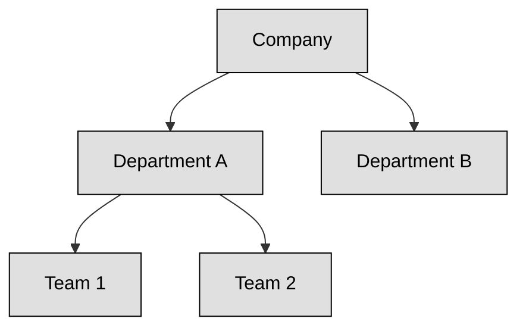
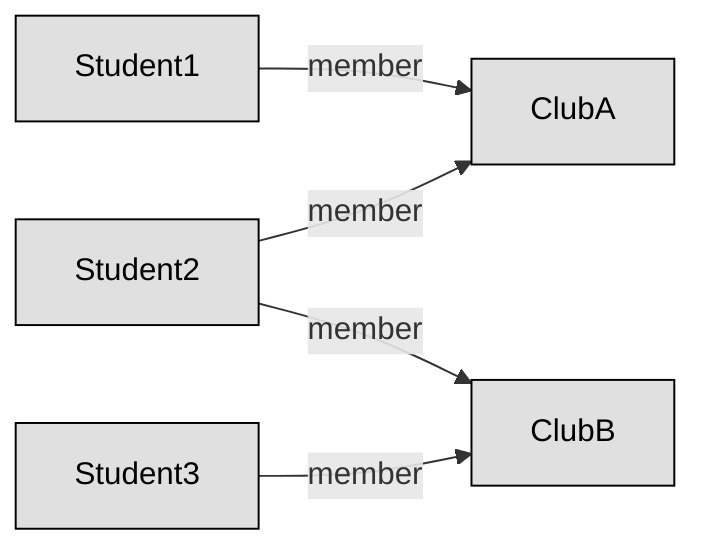
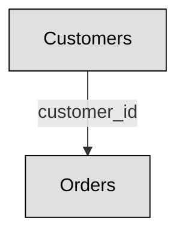
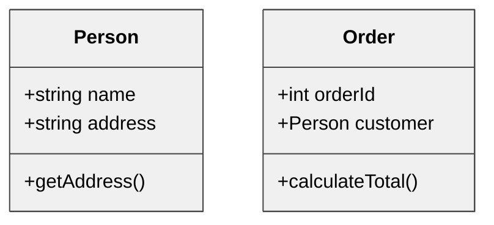
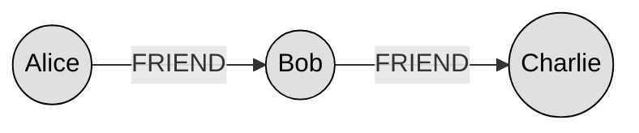
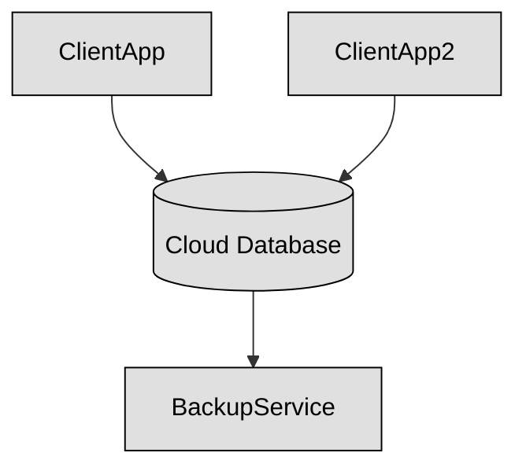
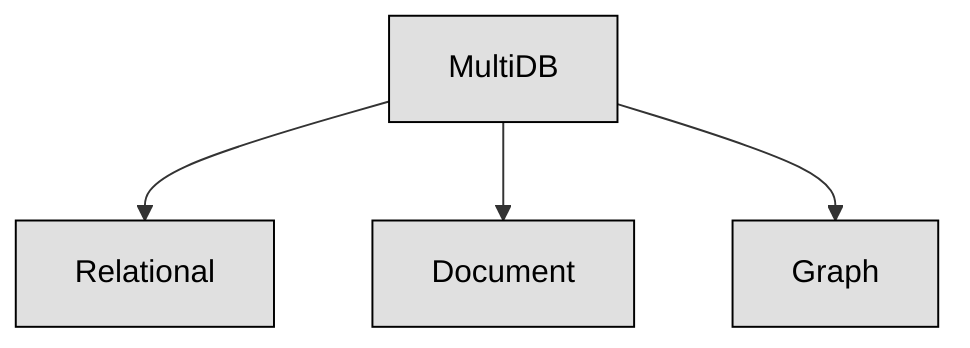

## 8.D.1 Databases Basics ##

### What is a database ? ###

A database is like a super-organized digital filing cabinet. It’s a structured collection of data that stores information in a way that makes it easy to access, update, and manage. Unlike plain files saved randomly on a computer, databases are built to handle large amounts of information efficiently. They allow multiple people or applications to read and write data at the same time, without confusion or errors. While regular files just hold data, a database makes that data work for you.

Databases do a lot more than just store data. They scale to handle massive amounts of information as your needs grow. They enforce rules to keep your data clean and accurate. They protect your information by allowing only the right people to access it, and they help businesses and analysts spot patterns and make better decisions based on trends found in the data.

Behind the scenes, what makes all this possible is a special type of software called a **Database Management System**, or **DBMS**. This is the brain that handles everything a database needs to do. It makes sure data is saved correctly, pulled up when needed, and kept secure from unauthorized users. Some common DBMS tools you might have heard of are MySQL, Oracle, or PostgreSQL.

A DBMS works with a few key pieces:

- **Data** is the core—the actual information being stored, whether it’s numbers, text, images, or even full files.

- **Schema** is like a map or blueprint—it defines how the data is structured, what fields are expected, and how different types of information relate to one another.

- **Queries** are how we interact with the data—basically, instructions (often written in SQL) that tell the database what to find or change.

- **Users** are the people or programs that use the database, each with specific permissions depending on their role.

For a database to be reliable, it needs to follow something called the **ACID** properties. These are four principles that keep data safe and accurate, even if something goes wrong like a crash or power outage.

-**Atomicity** ensures that a transaction is all-or-nothing—if one part fails, the whole thing is rolled back.

-**Consistency** means data must always follow rules and constraints—no corrupt or half-finished records.

-**Isolation ensures** that multiple people working at the same time won’t mess up each other’s data.

-**Durability** guarantees that once something is saved, it stays saved—even if the system crashes right after.

Because databases are so important, working with them has become a major career path. Some people become **database administrators (DBAs)** who keep the system running smoothly and securely. Others are **data analysts** who dive into the stored information to find insights and trends. You also have **data architects** who design how a database should be structured, and **developers** who write the code to connect apps to the data. All these roles help organizations get the most out of their data while keeping it safe and organized.

### Types of Databases ###

Usually databases are categorized by how they store and organize data.

#### Hierarchical Database ####
This type stores data in a tree structure where each record has one parent but can have many children—think of a family tree or folders inside folders. It fits well when relationships are clear and one-directional, like departments under a company.

Hierarchical databases are fast and predictable but rigid—if your relationships change, restructuring is painful

#### Network Database #### 
This one is more flexible: a child can belong to multiple parents. Imagine students joining several clubs and each club with many students. It functions like a web of connections. It handles many-to-many relationships well but can get complex.

#### Relational Database ####
Today’s most common type: data is stored in tables made of rows and columns. Tables link to each other using keys (like employee ID or order number). This model is flexible, widely supported, and works well with SQL. Systems like MySQL, PostgreSQL, and Oracle use it.

#### Object-Oriented Database ####
Here, data is treated just like objects in your code—they include both data and methods. You store things like Person or Order as objects, not rows. This is used in applications where working with complex data types is common—like multimedia or software simulations.

#### NoSQL (Non-Relational) Databases ####
This is a broad category covering databases that don't use the table-and-row model. It includes:

- Document stores (e.g., JSON documents in MongoDB)

- Key-value stores (like Redis)

- Wide-column stores (e.g., Cassandra)

- Graph databases (e.g., Neo4j)

Here’s a simple graph model for a graph database example:

These are great for unstructured or semi-structured data, scalability, and special use cases like building social networks or managing logs.

#### Cloud Databases ####
These run on cloud platforms (AWS, Azure, Google) and can be relational or NoSQL. They offer auto-scaling, high availability, and ease of management. Ideal for agile apps or businesses without their own infrastructure.

#### Multi-Model Databases ####
These support more than one data model—like relational, document, and graph—within a single system. They let developers pick the best data model for each part of an app, all under one roof.

The following table recap all that we have seen so far.

| **Database Type**       | **How Data is Organized**                          | **Strengths**                                  | **Considerations**                             |
|-------------------------|-----------------------------------------------------|------------------------------------------------|------------------------------------------------|
| Hierarchical            | Parent‑child tree                                   | Fast simple hierarchy                          | Rigid, one-to-many only                        |
| Network                 | Web of records linked many-to-many                  | Flexible relationship mapping                  | Complex navigation logic                       |
| Relational              | Tables linked via keys                              | Mature, SQL, transactional, consistent         | Joins can be expensive at scale                |
| Object-Oriented         | Objects with attributes & methods                   | Natural for OO code, supports complex types    | Less common, not standardized                  |
| NoSQL (Document/Graph)  | JSON docs, key-value, graph nodes/edges             | Scalable, flexible schema                      | Varies by vendor, some consistency trade-offs  |
| Cloud                   | Any model, hosted online with managed infra         | Auto-scale, managed backups, remote access     | Vendor lock-in, cost considerations            |
| Multi-Model             | Multiple data models in one engine                  | Versatile, single platform for varied needs    | Can be complex, newer technology               |

### SQL Basics ###

If you want to talk to a database, you use SQL — which stands for Structured Query Language. Think of it like giving instructions to a super-organized filing system.

#### Data Definition Language (DDL) – For Building the Structure ####

These commands are used to create or change tables and databases — the “blueprints” of your data system. Imagine you’re setting up folders and forms before any data is added.

Example:

- CREATE TABLE employees (...) → Create a new table.

- ALTER TABLE employees ADD email VARCHAR(100) → Add a new column.

- DROP DATABASE old_data → Delete a whole database.

| **Command**       | **Purpose**                | **Example**                               |
| ----------------- | -------------------------- | ----------------------------------------- |
| `CREATE TABLE`    | Creates a new table        | `CREATE TABLE users (id INT, name TEXT);` |
| `ALTER TABLE`     | Adds or changes columns    | `ALTER TABLE users ADD email TEXT;`       |
| `DROP TABLE`      | Deletes a table completely | `DROP TABLE users;`                       |
| `CREATE DATABASE` | Makes a new database       | `CREATE DATABASE company_db;`             |
| `DROP DATABASE`   | Deletes an entire database | `DROP DATABASE test_db;`                  |

#### Data Manipulation Language (DML) – For Working With the Data ####

These commands let you add, update, or remove data inside your tables — basically filling out or changing forms in your data folder.

Example:

- INSERT INTO employees VALUES (...) → Add new data.

- UPDATE employees SET email = 'a@b.com' WHERE id = 1 → Change data.

- DELETE FROM employees WHERE id = 5 → Remove data.

| **Command**   | **Purpose**            | **Example**                                   |
| ------------- | ---------------------- | --------------------------------------------- |
| `INSERT INTO` | Adds a new row of data | `INSERT INTO users VALUES (1, 'Alice');`      |
| `UPDATE`      | Modifies existing data | `UPDATE users SET name = 'Bob' WHERE id = 1;` |
| `DELETE`      | Removes rows           | `DELETE FROM users WHERE id = 1;`             |

#### Data Query Language (DQL) – For Finding Things ####

Mostly this means the SELECT command. It’s how you ask questions to your database and get answers.

Example:

- SELECT * FROM employees → Show all employees.

- SELECT name FROM employees WHERE department = 'Sales' → Show sales staff.

| **Command** | **Purpose**                 | **Example**                                       |
| ----------- | --------------------------- | ------------------------------------------------- |
| `SELECT`    | Retrieves data from a table | `SELECT * FROM users;`                            |
| `WHERE`     | Filters query results       | `SELECT * FROM users WHERE name = 'Alice';`       |
| `ORDER BY`  | Sorts results               | `SELECT * FROM users ORDER BY name ASC;`          |
| `GROUP BY`  | Groups data for aggregation | `SELECT dept, COUNT(*) FROM users GROUP BY dept;` |
| `LIMIT`     | Limits number of results    | `SELECT * FROM users LIMIT 10;`                   |

#### Data Control Language (DCL) – For Permissions

These commands control who can see or change things in the database. It's like giving someone a key to a cabinet.

Example:

- GRANT SELECT ON employees TO user1 → Let someone view data.

- REVOKE UPDATE ON employees FROM user2 → Take away editing rights.

| **Command** | **Purpose**               | **Example**                         |
| ----------- | ------------------------- | ----------------------------------- |
| `GRANT`     | Gives access to users     | `GRANT SELECT ON users TO john;`    |
| `REVOKE`    | Removes access from users | `REVOKE SELECT ON users FROM john;` |

#### Transaction Control Language (TCL) – For Saving or Canceling Changes ####

These commands help you confirm or undo changes. Like hitting save or undo in a Word document.

Example:

COMMIT → Save all changes.

ROLLBACK → Undo changes.

SAVEPOINT → Set a place you can go back to later.

| **Command** | **Purpose**                  | **Example**      |
| ----------- | ---------------------------- | ---------------- |
| `BEGIN`     | Starts a transaction         | `BEGIN;`         |
| `COMMIT`    | Saves all changes            | `COMMIT;`        |
| `ROLLBACK`  | Cancels changes              | `ROLLBACK;`      |
| `SAVEPOINT` | Sets a point to roll back to | `SAVEPOINT sp1;` |

