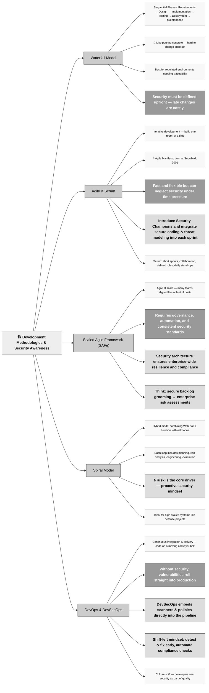

## 8.1.1 Development methodologies (e.g., Agile, Waterfall, DevOps, DevSecOps, Scaled Agile Framework) ##

Think of development methodologies as different blueprints for constructing a building. If you ignore security in the blueprint, patching the doors and windows after the walls go up won’t stop the thieves. We’re going to explore how different development methodologies integrate (or fail to integrate) security, and why your awareness of these models is key to both exam success and real-world impact.

The **Waterfall model** is the oldest and, in many ways, the most rigid. It operates in sequential phases—these phases might be, for example, requirements, design, implementation, testing, deployment, and maintenance. 

:brain: The waterfall model is like pouring concrete. Once it sets, there’s no reshaping it.

Waterfall offers predictability and clear documentation, which is great for environments like government contracts or medical systems where regulations demand traceability. But its biggest flaw is inflexibility. Imagine discovering a critical security vulnerability in the testing phase. Now you're stuck trying to bolt a lock onto a door that's already built and installed. Waterfall’s primary security implication is the cost and difficulty of late-stage changes. Security requirements must be exhaustively defined upfront, and any missed requirement can turn into an architectural flaw. Waterfall works best when security teams are involved from day one and have a seat at every design review.

**Agile**, by contrast, is like building a house one room at a time with constant input from the owner. It’s iterative, meaning you develop small pieces of functionality (called user stories) over short cycles called sprints, typically 2-4 weeks. 

:link: On February 11-13, 2001, at The Lodge at Snowbird ski resort in the Wasatch mountains of Utah, seventeen people met to talk, ski, relax, and try to find common ground—and of course, to eat. What emerged was the [Agile ‘Software Development’ Manifesto](https://agilemanifesto.org/)

Agile’s strength is responsiveness. If a customer changes their mind mid-project, you can adapt. But this speed and flexibility can cut both ways. Security, if not baked into every sprint, becomes an afterthought. 

:bulb: A common Agile pitfall is developers rushing to finish a sprint without considering threats or compliance needs. To combat this, many organizations introduce a **security champion** into each Agile team—someone with enough knowledge to raise a red flag when security is at risk.

Agile offers a golden opportunity to integrate security continuously, rather than episodically. Think of secure coding practices, static analysis tools, and lightweight threat modeling as tools that fit naturally into each sprint. When well-implemented, Agile can often lead to more secure outcomes than Waterfall—because you catch issues early and often.

**Scrum** is a known Agile framework that structures work in short, time-boxed iterations called **sprints** —usually 2 to 4 weeks long— where teams deliver potentially shippable product increments. It emphasizes collaboration, adaptability, and continuous feedback through defined roles (Product Owner, Scrum Master, Development Team) and ceremonies like daily stand-ups, sprint planning, reviews, and retrospectives. Scrum helps teams respond quickly to changing requirements while maintaining focus on delivering value.

Now imagine taking Agile and stretching it over a large enterprise with hundreds of developers. That’s where **Scaled Agile Framework, or SAFe**, comes in. SAFe isn’t a different methodology but an extension of Agile that enables coordination across many teams working toward a common goal. Think of it like managing a fleet of Agile boats all navigating in the same direction. SAFe introduces roles like Release Train Engineer and emphasizes alignment between business strategy and technical execution. For cybersecurity, the challenge is scaling your influence across all those boats. You need governance models, security standards, and automation that don’t just live in a binder—they must be embedded in every development value stream. This is where security architecture becomes crucial. You’re no longer just asking, “*Is this code secure?*” You’re asking, “*Is our system of systems resilient, compliant, and threat-aware across all layers and integrations?*” For the exam, understand SAFe’s layered complexity and how security must be equally layered—from secure backlog grooming to enterprise-level risk assessments.

**Spiral** is less commonly used today, but it’s still important conceptually. Think of it as a hybrid of Waterfall and iterative development with a focus on risk. Projects move through repeated cycles—or spirals—each with planning, risk analysis, engineering, and evaluation. It’s like walking around a mountain in ascending circles; each loop brings you higher but also exposes you to new risks. Spiral is most useful for large, high-stakes systems like defense applications, where the cost of failure is huge. What sets Spiral apart is that risk assessment isn’t just a checkpoint; it’s the core driver of each iteration. From a security standpoint, Spiral’s biggest advantage is the formal integration of risk analysis throughout the lifecycle. Spiral forces you to consider: What could go wrong? What is the impact? How do we mitigate it before we go further? Spiral’s security mindset is proactive, not reactive, and that makes it an excellent conceptual fit for systems with long timelines and high assurance requirements.

**DevOps** merges development and operations into one fast-moving, automation-heavy workflow. It’s all about reducing time to market through continuous integration and continuous delivery (CI/CD). Picture a factory where code is built, tested, and deployed on conveyor belts that never stop. It’s efficient, but if you throw insecure code onto that belt, it rolls right into production. DevOps by itself doesn’t inherently address security. In fact, when done poorly, it accelerates vulnerabilities right into your live environment. But this is where DevSecOps enters the picture.

**DevSecOps** is not just DevOps with a security team glued on. It’s the cultural and technical practice of integrating security at every stage of the DevOps pipeline. Imagine embedding security scanners into the conveyor belt—tools that check for known vulnerabilities, enforce coding standards, and validate configuration policies automatically and at scale. DevSecOps transforms security from a gatekeeper into a guide. Instead of stopping the line to conduct audits, we empower developers to detect and fix issues early. From a CISSP perspective, DevSecOps exemplifies “shift left” security—moving controls and assurance earlier in the process. Tools like SAST (static application security testing), DAST (dynamic testing), and IaC (infrastructure as code) scanning are your allies here. But the tools are only part of the equation. You also need the right culture—where developers view security as part of quality, not a tax. 

### Open Questions ###

1.1Why is it challenging to introduce security controls late in the Waterfall development model?

 
Show answer
 Because Waterfall follows a rigid, sequential flow, security flaws discovered late in the process require reworking earlier phases, making fixes expensive and difficult to implement effectively. Once a phase is completed, revisiting design or requirements becomes time-consuming and costly, often leading to insecure compromises or delayed releases. 

2.What does “shift-left” mean in the context of DevSecOps, and why is it important?

 
Show answer
 "Shift-left" means moving security testing and controls earlier in the development lifecycle. It allows vulnerabilities to be detected and fixed during design or coding, rather than after deployment. This approach reduces remediation costs, improves software quality, and embeds security awareness into every stage of development. 

3. How does the Agile methodology impact the way security is managed during software development?

 
Show answer
 Agile’s fast-paced, iterative sprints can lead to missed security considerations unless they are deliberately integrated into each iteration. By embedding security testing, threat modeling, and secure coding practices within each sprint, teams ensure continuous attention to security without slowing down delivery. 

4. What is the main advantage of the Spiral development model from a cybersecurity perspective?

 
Show answer
 The Spiral model’s strength lies in its focus on iterative risk assessment at every cycle. This continuous evaluation helps identify and mitigate security threats early, especially in complex or high-risk projects, ensuring that security evolves alongside system functionality. 

5. How does DevOps differ from DevSecOps in terms of cybersecurity integration?

 
Show answer
 DevOps focuses on collaboration, automation, and speed in delivering software but often overlooks security considerations. DevSecOps extends this by embedding automated security tools, continuous monitoring, and a security-first mindset throughout the CI/CD pipeline, ensuring protection without slowing innovation. 

6. In a Scaled Agile Framework (SAFe) environment, what is a key strategy to maintain consistent security across multiple Agile teams?

 
Show answer
 A key strategy is to implement enterprise-wide security governance and shared security standards across all Agile teams. Automation, centralized security tools, and alignment through Agile Release Trains (ARTs) ensure that every team applies the same security principles and maintains consistent protection levels. 

7. Why can DevOps increase the risk of introducing vulnerabilities into production systems?

 
Show answer
 Because DevOps emphasizes rapid deployment and automation, insecure code or misconfigurations can be pushed directly into production if security checks are skipped or insufficiently automated. Embedding security gates and automated scans within the CI/CD process is essential to prevent this risk. 

8. What role does a “security champion” play in Agile development teams?

 
Show answer
 A security champion acts as a bridge between developers and security experts, promoting secure coding, threat modeling, and compliance within the team. They advocate for security best practices, conduct peer reviews, and help ensure that each sprint includes security-focused deliverables, reducing reliance on external audits. 

---

## 8.1.2 Maturity models (e.g., Capability Maturity Model (CMM), Software Assurance Maturity Model (SAMM)) ##

In cybersecurity, maturity models are like maps. They don’t just show you where you are, they point you to where you could be if you want to build systems that don’t crumble under pressure. Many companies think they’re doing fine until something breaks, and then the cracks show. That’s why maturity models are important.

:necktie: Security Models give us a structured way to evaluate how well an organization’s processes are functioning and improving over time. 

Let’s start with the Capability Maturity Model, originally developed by the Software Engineering Institute at Carnegie Mellon. Think of CMM like a ladder with five rungs. At the bottom, you have chaos—projects are completed, but barely, and mostly through heroic individual effort. As you climb the ladder, things become more repeatable, then defined, then quantitatively managed, and finally optimized. 

**Level 1 is called "Initial"** and it’s what you might expect—ad hoc, disorganized, unpredictable. Maybe you’ve worked somewhere like that, where nobody documents anything and project success is based on a handful of people pulling all-nighters. 

**Level 2, "Repeatable,"** means that some basic project management is in place. You’re no longer reinventing the wheel with every new project. There are schedules, budgets, and hopefully some discipline. 

**Level 3, "Defined,"** introduces organization-wide standards and documentation. The organization isn’t just repeating good practices—it’s institutionalizing them. 

**Level 4, "Managed,"** is where the metrics come in. Processes are measured and controlled. You know how long things should take, what risks are likely to occur, and you have data to back it up. Finally

**Level 5, "Optimizing,"** is all about continuous improvement. You're analyzing performance, experimenting with improvements, and adapting over time. Security professionals should care about this because a mature organization can handle threats more effectively. 

For example, an organization at Level 1 may respond to a breach with panic and confusion, while a Level 4 or 5 organization will already have a playbook and monitoring in place, likely preventing the breach before it happens or containing it quickly. CMM gives us a language and framework for discussing process maturity, but it's general-purpose. 

The **Software Assurance Maturity Model, or SAMM**, is purpose-built for secure software development. Created by OWASP, it’s specifically designed to help organizations evaluate and improve their software security posture. Where CMM gives you a broad maturity picture, SAMM dives deep into software assurance practices. SAMM is organized into four business functions—Governance, Construction, Verification, and Deployment—and each of those functions contains three security practices. For instance, in Governance, you’ll find practices like Strategy & Metrics, Policy & Compliance, and Education & Guidance. SAMM is modular and allows organizations to assess themselves in each of these areas across five maturity levels, where each level builds on the previous one with increasing sophistication. Imagine you're managing a development team. If you’re at Level 1 in Education & Guidance, maybe you have some developers with basic security awareness. At Level 2, you’re running regular secure coding workshops. At Level 3, you’ve embedded security champions in every Agile team and are tracking their influence on reduced vulnerabilities. The benefit of SAMM is that it’s practical—it doesn’t just say “you should be secure,” it shows you how to get there and what progress looks like. Unlike general maturity models, SAMM speaks the language of developers, product managers, and CISOs alike.

Now, let’s talk about the Ideal Model, which comes from the Carnegie Mellon Software Engineering Institute just like CMM. **IDEAL** is an acronym that stands for Initiating, Diagnosing, Establishing, Acting, and Learning. Rather than being a static model that describes levels of maturity, the Ideal Model is more like a lifecycle or road map for improvement initiatives. You use it when you're launching a new security program or when you're trying to change something broken. In the Initiating phase, you identify the need for improvement and secure sponsorship. Think of a CISO making the case to the board that security maturity needs to increase to meet industry compliance. The Diagnosing phase is all about understanding the current state. This might involve running assessments, vulnerability scans, penetration tests, and stakeholder interviews. In Establishing, you define the future state and create a plan to get there—this is your security roadmap. Then, in Acting, you execute the plan. This includes implementing new policies, acquiring new tools, training staff, and changing behaviors. Finally, in the Learning phase, you reflect on what worked, what didn’t, and use that feedback to start the cycle again. IDEAL isn’t a scoring system like CMM or SAMM—it’s a method for driving meaningful change. That makes it especially useful in environments where security has been neglected or fragmented. It’s also a favorite of consultants because it provides structure to transformation efforts.

To help you compare these three models quickly, here’s a table:

| Model | Focus Area | Structure | Best Used for |
|--------|-------------|------------|----------------|
| CMM | General process maturity | 5 levels | Understanding and improving organizational processes |
| SAMM | Secure software development | 4 Functions × 3 Practices × 5 Levels | Guiding software security improvement programs |
| IDEAL | Organizational change lifecycle | 5 Phases | Implementing and managing change in security programs |

:necktie: CMM is your altitude—how high your organization is flying. SAMM is your instrumentation—how well you’re navigating securely through software development. IDEAL is your flight plan—where you’re going and how you intend to get there.

### Open Questions ###

1. What is the primary purpose of a cybersecurity maturity model?

 
Show answer
 A cybersecurity maturity model helps organizations evaluate their current capabilities, identify gaps, and provide a roadmap to improve processes, controls, and behaviors systematically. 

2. How does the Capability Maturity Model (CMM) define and measure organizational maturity?

 
Show answer
 The Capability Maturity Model uses five levels—from Initial to Optimizing—to describe how repeatable, controlled, and continuously improving an organization’s processes are, including those related to cybersecurity. 

3. Why is SAMM considered more suitable than CMM for secure software development?

 
Show answer
 SAMM, created by OWASP, is tailored specifically for software assurance. It breaks down secure development practices into business functions and offers maturity levels for each, making it highly practical and actionable for development teams. 

4. What does the “Learning” phase of the IDEAL model focus on?

 
Show answer
 The “Learning” phase of the IDEAL model involves reviewing results, identifying lessons, and feeding that knowledge back into the next cycle of improvement—helping organizations avoid stagnation and repeat mistakes. 

5. In what way can maturity models provide value to incident response planning?

 
Show answer
 Maturity models enhance incident response by clarifying roles, improving documentation, ensuring repeatable procedures, and enabling organizations to evolve from reactive firefighting to proactive threat management. 

6. How does SAMM encourage continuous improvement within software teams?

 
Show answer
 SAMM encourages continuous improvement by providing incremental goals within each practice area, allowing teams to mature their software security posture step-by-step, measure progress, and tailor improvements based on business needs. 

7. What kind of environment is the IDEAL model best suited for?

 
Show answer
 The IDEAL model is best suited for organizations undergoing transformation or launching new security initiatives, as it provides a structured lifecycle—Initiating, Diagnosing, Establishing, Acting, Learning—for managing long-term change. 

8. What is the difference between a maturity model like CMM and a lifecycle model like IDEAL?

 
Show answer
 CMM is a maturity model that benchmarks the current state of organizational processes on a fixed scale, while IDEAL is a lifecycle model that guides the process of improvement itself, focusing more on change management than benchmarking. 

---

## 8.1.3 Operation and maintenance ##

The operations and maintenance phase of the software development lifecycle is where the software either proves its resilience or crumbles under pressure. Why? Because this is the longest phase in the lifecycle, and it’s where the software lives in the real world, under constant stress from users, attackers, patch cycles, updates, and shifting business demands. Software requires care, updates, and sometimes even surgery. Security in operations is not just about reacting to incidents but building a system that anticipates, detects, responds, and evolves. The goal is stability, availability, and integrity—without sacrificing confidentiality.

Every time a user logs in, a query runs, a system boots, or a scheduled job executes, you’re in the domain of **operations**. It’s where performance monitoring, security controls, and uptime guarantees are put to the test. Operations teams use monitoring tools like Splunk, Nagios, or Datadog to watch the system in real time. But it’s not just about uptime. It’s about ensuring that logs are captured and preserved securely, that audit trails are in place, and that the least privilege model is enforced in production just as strictly—if not more—than in development. In cybersecurity, operations is where the CIA triad gets tested every day. How do we ensure availability if someone launches a DDoS attack? How do we maintain integrity when patching a vulnerability? And what happens to confidentiality when a legacy service is suddenly exposed to the internet?

**Maintenance** is where the system changes. Not dramatically like in design or development, but through steady, quiet updates. Patch management is a central concept here. Imagine you have a CRM system used by 400 salespeople across five countries. A zero-day vulnerability in its web framework gets discovered. The vendor releases a patch. Do you apply it immediately? Probably not directly in production. First, you review the patch’s impact. Then you apply it in a staging environment. You test to see if it breaks existing workflows. Only then do you schedule a controlled deployment, usually during a maintenance window. This process—when handled maturely—can be the difference between a secure system and a breach. Equifax’s famous 2017 breach stemmed from a missed patch. The vulnerability had a fix available. It simply wasn’t applied in time. This is why mature patch management processes include not only the technical steps but also asset inventories, configuration management databases (CMDBs), and alerting systems that track missing patches.

Maintenance also includes the enhancement of features, retirement of obsolete components, and adjusting configurations as the operating environment evolves. The team must also track security baselines. For example, if encryption standards change—say, you move from TLS 1.1 to TLS 1.3—you need to evaluate which services, certificates, and dependencies will be affected. 

So you move carefully, version by version, testing everything. Maintenance is about discipline. It’s where your organization’s change control policy lives and breathes. All changes must be tracked, authorized, and reviewed. Operations and maintenance also tie into incident response and continuous monitoring. A well-maintained system should not only function smoothly but also have the eyes and ears of the security team embedded in its fabric. SIEM systems should be fed with logs from applications, operating systems, access control systems, and firewalls. Alerts should be tuned—not too noisy, not too quiet.

:bulb: Let’s not forget the human side of operations and maintenance. People make mistakes. Fatigue, miscommunication, or even a rushed approval can lead to security flaws. So procedures, checklists, and cross-checks become essential. Just like a flight crew uses a pre-takeoff checklist—even after thousands of flights—your IT and security teams should follow rigorous protocols every time a change is made. Peer reviews, sign-offs, and audit logs don’t slow down progress; they keep you flying safely. And in regulated industries, they also keep you out of trouble.

Good operations and maintenance feed into software retirement. Eventually, all systems must be decommissioned. But without solid documentation and version control, that process becomes chaotic. Sensitive data may remain on old servers, logs may get deleted improperly, or APIs may still be exposed. So O&M isn’t just about today’s stability—it’s about tomorrow’s smooth exit. System decommissioning is just as secure and controlled as the initial deployment. Data must be wiped securely. Logs must be archived. Dependencies must be reviewed. It’s the last mile of security, and it often gets neglected.

### Open Questions ###

1. Why is the operations and maintenance phase considered the longest and most critical in the software development lifecycle from a security perspective?

 
Show answer
 The operations and maintenance phase is the longest because it begins once the software is deployed and continues for its entire lifecycle until retirement. It's the most critical for security because it’s when the system is exposed to real users, real data, and real attackers. This is the phase where patches must be applied, attacks must be detected, logs must be maintained, and changes must be controlled—making it the front line for both proactive and reactive security. 

2. How does effective patch management contribute to software security during the maintenance phase?

 
Show answer
 Patch management addresses known vulnerabilities by applying updates in a timely and controlled manner. Without proper patching, even well-designed systems become vulnerable over time, as attackers often target known exploits. Effective patch management includes testing, scheduling, and tracking changes, ensuring that security improvements don’t break functionality while closing attack vectors promptly. 

3. What role does change management play in maintaining a secure production environment?

 
Show answer
 Change management ensures that all modifications to the system are documented, tested, approved, and reversible. This prevents unauthorized or poorly executed changes that could introduce vulnerabilities, disable critical controls, or cause service outages. A structured change process also supports audits and compliance, making the system more secure and accountable. 

4. Why must monitoring and logging be prioritized during operations, and how can poor implementation affect security?

 
Show answer
 Monitoring and logging are essential to detect threats, track user activity, and support incident response. If logging is incomplete, misconfigured, or stored insecurely, it can blind the security team to malicious actions or prevent accurate forensics. Proper logging ensures accountability, while monitoring tools help detect anomalies before they become breaches. 

5. How can the decommissioning of systems become a security risk if not handled properly during the maintenance phase?

 
Show answer
 Improper system decommissioning can leave behind sensitive data, active services, or configuration files that expose the organization to risk. Without secure data wiping, dependency mapping, and shutdown procedures, attackers can exploit forgotten assets. Maintenance must include secure retirement policies to ensure that obsolete systems don’t become weak links in the security chain. 

---

## 8.1.4 Change management ##

Change management in the software development lifecycle is not just about tracking who made which code update and when—it’s a structured safeguard for the entire business, especially from a security perspective. Changes can be as small as updating a configuration file or as large as replacing a core component of the application. Regardless of size, every change has the potential to introduce vulnerabilities, disrupt service, or inadvertently remove critical protections. This is why change management is one of the most security-sensitive practices in the entire lifecycle. 

:bulb: When changes are made without visibility, you end up with what's called shadow IT: undocumented changes, unauthorized tools, and mystery behaviors that can blindside operations and security teams alike. 

In high-assurance environments, such as financial systems or healthcare platforms, a single untracked change can invalidate months of security work, introduce a regulatory violation, or even expose sensitive data. To appreciate the importance of change management, imagine a company that skips proper review and pushes a hotfix straight to production. Maybe the code solves the bug but disables input validation. The development team is thrilled the bug is fixed—meanwhile, attackers are now able to inject malicious inputs, breach the system, and exfiltrate data. Without a change management process that includes risk assessment and code review, the security implications are missed, and what seemed like progress actually opened the door to a cyber incident. The core of change management involves several stages: request, assessment, approval, implementation, and post-change review. Each of these stages should be understood not as bureaucratic red tape but as essential for ensuring that changes are safe, documented, reversible, and aligned with security policies. When done right, this process helps both developers and security teams collaborate smoothly, keeping innovation and protection in balance. 

:necktie: The most important aspect of change management is control. Control over what goes into production, who made the decision, what risks were considered, and how it can be undone if something goes wrong. Every change should have a rollback plan.

Imagine deploying a new feature at 5:00 p.m. on a Friday, only to realize it crashes the system. Without rollback capabilities, you’re left scrambling all weekend. With good change control, you simply reverse the change and resume operations. This is where version control systems, automated deployment pipelines, and audit trails play a huge role—they give you the tools to track, test, and trust your changes. 
Even more critically, change management supports the principle of least privilege. Only authorized personnel should be able to approve or implement certain types of changes, and this access should be auditable. If everyone can modify firewall rules or database schemas without oversight, it’s only a matter of time before something disastrous happens—either through mistake or malice. Segregation of duties is another security anchor here. The person requesting a change shouldn't be the one approving or deploying it. This separation reduces the risk of insider threats and enforces checks and balances.

Now, let’s look at **emergency changes** those last-minute fixes that must be made quickly to address a critical issue. Even in these cases, the change should still follow a streamlined but formal path, including rapid approval, documentation, and immediate post-change review. Otherwise, you’re trading one risk for another. A fix that works today might unravel stability tomorrow. This balance between speed and safety is exactly where security professionals can add value. By designing policies that distinguish between normal, urgent, and emergency changes—and ensuring each type has controls in place—you create agility without sacrificing assurance. Don’t overlook the cultural side either. In many teams, developers view change management as a bottleneck, while security views it as a shield. The key is to build bridges between those perspectives, showing how structured changes actually accelerate progress over time. When everyone trusts the process, fewer mistakes happen, and blame is replaced by shared ownership. Tools like change advisory boards (CABs), automated CI/CD pipelines with integrated security checks, and ticketing systems with mandatory risk fields are just some ways this plays out in practice. 

:necktie: A good change management system doesn’t slow down development—it empowers it, making every release safer, more transparent, and more professional.

### Open Questions ###

1. Why is change management considered a critical security control in the software development lifecycle?

 
Show answer
 Change management is critical because it provides visibility, control, and accountability over system modifications. Uncontrolled changes can introduce vulnerabilities, violate compliance, or disrupt service availability. By enforcing structured reviews, approvals, and tracking, change management ensures that updates support both business and security objectives. 

2. How does segregation of duties enhance security within the change management process?

 
Show answer
 Segregation of duties prevents a single individual from having unchecked control over an entire change process, reducing the risk of insider threats and errors. For example, the person who writes code shouldn't be the one who deploys it to production. This division forces collaborative validation and adds layers of oversight that protect the system’s integrity. 

3. What are the risks of allowing emergency changes without any oversight or documentation?

 
Show answer
 Allowing emergency changes without oversight leads to undocumented modifications, making it difficult to trace issues or confirm what changed. These ad-hoc updates may fix immediate problems but often bypass testing and risk assessment, which can introduce critical flaws or break other components, increasing the risk of future incidents. 

4. How does poor change management contribute to security breaches or system outages?

 
Show answer
 Poor change management can directly cause breaches or outages by introducing misconfigurations, insecure code, or compatibility issues. When teams lack visibility into what has changed, troubleshooting becomes harder, and security teams may not detect vulnerabilities or malicious activity in time to respond effectively. 

5. Why is rollback capability essential in a well-structured change management process?

 
Show answer
 Rollback capability allows teams to quickly revert to a known good state if a change fails or causes unintended side effects. Without it, organizations may face prolonged outages, data loss, or exposure to threats while they scramble to patch over broken changes. A rollback is the safety net that turns potential disasters into minor bumps in the road. 

---

## 8.1.5 Integrated Product Team ##

An IPT is a multidisciplinary group of professionals formed to collaborate throughout the development lifecycle of a product, and its superpower is integration—integrating knowledge, responsibilities, and perspectives from across the organization into a single focused mission. This team is not just a random gathering of people. It’s deliberately structured to include representatives from software development, system architecture, testing, operations, support, legal, risk management, and crucially, cybersecurity. Security must be part of the design, not a bolt-on at the end. When the security professional is part of the IPT from day one, security requirements get built into architecture, design decisions are informed by threat models, and compliance issues are anticipated early instead of discovered too late.

By forming an IPT, you're essentially building a bridge between disciplines—developers know what security expects, security understands the business priorities, operations can give feedback on deployment pain points, and legal can call out regulatory boundaries before the product is out the door. This cross-functional approach supports informed trade-offs, rapid decision-making, and better risk visibility. From a cybersecurity standpoint, the value is enormous. Let’s say a developer proposes using a new cloud storage API for performance. If the security member of the IPT is there, they can immediately raise concerns about encryption standards, data residency, or exposure to new threat vectors. Instead of rejecting the idea after the code is written, the team finds a secure alternative or adds controls proactively.

You’ll often hear the phrase “shift left” in DevSecOps discussions, which means addressing security early in the lifecycle. Well, IPTs are one of the most practical ways to shift left. They break down the artificial barrier that once separated security people from creative processes. Instead of being the department of “no,” cybersecurity becomes an enabler—helping the team build resilient, compliant, and trustworthy systems. IPTs can operate at multiple levels. Some are tactical, embedded in a specific sprint team or product release cycle. Others are strategic, guiding architectural direction across multiple releases or even entire product portfolios. In regulated industries, IPTs often have formal responsibilities like reviewing system authorization packages or contributing to security plans and documentation for compliance audits. They’re also the people who write or review the system security plan (SSP), coordinate with external auditors, and help gather evidence for a system’s accreditation.

:necktie: IPTs help remove finger pointing. Instead of blaming developers or operations after an incident, everyone owns the outcome together.

It’s not uncommon to see an IPT become the nucleus of a continuous improvement cycle: after an incident, the same people who designed the system, deployed it, and defended it can analyze what went wrong and make lasting changes. That leads to higher maturity and stronger resilience. A common barrier to IPT success is organizational inertia. Departments aren’t always used to working together, and turf wars or communication gaps can slow things down. That’s why a strong IPT doesn’t just happen—it requires executive sponsorship, clear roles, documented responsibilities, and effective facilitation. Agile methodologies often provide a natural framework for IPTs. In Scrum, for instance, a cross-functional team is already part of the DNA. But even in Waterfall or more traditional models, IPTs can be introduced during key phases such as requirements engineering, design reviews, or test planning.

### Open Questions ###

1. What is the primary purpose of forming an Integrated Product Team (IPT) in the software development lifecycle?

 
Show answer
 The primary purpose of an Integrated Product Team is to bring together cross-functional stakeholders—including developers, architects, operations, security, and compliance—into a single, collaborative group that works throughout the software lifecycle to ensure that functionality, security, and business goals are aligned and achieved efficiently. 

2. How do Integrated Product Teams support the principle of “shifting security left” in software development?

 
Show answer
 IPTs support the “shift left” principle by involving security professionals early in the lifecycle—during planning, requirements, and design phases—allowing potential risks to be identified and addressed before development and deployment, which reduces vulnerabilities and costly rework later. 

3. Why is the inclusion of a cybersecurity professional in an IPT important from a CISSP perspective?

 
Show answer
 Including a cybersecurity professional in the IPT ensures that security is not an afterthought but a built-in requirement. This aligns with the CISSP view that security must be integrated into every phase of system development, supporting confidentiality, integrity, and availability from day one. 

4. What common challenges can limit the effectiveness of an Integrated Product Team?

 
Show answer
 Common challenges include organizational silos, unclear roles, resistance to collaboration, and lack of executive support. These obstacles can undermine the IPT’s ability to communicate effectively or make timely decisions, especially if team members are not empowered or coordinated. 

5. How do IPTs improve compliance and audit readiness in regulated industries?

 
Show answer
 IPTs improve compliance by integrating regulatory knowledge into the development process. Security and compliance team members help ensure documentation is accurate, controls are in place, and audit evidence is gathered continuously, reducing last-minute panic and audit failures. 

---

